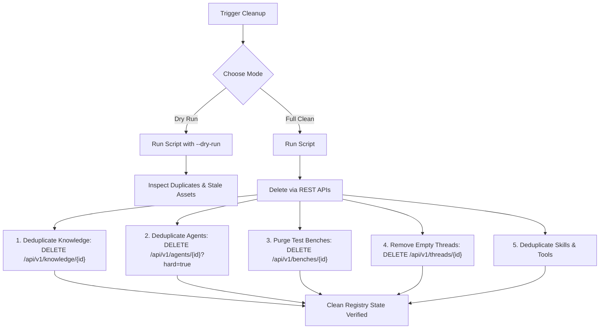

# Clean Test Data Skill

This skill provides automated and interactive procedures to inspect and purge duplicate, near-duplicate, and stale test entities from the Agent-as-Data database entirely via the REST APIs (`http://localhost:8080/api/v1`).

## When to Use

Use this skill whenever:
- Integration tests or Robot Framework test runs (e.g. `tests/knowledge_mcp_journey.robot`, `tests/test_journey_*.robot`) have run repeatedly and left duplicate exemplar agents or test-generated assets.
- The UI (Knowledge Explorer, Agent Registry, Workbench) displays multiple identical or near-identical cards.
- You need a dry-run or full purge of test artifacts without modifying the underlying database schema directly or interrupting running dev server watch processes.



## Quick Execution

Execute the bundled cleanup script directly from the workspace:

```bash
# Preview what would be deleted without making changes
python3 .agents/skills/clean-test-data/scripts/cleanup_stale_data.py --dry-run

# Execute full cleanup across all assets
python3 .agents/skills/clean-test-data/scripts/cleanup_stale_data.py
```

Helper script location: [cleanup_stale_data.py](./scripts/cleanup_stale_data.py)

---

## Targeted REST API Procedures

If executing deletions manually or targeting specific asset classes, use standard `curl` commands against the backend REST APIs:

### 1. Knowledge Nodes
Integration tests often ingest repeated architecture or decision notes with random topic suffixes (e.g. `robot-tenant-sso-architecture-*`, `auth-microservice-architecture-*`).

- **List Knowledge Nodes**:
  ```bash
  curl -s http://localhost:8080/api/v1/knowledge
  ```
- **Delete Duplicate Node**:
  ```bash
  curl -s -X DELETE http://localhost:8080/api/v1/knowledge/<node_id>
  ```

### 2. Agents
Integration tests seed exemplar agents repeatedly (`FinancialControllerAgent`, `SeniorDeveloperAgent`, etc.) or generate test runners matching `Journey*_Agent_*`.

- **Search Active Agents**:
  ```bash
  curl -s -X POST http://localhost:8080/api/v1/agents/search \
    -H "Content-Type: application/json" \
    -d '{"query": "", "limit": 1000}'
  ```
- **Hard Delete Agent (if 0 executions)**:
  ```bash
  curl -s -X DELETE "http://localhost:8080/api/v1/agents/<agent_id>?hard=true"
  ```
- **Soft Delete / Archive Agent (if executions exist)**:
  ```bash
  curl -s -X DELETE "http://localhost:8080/api/v1/agents/<agent_id>"
  ```

### 3. Workbench Benches & Memory
Robot test journeys create ephemeral memory benches matching `MemoryBench_*`.

- **List Benches**:
  ```bash
  curl -s -X POST http://localhost:8080/api/v1/benches \
    -H "Content-Type: application/json" \
    -d '{"owner_id": "00000000-0000-0000-0000-000000000000", "pagination": {"page": 0, "size": 100}}'
  ```
- **Delete Stale Test Bench**:
  ```bash
  curl -s -X DELETE "http://localhost:8080/api/v1/benches/<bench_id>"
  ```
  *Note: Deleting a bench cascades to its workspace directory and memory records.*

### 4. Empty Threads
- **List Threads**:
  ```bash
  curl -s -X POST http://localhost:8080/api/v1/threads \
    -H "Content-Type: application/json" \
    -d '{"owner_id": "00000000-0000-0000-0000-000000000000", "pagination": {"page": 0, "size": 100}}'
  ```
- **Delete Thread**:
  ```bash
  curl -s -X DELETE "http://localhost:8080/api/v1/threads/<thread_id>"
  ```

### 5. Skills & Tools
- **List & Delete Skills**:
  ```bash
  curl -s http://localhost:8080/api/v1/skills
  curl -s -X DELETE http://localhost:8080/api/v1/skills/<skill_id>
  ```
- **List & Delete MCP Tools**:
  ```bash
  curl -s http://localhost:8080/api/v1/agents/tools
  curl -s -X DELETE http://localhost:8080/api/v1/agents/tools/<tool_id>
  ```
