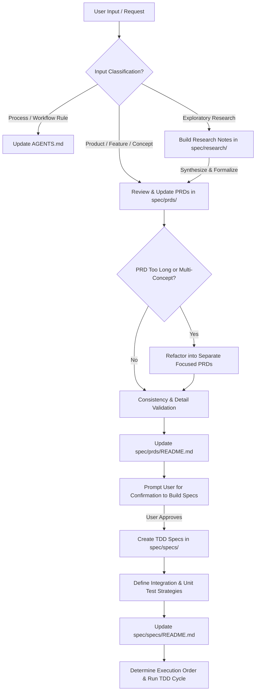

# Agent Workspace Guidance & Specification Rules

## Communication & Diagramming Standards
- **Relative Markdown Links**: Use relative Markdown links for file cross-references (e.g. `[agent-schema-spec.md](./spec/specs/agent-schema-spec.md)` or `[Master PRD](./spec/prds/agent-as-data-prd.md)`). Do NOT use `file:///` URLs inside Markdown files as IDE previewers cannot click them.
- **Mermaid Diagrams**: When describing domain concepts, system architectures, data flows, sequence flows, or process lifecycles, **always use Mermaid diagrams** (`mermaid` code blocks).

## Input Routing & Classification Rules
- **Process & Workflow Inputs**: When the user provides feedback or instructions regarding *how we work*, development workflows, file locations, or process rules, immediately capture and document them in **[AGENTS.md](./AGENTS.md)**.
- **Research Inputs**: When the user requests exploratory research, technology evaluations, or background analysis, document the findings in **[spec/research/](./spec/research/)**. Use these research documents to inform and synthesize content into PRDs.
- **Product, Concept, & Feature Inputs**: When the user provides feedback or instructions regarding *what the system does*, new concepts, data models, or product capabilities, guide and capture those inputs into **[spec/prds/](./spec/prds/)**.

---

## Product & Task Workflow Rules

### Research Phase (`spec/research/`)
1. **Build Research Base**: When research is requested, store technical evaluations, trade-offs, and exploratory findings in `spec/research/`.
2. **Indexing**: Update [spec/research/README.md](./spec/research/README.md) using relative links whenever a research document is created or updated.
3. **Synthesis**: Review research findings with the user and use them to construct or refine persistent PRDs in `spec/prds/`.

### Phase 1: Feature Evaluation & PRD Management (`spec/prds/`)
1. **Review Existing PRDs**: When a new feature or capability is requested, first review existing PRDs in `spec/prds/` to determine if it fits within an existing PRD or warrants a new one.
2. **Modular PRD Structure**: If a PRD becomes too long or begins covering multiple distinct domain concepts, refactor it into separate, focused PRDs.
3. **Consistency & Detail Check**: Verify that new PRD requirements contain sufficient detail and do not contradict existing features or architectural objectives.
4. **User Confirmation**: Once PRDs are updated/created and validated, **explicitly ask the user** if they wish to proceed to creating build spec files (`spec/specs/`).

### Phase 2: Specification & TDD Test Planning (`spec/specs/`)
1. **Drive TDD Execution**: Spec files in `spec/specs/` are derived from PRDs to serve as definitions for a Test-Driven Development (TDD) build process.
2. **Spec Status Lifecycle (`draft` -> `complete` -> `deprecated`)**:
   - **`draft`**: Spec is actively being authored or refined prior to implementation. Modifications are allowed **only** while in `draft` status.
   - **`complete`**: Marked once the spec features and tests are fully implemented. **A complete spec cannot be modified** except to transition its status to `deprecated`.
   - **`deprecated`**: Marked when a historical spec is superseded by a newer spec. Preserved for auditability.
3. **Clear Test Strategy**: Every spec file must clearly define:
   - Expected operational outcomes and payload contracts.
   - Comprehensive test strategy (prioritizing integration tests alongside unit tests).
4. **Preservation**: Spec files are preserved in `spec/specs/` to maintain historical auditability of what was built and why design choices evolved.
5. **Indexing & Linking**: Always update `spec/prds/README.md` and `spec/specs/README.md` using relative Markdown links whenever PRDs or specs are added or modified.

### Phase 3: Ordered Build & Implementation
1. **Dependency Sequencing**: Determine the appropriate build order across all spec files (e.g., database DDL & migrations -> core domain logic -> API endpoints -> integrations).
2. **Strict TDD Execution**: Build out code using a strict TDD approach (Write failing integration/unit test -> Implement code -> Verify test passes -> Refactor).
