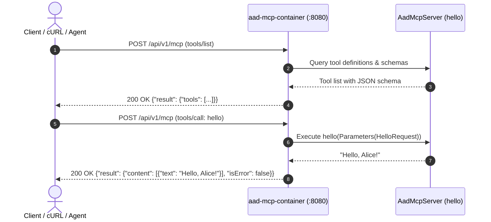

# Agent-As-Data MCP Server (`aad-mcp-container`)

The `aad-mcp-container` is a microservice providing Model Context Protocol (MCP) capabilities to AI assistants, autonomous agents, and IDEs using standard HTTP JSON-RPC 2.0 requests over port `8080`.

---

## 🚀 Running Locally

You can start the service using the repository root Makefile targets or directly via `cargo`:

```bash
# Option 1: Run via Makefile (from workspace root)
make aad-mcp-dev

# Option 2: Run with hot-reloading (cargo-watch)
make aad-mcp-watch

# Option 3: Run directly with cargo
cd aad-mcp-container
cargo run -- --config-path config/default.yaml serve
```

Default service ports:
- **MCP HTTP Web Service**: `http://localhost:8080`
- **HaMS Health Sidecar**: `http://localhost:8079` (`/hams/alive`, `/hams/ready`, `/hams/metrics`)

---

## 📡 HTTP Endpoints

The server accepts JSON-RPC 2.0 `POST` requests at any of the following mounted routes:
- `http://localhost:8080/api/v1/mcp` *(prefixed endpoint)*
- `http://localhost:8080/mcp` *(convenience alias)*
- `http://localhost:8080/` *(root endpoint)*

---

## 🛠️ cURL Examples



### 1. Health Check
```bash
curl -i http://localhost:8080/healthz
```

**Expected Response (`200 OK`):**
```
HTTP/1.1 200 OK
content-type: text/plain; charset=utf-8

ok
```

---

### 2. Initialize Session (`initialize`)
Sends an initialization handshake to query protocol version, server capabilities, and server instructions.

```bash
curl -X POST http://localhost:8080/api/v1/mcp \
  -H "Content-Type: application/json" \
  -d '{
    "jsonrpc": "2.0",
    "id": 1,
    "method": "initialize",
    "params": {
      "protocolVersion": "2024-11-05",
      "capabilities": {},
      "clientInfo": {
        "name": "curl-client",
        "version": "1.0.0"
      }
    }
  }'
```

**Expected Response (`200 OK`):**
```json
{
  "jsonrpc": "2.0",
  "id": 1,
  "result": {
    "capabilities": {
      "tools": {}
    },
    "instructions": "Agent-As-Data MCP Server",
    "protocolVersion": "2024-11-05",
    "serverInfo": {
      "name": "aad-mcp",
      "version": "0.1.0"
    }
  }
}
```

---

### 3. List Available Tools (`tools/list`)
Queries all tools currently registered on the server alongside their generated `schemars` JSON schemas.

```bash
curl -X POST http://localhost:8080/api/v1/mcp \
  -H "Content-Type: application/json" \
  -d '{
    "jsonrpc": "2.0",
    "id": 2,
    "method": "tools/list"
  }'
```

**Expected Response (`200 OK`):**
```json
{
  "jsonrpc": "2.0",
  "id": 2,
  "result": {
    "tools": [
      {
        "name": "hello",
        "description": "Generates a friendly greeting response for a specified user or entity name.",
        "inputSchema": {
          "$schema": "http://json-schema.org/draft-07/schema#",
          "title": "HelloRequest",
          "type": "object",
          "required": [
            "name"
          ],
          "properties": {
            "name": {
              "description": "The name of the user, persona, or entity to greet.",
              "type": "string"
            }
          }
        }
      }
    ]
  }
}
```

---

### 4. Call a Tool (`tools/call`)

#### Example A: Successful Tool Call
```bash
curl -X POST http://localhost:8080/api/v1/mcp \
  -H "Content-Type: application/json" \
  -d '{
    "jsonrpc": "2.0",
    "id": 3,
    "method": "tools/call",
    "params": {
      "name": "hello",
      "arguments": {
        "name": "Alice"
      }
    }
  }'
```

**Expected Response (`200 OK`):**
```json
{
  "jsonrpc": "2.0",
  "id": 3,
  "result": {
    "content": [
      {
        "type": "text",
        "text": "Hello, Alice!"
      }
    ],
    "isError": false
  }
}
```

#### Example B: Whitespace Trimming & Unicode
Leading and trailing whitespaces are automatically trimmed.

```bash
curl -X POST http://localhost:8080/api/v1/mcp \
  -H "Content-Type: application/json" \
  -d '{
    "jsonrpc": "2.0",
    "id": 4,
    "method": "tools/call",
    "params": {
      "name": "hello",
      "arguments": {
        "name": "   José   "
      }
    }
  }'
```

**Expected Response (`200 OK`):**
```json
{
  "jsonrpc": "2.0",
  "id": 4,
  "result": {
    "content": [
      {
        "type": "text",
        "text": "Hello, José!"
      }
    ],
    "isError": false
  }
}
```

#### Example C: Validation Failure (Empty String)
Empty or whitespace-only names are rejected with an error outcome.

```bash
curl -X POST http://localhost:8080/api/v1/mcp \
  -H "Content-Type: application/json" \
  -d '{
    "jsonrpc": "2.0",
    "id": 5,
    "method": "tools/call",
    "params": {
      "name": "hello",
      "arguments": {
        "name": "   "
      }
    }
  }'
```

**Expected Response (`200 OK`):**
```json
{
  "jsonrpc": "2.0",
  "id": 5,
  "result": {
    "content": [
      {
        "type": "text",
        "text": "Error: 'name' argument must be a non-empty string"
      }
    ],
    "isError": true
  }
}
```

#### Example D: Unknown Tool
```bash
curl -X POST http://localhost:8080/api/v1/mcp \
  -H "Content-Type: application/json" \
  -d '{
    "jsonrpc": "2.0",
    "id": 6,
    "method": "tools/call",
    "params": {
      "name": "unknown_tool",
      "arguments": {}
    }
  }'
```

**Expected Response (`200 OK`):**
```json
{
  "jsonrpc": "2.0",
  "id": 6,
  "result": {
    "content": [
      {
        "type": "text",
        "text": "Error: Tool 'unknown_tool' not found"
      }
    ],
    "isError": true
  }
}
```

---

### 5. Ping Server (`ping`)
```bash
curl -X POST http://localhost:8080/api/v1/mcp \
  -H "Content-Type: application/json" \
  -d '{
    "jsonrpc": "2.0",
    "id": 7,
    "method": "ping"
  }'
```

**Expected Response (`200 OK`):**
```json
{
  "jsonrpc": "2.0",
  "id": 7,
  "result": {}
}
```

---

### 6. Client Notification (`notifications/initialized`)
Notifications have no `id` and return an immediate `204 No Content` response:

```bash
curl -i -X POST http://localhost:8080/api/v1/mcp \
  -H "Content-Type: application/json" \
  -d '{
    "jsonrpc": "2.0",
    "method": "notifications/initialized"
  }'
```

**Expected Response (`204 No Content`):**
```
HTTP/1.1 204 No Content
```

---

## ⚙️ Configuration & Port Overrides

Configuration is managed fail-fast via `config/default.yaml` and can be overridden via environment variables:

| Environment Variable | Default | Purpose |
|---|---|---|
| `AAD_MCP__WEBSERVICE__ADDRESS` | `0.0.0.0:8080` | Bind host & port for MCP HTTP service |
| `AAD_MCP__WEBSERVICE__API_PREFIX` | `/api` | Base API route prefix |
| `AAD_MCP__HAMS__ADDRESS` | `0.0.0.0:8079` | Bind host & port for HaMS health sidecar |
| `AAD_MCP__DEBUGGING__LOG_LEVEL` | `info` | Logging verbosity |

Example running on a custom port:
```bash
AAD_MCP__WEBSERVICE__ADDRESS="127.0.0.1:9090" cargo run -- serve
```
