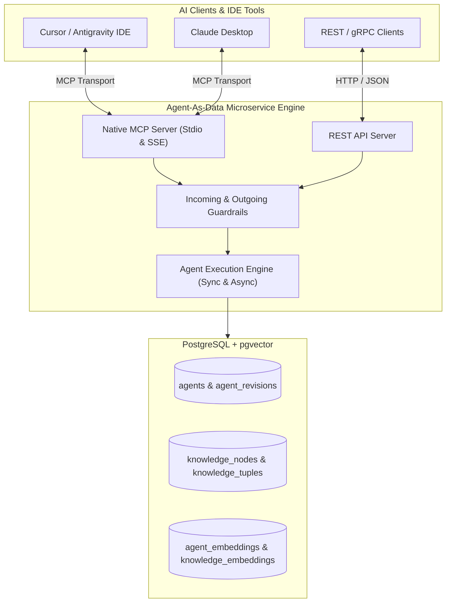

# Agent-As-Data (AAD) - Product Requirements Document

## Overview
Agent-As-Data (AAD) is an enterprise-grade declarative platform and specification designed to **capture, organize, and reason over an enterprise's tacit knowledge, domain processes, and institutional wisdom**. By transforming unwritten developer and business insights into structured text chunks (`pgvector`) and entity relationship tuples (`subject`, `predicate`, `object`), AAD provides a unified "Enterprise Brain". Human teams and AI tools (IDEs, autonomous agents, strategic planners) can query this organizational memory to reason through new business concepts, evaluate project ideas, and execute domain-tailored agents grounded in historical context.

## Core Objectives
1. **Enterprise Tacit Knowledge Capture**: Systematic ingestion and preservation of unwritten operational processes, architecture decisions, business rules, and domain expertise.
2. **Strategic AI Reasoning & Ideation**: Enable AI agents and human teams to reason about new business ideas and project concepts based on a broad, interconnected organizational knowledge base.
3. **Hybrid Knowledge Retrieval (RAG + Graph Tuples)**: Search organizational memory using semantic vector similarity (`pgvector`) for narrative context alongside Graph relation tuples (`subject`, `predicate`, `object`) for concept mapping.
4. **Seamless AI Tooling Context via MCP**: Natively expose knowledge ingestion, concept querying, and agent discovery via Model Context Protocol (MCP over Stdio/SSE) for immediate availability in IDEs and AI assistants.
5. **Declarative Agent Registry & Versioning**: Store agent definitions, system prompts, guardrails, capabilities, and immutable version revisions in PostgreSQL.
6. **Execution Engine & Safety Guardrails**: Serve and execute agents dynamically with strict incoming/outgoing guardrail validation, supporting both synchronous token streaming and asynchronous background execution jobs.
7. **Cloud-Native Architecture**: Fully containerized Rust microservice integrated with Garden, Helm, and FluxCD dev environments.


## Feature Specifications

### 1. Storage & Version Management
- **Agent Registry**: CRUD operations for agents with metadata (`name`, `description`, `tags`).
- **Immutable Revisions**: Each modification creates an immutable version snapshot (`agent_revisions`), ensuring existing executions and client bindings remain deterministic.
- **Soft Delete by Default**: To preserve database referential integrity and historical execution records, deleting an agent sets `archived_at` to mark it archived. Archived agents are hidden from registries and searches, but their execution logs remain intact.
- **Optional Hard Delete**: Active deletions via `DELETE` can specify a `hard=true` query parameter to attempt a physical delete. The delete will naturally fail if active referenced records exist (such as in `executions`).


### 2. RAG Agent Search & Discovery
- **Vector Embeddings**: Automated embedding generation for agent definitions, descriptions, and tags stored in `pgvector`.
- **Top-N Semantic Discovery**: Endpoint `POST /api/v1/agents/search` accepting a request context string and `n` parameter to return the top `n` nearest match agents sorted by cosine similarity score.
- **Hybrid Search**: Combine semantic vector queries with explicit tag and capability filters.

### 3. Knowledge System (RAG + Graph Store)
- **Knowledge Capture**: Capture topic notes, documents, and structured facts.
- **Vector Chunking & RAG**: Split text into semantic chunks, generating vector embeddings in `pgvector` for similarity matching (`POST /api/v1/knowledge/search`).
- **Graph Triples**: Express semantic entity relationships as tuples (`subject`, `predicate`, `object`, metadata).
- **Graph Traversal API**: Traverse knowledge graphs (`POST /api/v1/knowledge/graph/traverse`) to discover connected entities and multi-hop relationships.

### 4. Native Model Context Protocol (MCP) Server
- Natively implement the MCP protocol (`mcp-server-rs`) supporting Stdio and SSE transports.
- **Exposed MCP Tools**:
  - `search_agents`: RAG vector search for top `n` agents matching task context.
  - `execute_agent`: Hydrate and run agent with prompt and guardrail checks.
  - `visualize_agents`: Generate Mermaid flowchart string and JSON graph nodes/edges for agent hierarchies.
  - `ingest_knowledge`: Store new text notes or graph tuples.
  - `search_knowledge`: Semantic RAG search over knowledge items.
  - `query_knowledge_graph`: Query subject-predicate-object relationships.

### 5. Agent Execution Engine
- **Synchronous & Streaming Execution**: `POST /api/v1/agents/:id/execute` and `POST /api/v1/agents/search-and-execute`, streaming LLM output and tool call events back via SSE/chunked response.
- **Asynchronous Execution Jobs**: `POST /api/v1/executions` for long-running agent tasks, allowing status polling (`GET /api/v1/executions/:id`) and log inspection.
- **Guardrail Interceptors**: Evaluated on incoming request payload and outgoing response payload.

### 6. Agent Refactoring & Compression Engine
- **Duplication & Overlap Analysis**: Semantic cluster scanning across `agent_embeddings` to find redundant or overlapping agent definitions.
- **Harmonization & Conflict Resolution**:
  - Merge redundant agent capabilities into unified master agent records.
  - Harmonize accidental prompt or tool contradictions.
  - Explicitly document **deliberate contradictions** (e.g., contrasting reviewer personas), updating input/output contracts so contrasting agents operate harmoniously.
- **Automated Versioning**: Applied refactoring operations publish new snapshots to `agent_revisions`.

### 7. Agent Network & Relationship Visualization Engine
- **Delegation & Skill Graph Generation**: Traverses sub-agent (`available_agents`) and skill (`available_skills`) relationships across registered agents.
- **Dual Format Payload**: Endpoint `GET /api/v1/agents/visualize` returns:
  - `mermaid`: Formatted Mermaid string for instant rendering.
  - `graph_json`: Structured JSON payload (`{ "nodes": [...], "edges": [...] }`) for UI network rendering.


### 8. Agent Traits, 3-Element Definition & Trait Guardrail Inheritance Engine
- **3-Element Trait Definition (`implements_traits`)**: Declarative trait bindings defined by three core elements:
  1. *Capability Requirements*: Necessary tools, state access, or environmental interaction permissions (e.g. AST parser, read-only repo access).
  2. *Behavioral Invariants*: Strict rules and constraints the agent MUST ALWAYS or MUST NEVER violate (e.g. *MUST NEVER execute untrusted binaries*).
  3. *Evaluation Criteria*: Semantic guidelines and scoring rubrics for LLM judges or evaluators to grade performance.
- **Inherited & Baseline Trait Guardrails**: Traits attach mandatory pre-execution and post-execution guardrails (e.g. `SecurityAuditor` trait carries `Prompt Injection Interceptor`, `PII Regex Filtering`, `Secret & API Key Redaction`, and `Internal Infra & Network Leakage Filter`). Any agent implementing a Trait automatically inherits its baseline guardrails.
- **Semantic Compatibility Verification**: Endpoint `POST /api/v1/agents/verify-contract` executes a semantic similarity check (`pgvector`) to ensure a referenced sub-agent conceptually "fits" the referring agent's domain context and satisfies required capability traits.
- **Abstract Sub-Agent Delegation**: Agents delegate tasks to trait signatures rather than concrete UUIDs, ensuring loose coupling and trait-contract enforcement.
- **Dynamic User Trait Mapping**: At runtime, clients specify `trait_mappings` to substitute out-of-scope agents, which automatically pass contract verification before execution.


### 9. Remote MCP Server Registration & Tool Schema Caching Engine
- **Remote Server Ingestion (`POST /api/v1/agents/mcp/register`)**: Register external MCP servers (Stdio & SSE).
- **Tool & Schema Parsing**: Automatically queries `tools/list`, `resources/list`, and `prompts/list` upon registration, caching tool definitions, argument types, and JSON schemas.
- **RAG Discovery Integration**: Generates `pgvector` embeddings for remote MCP tools, allowing seamless discovery alongside native declarative agents.

### 10. Agent Development UI & Testing Kit Container (`aad-fe-container`)
- **Interactive Development Studio**: Web dashboard container built with Angular 18+ (Standalone Components, Angular Material, RxJS, and TailwindCSS) following the `sward-warden/sw-fe-container` architecture.
- **Top-Level Trait Definition Registry (`/traits-registry`)**: Dedicated workspace to inspect, define, and edit Trait specifications across Capability Requirements, Behavioral Invariants, Evaluation Criteria, and Mandatory Execution Guardrails.
- **Testing Kit & SSE Workbench**: Interactive testing playground for running synchronous agents, streaming real-time SSE token events, and testing dynamic trait mapping overrides.
- **Visual Diagnostics**: Embedded Mermaid network diagram visualizer, Refactoring & Compression lab, Knowledge SPO tuple inspector, and Remote MCP Server manager.


### 11. Probabilistic Agent Unit Testing & LLM-as-a-Judge Evaluation Engine
- **Test Suite Declarations (`agent_test_suites`)**: Store test cases with input payloads and expected outcome rubrics.
- **Dual Evaluation (Deterministic + LLM-as-a-Judge)**: Combines strict schema/guardrail checks with an automated "Judge Agent" that scores probabilistic text outputs on a 0.0-1.0 scale.
- **CI/CD Quality Gates (`POST /api/v1/agents/:id/test`)**: Blocks regressions from publishing new `agent_revisions` if test pass rates or Judge scores drop below configurable thresholds.

### 12. Agent & Tool Usage Audit Telemetry Subsystem
- **Structured Audit Logs (`agent_usage_logs`)**: Records detailed telemetry whenever an agent or tool is discovered, invoked, or executed.
- **Tracked Telemetry**: `agent_id`, `agent_version`, `caller_identity`, `tool_calls` (tool name, args, duration ms, status), `token_metrics` (prompt/completion/cost), and `guardrail_events`.
- **Analytics & Observability APIs**: Endpoint `GET /api/v1/analytics/usage` for reporting tool usage frequency, error rates, and token consumption trends.

### 13. Managed Skills & Promotion/Demotion Engine
- **Skills Registry (`skills`)**: Dedicated repository for single-purpose, direct execution routines without autonomous reasoning loops or sub-agent delegation.
- **Skill vs. Agent Differentiation & Guidance**: API `GET /api/v1/skills/guidance` providing guidance on when to create a Skill vs. an Agent.
- **Promotion & Demotion Lifecycle**:
  - `POST /api/v1/skills/:id/promote`: Converts a growing skill into an Agent definition with guardrail defaults.
  - `POST /api/v1/agents/:id/demote`: Extracts a prompt-wrapped agent down to a single-purpose deterministic skill routine.

### 14. Distributed Multi-Agent State Synchronization & Working Memory Persistence Subsystem
- **Three-Tier Memory Architecture**:
  - *Tier 1 (In-Memory)*: Transient reasoning context during active LLM token generation loops.
  - *Tier 2 (Snapshot Store)*: Working memory snapshots stored in PostgreSQL `executions.working_memory` (JSONB) with version locking (`execution_version`), rejecting stale writes during parallel sub-agent executions via Optimistic Concurrency Control (OCC).
  - *Tier 3 (Append-Only Event Stream)*: Immutable audit telemetry in `agent_usage_logs`.
- **Transactional State Locking**: Critical guardrail transitions acquire temporary distributed locks on `execution_id` to guarantee single-writer safety across distributed agent workers.

### 15. Agent Network Compilation & Conceptual Validation Engine
- **Pre-Flight Verification (`POST /api/v1/agents/compile` or `POST /api/v1/agents/:id/validate`)**: Performs structural, contractual, and semantic verification across an agent network prior to execution deployment.
- **Three Verification Layers**:
  1. *Structural DAG Topology Verification*: Scans delegation trees (`available_agents`) for circular dependency deadlocks, infinite loops, and unresolvable missing sub-agent UUIDs/traits.
  2. *Schema & Guardrail Contract Matching*: Verifies that parent agent output JSON schemas align with child sub-agent input JSON schemas and guardrail boundaries.
  3. *Conceptual Cohesion & Semantic Fit Scoring*: Evaluates vector similarity (`pgvector`) across parent and sub-agent prompt definitions to ensure referenced sub-agents conceptually fit the referring domain context.
- **Diagnostic Compilation Report**: Emits structured diagnostic messages (`status: "clean"` or `status: "compilation_errors"`) with line-level warning codes (e.g. `ERR_CIRCULAR_DELEGATION`, `WARN_LOW_SEMANTIC_FIT`, `ERR_SCHEMA_MISMATCH`).

### 17. Local Developer Mock LLM Engine & Offline Testing Provider
- **Offline / Mock Provider (`model: { "provider": "mock" }`)**: Internal deterministic execution engine returning pre-recorded token streams and mock tool call events for local development, CI pipelines, and offline testing without live LLM API keys.

### 18. Execution Webhook Subscriptions & Push Notifications
- **Completion Webhooks (`POST /api/v1/executions`)**: Optional `webhook_url` parameter on async execution requests. AAD dispatches a signed HTTP POST event payload upon job completion or guardrail failure.

### 19. Remote MCP Server Authentication & Secret Management
- **Encrypted Secret Credentials**: Remote MCP server configurations in `mcp_servers.endpoint_config` support encrypted bearer tokens and API keys stored in environment secrets (`auth_secret_name`).

### 20. Database Migration Runner, Reversible Migrations & Seed Engine
- **Automated Migration Runner**: Container startup executes `sqlx` database migrations from `/migrations`, populating base traits (`SecurityAuditor`, `CodeReviewer`) and default guardrail templates.
- **Mandatory Reversible Migrations (`.up.sql` & `.down.sql`)**: Every schema migration MUST strictly consist of paired forward (`<version>_<name>.up.sql`) and reverse (`<version>_<name>.down.sql`) SQL migration files. Reverse migrations provide deterministic rollback capabilities in the event of bad updates or deployment rollbacks.


### 21. HaMS Sidecar Health Monitoring & Fail-Fast Startup Validation
- **Out-of-Band HaMS Probes (`hams`)**: Runs dedicated sidecar health listener on port `8079` exposing `GET /hams/alive` (liveness probe), `GET /hams/ready` (readiness probe), and `GET /metrics` (Prometheus metrics).
- **Fail-Fast Early Startup Validation**: Application configuration, YAML overrides, secret files, database connectivity, and required `pgvector` PostgreSQL extensions are validated **at process startup** before opening the main webservice port (`8080`). Invalid configurations, missing credentials, or missing database extensions abort execution immediately with error logs (failing fast).

### 22. Essential Developer Ergonomics & Build Automation Tooling
- **Mandatory Development Features & Workflow Rules**: Developer ergonomics tooling is classified as an **essential platform requirement**, not optional scripts.
- **Unified Build Automation (`Makefile`)**: Must provide explicit, human-readable CLI targets (`make help`, `make aad-be-dev`, `make aad-be-watch`, `make aad-fe-dev`, `make compose-db-up`, `make compose-db-clean`, `make robot-test`, `make garden-up`).
- **Hot-Reloading Watch Modes**: Rust backend supports `cargo watch` auto-recompilation (`make aad-be-watch`), and Angular frontend supports live `ng serve` hot-module reloading (`make aad-fe-dev`).
- **Container Cleanup & Port Management**: Targets automatically detect and kill stale process listeners on ports `8080`, `8079`, and `4200` (`lsof -t -i`) and clean up conflicting database containers (`make stop-other-db`).


## Data Model Requirements

### Unified Struct Pattern
- **Single Representation**: Core entities (Agents, Skills, Trait Contracts) use single, unified data models for both requests and responses (no separate `CreateAgentRequest` or `AgentResponse` types).
- **ID Optionality**: The resource `id` is the only optional field in the struct (allowing creations where the server generates the ID). For all updates, gets, and deletes, the ID must be provided.
- **Full Replacement Updates**: Updates are performed via full replacement payloads (`PUT`) rather than partial patches, keeping models clean and deterministic.
- **Payload-Enriched Deletion**: Delete endpoints return the fully deleted record details inside the HTTP response body rather than returning empty payloads.

### Agent Entity
- `id` (UUID): Unique agent identifier.
- `name` (String), `description` (String), `tags` (TEXT[]), `version` (String - SemVer e.g., '1.0.0', updated minor component on save).
- **Traits & Abstraction**:
  - `implements_traits` (TEXT[]): List of abstract trait interfaces this agent satisfies (e.g., `["SecurityAuditor", "CodeReviewer"]`).
- **Access Control & Ownership**:
  - `owner_id` (UUID): Owner user or service account.
  - `read_groups` (TEXT[]): Groups with discovery and read permissions.
  - `write_groups` (TEXT[]): Groups with edit, refactor, and delete permissions.
  - `execute_groups` (TEXT[]): Groups with execution permissions.
- `incoming_guardrails` (JSONB), `outgoing_guardrails` (JSONB).
- `agent_definition` (JSONB), `model` (JSONB), `tools` (JSONB), `available_skills` (JSONB), `available_agents` (JSONB).
- `created_at` & `updated_at` (Timestamps).

### Remote MCP Server Cache Entity (`mcp_servers`)
- `id` (UUID), `server_name` (String), `transport_type` (Enum: `stdio`, `sse`), `endpoint_config` (JSONB), `cached_capabilities` (JSONB), `last_synced_at` (Timestamp).

### Agent Test Suite Entity (`agent_test_suites`)
- `id` (UUID), `agent_id` (UUID), `name` (String), `test_cases` (JSONB - Array of input payloads, deterministic assertions, and natural language Judge rubrics), `created_at` (Timestamp).

### Agent Test Run Entity (`agent_test_runs`)
- `id` (UUID), `agent_id` (UUID), `agent_version` (String - SemVer), `suite_id` (UUID), `status` (Enum: `passed`, `failed`), `deterministic_results` (JSONB), `judge_evaluation` (JSONB - Judge scores, reasoning, rubric compliance), `created_at` (Timestamp).

### Agent Usage Log Entity (`agent_usage_logs`)
- `id` (UUID), `agent_id` (UUID), `agent_version` (String - SemVer), `caller_identity` (String), `tool_calls` (JSONB - Array of tool calls with name, args, duration_ms, and status), `token_metrics` (JSONB - prompt_tokens, completion_tokens, total_tokens, estimated_cost), `guardrail_events` (JSONB), `created_at` (Timestamp).

### Execution Entity (`executions`)
- `id` (UUID), `agent_id` (UUID), `agent_version` (String - SemVer), `execution_version` (Integer - OCC version counter), `status` (Enum: `pending`, `running`, `completed`, `failed`), `working_memory` (JSONB - Persistent working memory snapshot), `request_payload` (JSONB), `response_payload` (JSONB), `error_message` (Text), `started_at` & `completed_at` (Timestamps).

### Skill Entity (`skills`)
- `id` (UUID), `name` (String), `description` (String), `tags` (TEXT[]), `version` (String - SemVer, updated minor component on save), `owner_id` (UUID), `read_groups` (TEXT[]), `write_groups` (TEXT[]), `input_schema` (JSONB), `output_schema` (JSONB), `implementation` (JSONB), `created_at` & `updated_at` (Timestamps).


### Knowledge Entities
- `knowledge_nodes`: `id`, `topic`, `content`, `metadata`, `created_at`.
- `knowledge_embeddings`: `node_id`, `chunk_index`, `embedding` (vector(1536)), `chunk_text`.
- `knowledge_tuples`: `id`, `subject`, `predicate`, `object`, `confidence`, `source_node_id`, `created_at`.

## Architectural Safeguards & Mitigations

To prevent common architecture anti-patterns and performance degradation, AAD incorporates specific design safeguards identified in technical research:

1. **Database Strain & Scaling Mitigations**:
   - **Vector Index Tuning**: Uses `HNSW` (Hierarchical Navigable Small World) cosine indexing on `pgvector` columns (`agent_embeddings`, `knowledge_embeddings`) to prevent full-table scan bottlenecks.
   - **Execution Isolation**: Asynchronous background execution jobs are decoupled into the `executions` table, leaving vector/graph search queries unaffected by execution queue depth.
2. **Knowledge Graph Quality & Pruning Mitigations**:
   - **Tuple Confidence Ratings**: All Subject-Predicate-Object triples in `knowledge_tuples` carry a mandatory `confidence` float rating (0.0 to 1.0).
   - **Source Traceability**: Foreign key linkages (`source_node_id`) bind tuples back to their originating `knowledge_nodes`, enabling automated pruning of low-confidence or orphaned graph data.
3. **Guardrail-Enforced Determinism**:
   - Every agent state mutation creates an immutable snapshot in `agent_revisions`, preventing runtime configuration drift across distributed agent execution instances.

## REST & MCP Specification
### REST Endpoints
- **Agents**: `/api/v1/agents` (CRUD, revisions, search, execute).
- **Executions**: `/api/v1/executions` (Async job creation & status).
- **Traits**: `/api/v1/traits` (CRUD for Trait Contracts).
  - *Browse Pagination Pattern*: `GET /api/v1/traits` accepts page options query parameters and returns a paged list of IDs with the structure:
    ```json
    {
      "ids": ["uuid-1", "uuid-2"],
      "pagination": {
        "page": 0,
        "size": 10
      }
    }
    ```
- **Knowledge**:
  - `POST /api/v1/knowledge`: Store document/chunk.
  - `POST /api/v1/knowledge/search`: RAG semantic search over knowledge.
  - `POST /api/v1/knowledge/tuples`: Store graph relation tuple.
  - `POST /api/v1/knowledge/graph/traverse`: Multi-hop tuple graph traversal.


## System Overview Architecture



## Sub-PRDs & Specifications
- **PRD Index**: [spec/prds/README.md](./README.md)
  - [Knowledge & Data System PRD](./knowledge-data-system-prd.md)
  - [Agent Registry & Execution Engine PRD](./agent-registry-execution-prd.md)
  - [Agent Development UI & Testing Kit PRD](./agent-ui-testing-kit-prd.md)
- **Task Specs Index**: [spec/specs/README.md](../specs/README.md)
  - [Detailed Schema Specification](../specs/agent-schema-spec.md)
  - [User Journeys & Use Cases](../specs/user-journeys-spec.md)


