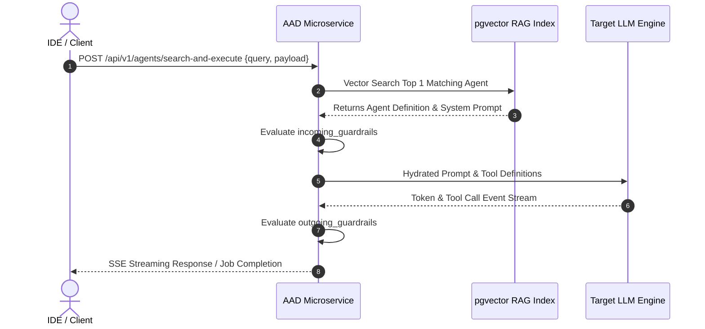

# Agent Registry & Execution Engine PRD

## Overview
The **Agent Registry & Execution Engine** in **Agent-As-Data (AAD)** treats AI agents as declarative, queryable, version-controlled database records rather than hardcoded imperative logic. It provides dynamic agent serving, version history, RAG discovery, and execution runtimes with strict incoming/outgoing guardrail enforcement.

## Core Capabilities

### 1. Declarative Agent Storage, Versioning & Access Control
- **Agent Specification**: Stores `name`, `description`, `tags`, `agent_definition` (system prompt/persona), `model` config, `attached_tools`, `attached_skills`, `attached_agents`, `incoming_guardrails`, and `outgoing_guardrails`.
- **UI Consistency & Viewport Scrolling**: The Edit views for Traits, Tools, Skills, and Agents must display Name, Owner, Description, and Tags as the top lines on the view, maintaining consistent labels across all 4. Sidebar lists of cards (e.g. skills list on `/skills` or agents on `/agents`) must scroll independently in an isolated container without scrolling the global page or top bar.
- **Ownership & Group-Based Access Control (RBAC)**:
  - `owner_id` (UUID): Primary user or service account owner.
  - `read_groups` (TEXT[]): Array of group names / IDs granted read & discovery access.
  - `write_groups` (TEXT[]): Array of group names / IDs granted modification, refactoring, and deletion permissions.
  - `execute_groups` (TEXT[]): Array of group names / IDs permitted to run/execute the agent.
- **RBAC Delegation Context Inheritance**: When Agent A delegates to Agent B, the caller's identity (`caller_identity`) is inherited. Child invocation is rejected (`423 Forbidden`) if caller identity lacks `execute_groups` access to Agent B. Pre-delegation guardrails sanitize secrets/PII before cross-team transfer.
- **Immutable Revisions**: Any modification increments the agent's version counter and creates an immutable snapshot in `agent_revisions`, ensuring execution determinism.

### 2. Agent Traits, 3-Element Definition & Trait-Inherited Guardrails
- **3-Element Agent Trait Specification (`implements_traits`)**: Agents declare adherence to abstract traits (e.g. `CodeReviewer`, `SecurityAuditor`, `Compiler`). Traits are authored independently from data-type schemas via three core elements:
  1. *Capability Requirements*: Necessary tools, state access, or environmental interaction permissions (e.g. AST parser, read-only repo access).
  2. *Behavioral Invariants*: Strict rules and constraints the agent MUST ALWAYS or MUST NEVER violate (e.g. *MUST NEVER execute untrusted binaries*).
  3. *Evaluation Criteria*: Semantic guidelines and scoring rubrics for LLM judges or evaluators to grade performance.
- **Inherited & Mandatory Trait Guardrails**: Traits attach mandatory pre-execution and post-execution guardrails. When an Agent implements a Trait, it automatically inherits the Trait's baseline guardrails alongside any Agent-specific guardrails.
- **Semantic Compatibility Verification**: When an agent references a concrete sub-agent or trait implementation, AAD executes a semantic similarity and contract check (`POST /api/v1/agents/verify-contract`):
  - *Conceptual Fit Check*: Verifies vector similarity (`pgvector`) between the referring agent's prompt intent and the referenced agent's capabilities to ensure the sub-agent conceptually "fits".
  - *Trait Contract Validation*: Ensures the referenced agent satisfies required capability requirements, behavioral invariants, and guardrail boundaries.
- **Dynamic Contract Negotiation & Fallback Resolution**: Trait resolution uses Depth-First Search (DFS) topological cycle detection (`ERR_CIRCULAR_DELEGATION`). If a user's custom `trait_mappings` fail contract verification, AAD attempts fallback negotiation to default trait agents or rejects with `422 Unprocessable Entity` in strict mode.

### 3. Remote Tool Agent Registration & Schema Caching
- **External Tool Ingestion**: Endpoint `POST /api/v1/agents/tools/register` registers external tools (Stdio command or SSE URL transport).
  - Automatically queries `tools/list`, `resources/list`, and `prompts/list` from the remote server upon registration.
  - Caches tool definitions, input/output JSON schemas, type information, and description metadata into the database's `tools` table JSONB.
- **RAG Discovery Integration**: Generates vector embeddings (`pgvector`) for parsed tools and prompts, enabling dynamic RAG discovery (`POST /api/v1/agents/search`) of remote tools alongside native declarative agents.
- **Background Sync Cache**: Periodic background refreshes re-query remote tool capabilities to ensure definitions remain up to date.

### 2. Semantic RAG Discovery
- **Vector Embeddings**: Generates embeddings for agent definitions and tags in `agent_embeddings` (`pgvector`).
- **Prompt Search**: Endpoint `POST /api/v1/agents/search` returns the top `n` most relevant agents for a natural language task description.

### 3. Execution Engine & Guardrails
- **Synchronous / Streaming**: Immediate execution (`POST /api/v1/agents/:id/execute`, `POST /api/v1/skills/:id/execute`, and `POST /api/v1/agents/search-and-execute`) streaming output tokens and tool calls via SSE.
- **Asynchronous Execution Jobs**: Job queue creation (`POST /api/v1/executions`) and status tracking (`GET /api/v1/executions/:id`) for long-running agent workflows.
- **AI Execution via Rig & Local Ollama Runtime**:
  - The backend integrates `rig-core` with the Ollama provider (`rig_core::providers::ollama::Client`).
  - Configured for local testing against Ollama (`http://localhost:11434` or environment-configured `OLLAMA_API_BASE_URL`), defaulting to `qwen2.5-coder:14b` (or the model declared in the agent's `model` field).
  - Injects the agent's `agent_definition` (system prompt) or skill's `definition` as the completion instructions, passing the user prompt through Rig's completion agent pipeline.
  - Returns the final LLM response text along with execution logs and guardrail validation status for live developer inspection.
### 4. Agent Refactoring & Compression Engine
- **Overlap & Duplication Detection**: Vector similarity scans across `agent_embeddings` identify candidate clusters of overlapping, duplicate, or conflicting agents (`POST /api/v1/agents/refactor/analyze`).
- **Conflict Resolution & Harmonization**: Analyzes candidate agent definitions to identify:
  - *Redundant Agents*: Merges duplicate agent prompt capabilities into unified master definitions.
  - *Unintended Contradictions*: Harmonizes conflicting system prompts, tool bindings, or guardrail rules.
  - *Deliberate Contradictions*: For agents intentionally designed with opposing viewpoints (e.g. `optimist-reviewer` vs `pessimist-security-auditor`), updates definitions to explicitly highlight the deliberate contrast and re-defines input/output payloads so they harmoniously co-exist.
- **Automated Versioning**: Applied changes create new version records in `agent_revisions`, preserving historical lineage.

### 5. Agent Network & Relationship Visualization Engine
- **Delegation & Skill Graph Generation**: Endpoint `GET /api/v1/agents/visualize` (or `GET /api/v1/agents/:id/visualize`) traverses the `attached_agents` sub-agent hierarchy and `attached_skills` bindings.
- **Dual Representation Output**: Returns the relationship graph in both formats in a single API response payload:
  - **`mermaid` (String)**: Renderable Mermaid flowchart diagram (e.g. `graph TD; AgentA -->|delegates| AgentB`).
  - **`graph_json` (JSON Object)**: Structured nodes and edges representation (`{ "nodes": [...], "edges": [...] }`) for programmatically rendering custom UI network graphs.

### 6. Probabilistic Agent Unit Testing & LLM-as-a-Judge Evaluation Engine
- **Declarative Test Suite Registration**: Agents can store associated test suites (`agent_test_suites` table) containing input payloads, expected output criteria, and assertion strategies.
- **Dual Evaluation Strategy**:
  - *1. Deterministic Schema & Guardrail Checks*: Validates input/output JSON schema compliance, required keys, regex patterns, and guardrail pass rates.
  - *2. Probabilistic LLM-as-a-Judge Evaluation*: Uses an independent evaluator agent persona ("Judge Agent") to assess probabilistic outputs against natural language rubrics (e.g. accuracy, tone, safety, constraint adherence) scoring 0.0 to 1.0.
- **Regression Detection & CI/CD Gates**: Endpoint `POST /api/v1/agents/:id/test` runs test suites against new agent prompt iterations. If pass rate or Judge scores fall below configurable thresholds (e.g., `score < 0.85`), modification is flagged as a regression and blocked from updating `agent_revisions`.
- **Test History Audit**: Test execution runs and Judge evaluation rubrics are persisted in `agent_test_runs` for auditability across version iterations.

### 7. Agent & Tool Usage Audit Logging Subsystem
- **Execution & Tool Call Telemetry**: Automatically records structured audit telemetry into `agent_usage_logs` whenever an agent is discovered, invoked, or executes a native/remote tool call.
- **Logged Attributes**:
  - `agent_id` & `agent_version`: Specific agent revision executed.
  - `caller_identity`: User ID, service account, or referring parent agent UUID.
  - `tool_calls` (JSONB): List of tools invoked, including tool name, arguments, execution duration (ms), status code, and error trace.
  - `token_metrics` (JSONB): Prompt tokens, completion tokens, total tokens, and estimated cost.
  - `guardrail_events` (JSONB): Pass/fail status of pre-execution (`incoming_guardrails`) and post-execution (`outgoing_guardrails`) checks.
- **Audit & Analytics APIs**: Endpoints `GET /api/v1/agents/:id/logs` and `GET /api/v1/analytics/usage` for querying tool invocation frequencies, token consumption trends, error rates, and caller activity.

### 8. Managed Skills Registry, Builder & Lifecycle Engine
- **Dedicated Skills Registry (`skills` Table)**: Managed database repository for deterministic, single-purpose skills (`name`, `description`, `input_schema`, `output_schema`, `implementation`). Agents bind to skills via `attached_skills`.
- **Skill vs. Agent Distinction**:
  - *Skills*: Direct, single-purpose execution routines without autonomous reasoning loops or sub-agent delegation.
  - *Agents*: Autonomous reasoners with system prompts, guardrails, dynamic tool choice, and sub-agent delegation.
- **Full Skills CRUD APIs**: 
  - `GET /api/v1/skills` — Lists all registered skills (with optional tag and name filter).
  * `GET /api/v1/skills/{id}` — Fetches the complete specification of a skill.
  * `POST /api/v1/skills` — Registers a new skill.
  * `PUT /api/v1/skills/{id}` — Updates an existing skill's schemas, tags, or execution template.
  * `DELETE /api/v1/skills/{id}` — Deletes/archives a skill.
- **Skill <-> Agent Lifecycle Actions**:
  - **Skill -> Agent Promotion (`POST /api/v1/skills/:id/promote`)**: Converts a growing skill into a full declarative agent, creating an `agent_definition`, wrapping it in guardrail defaults, and deprecating the original skill.
  - **Agent -> Skill Demotion (`POST /api/v1/agents/:id/demote`)**: Simplifies a prompt-wrapped agent down to a single-purpose deterministic skill entry.
- **Developer Guidance API (`GET /api/v1/skills/guidance`)**: Provides actionable feedback to developers on whether a proposed capability should be built as a Skill or an Agent based on complexity metrics.
- **Skills Registry & Builder UI**:
  - **Skills Registry**: An interactive UI dashboard showcasing registered skills, filtering by tag, search capabilities, and usage stats.
  - **Skills Builder**: A schema-driven editor enabling developers to construct and configure new skills, define deterministic input/output JSON schemas, configure code/MCP implementation templates, and trigger lifecycle actions (Promote/Demote) directly from the interface.

### 9. Distributed State Synchronization & Working Memory Persistence Subsystem
- **Three-Tier Memory Persistence**:
  - *Tier 1 (In-Memory)*: Transient working context during active LLM token generation loops.
  - *Tier 2 (Optimistic Concurrency Control - OCC)*: Working memory snapshots stored in PostgreSQL `executions.working_memory` (JSONB) with version locking (`execution_version`), rejecting stale writes during parallel sub-agent executions.
  - *Tier 3 (Append-Only Event Stream)*: Immutable audit telemetry in `agent_usage_logs`.
- **Transactional State Locking**: Critical guardrail transitions acquire temporary distributed locks on `execution_id` to guarantee single-writer safety across distributed agent workers.

### 10. Agent Network Compilation & Conceptual Validation Engine
- **Validation & Compilation API (`POST /api/v1/agents/compile` or `POST /api/v1/agents/:id/validate`)**: Performs pre-flight structural, semantic, and contractual verification across an agent network prior to execution deployment.
- **Verification Phases**:
  1. **Structural DAG Topology Verification**: Scans `available_agents` delegation trees for circular reference deadlocks, infinite loops, and unresolvable missing sub-agent UUIDs/traits.
  2. **Schema & Guardrail Contract Matching**: Verifies that outgoing response JSON schemas from parent agents align with incoming request JSON schemas and guardrail boundaries of child sub-agents.
  3. **Conceptual Cohesion & Semantic Fit Scoring**: Executes cosine similarity vector scans (`pgvector`) across parent and sub-agent prompt definitions to ensure sub-agents conceptually fit the referring domain context (flagging semantic mismatches).
- **Compilation Report & Diagnostics**: Returns a detailed compilation status (`status: "clean"` or `status: "compilation_errors"`) with line-level warning diagnostic messages (e.g. `ERR_CIRCULAR_DELEGATION`, `WARN_LOW_SEMANTIC_FIT`, `ERR_SCHEMA_MISMATCH`).

### 11. Architectural Safeguards, HaMS & Fail-Fast Validation
- **HaMS Health & Metrics Sidecar (`hams`)**: Serves out-of-band health probes (`/hams/alive` liveness, `/hams/ready` readiness) and Prometheus metrics (`/metrics`) on dedicated port `8079`.
- **Fail-Fast Early Startup Validation**: Application configuration, YAML environment overrides, secret files, database connectivity, and required `pgvector` extensions are validated **at process startup** before opening the main webservice listener (`8080`). Invalid configs or missing database extensions abort immediately with diagnostic error logs (failing fast).
- **Decoupled Job Queue**: Asynchronous background agent runs are isolate-tracked in the `executions` table, preventing long-running agent tasks from blocking vector discovery endpoints.
- **Deterministic Version Snapshots**: All executions bind to explicit `version` snapshots in `agent_revisions`, guaranteeing that agent behavior remains immutable even if an agent prompt is edited mid-task.
- **Guardrail Interceptors**: Strict pre-submission (`incoming_guardrails`) and post-execution (`outgoing_guardrails`) validation steps block malformed JSON or prompt injection attacks.
- **Reversible Schema Rollback**: All agent and execution schema migrations (`agents`, `agent_revisions`, `executions`, `skills`, `tools`) require paired forward (`.up.sql`) and reverse (`.down.sql`) scripts to guarantee safe rollbacks.

## User Journeys: Execution & Automated Testing

### Journey 1: Programmatic Trait Constraint & Guardrail Testing
**Scenario**: An automated CI script needs to verify that an agent correctly respects its inherited Trait constraints and guardrails when evaluating an ambiguous request.
1. The CI test queries the registry for the agent and determines the expected strict Trait behaviors (e.g. MUST NEVER expose PII).
2. It sends a series of edge-case payloads to `POST /api/v1/agents/:id/execute` with malicious or borderline inputs.
3. The LLM processes the input, but the `rig-core` powered backend intercepts the response based on the `outgoing_guardrails`.
4. The test verifies that the system appropriately blocks or sanitizes the output, returning a structural diagnostic failure to the caller instead of the raw LLM response.

### Journey 2: Automated Skill and Agent Evaluation via LLM-as-a-Judge
**Scenario**: A deployment gate in a CI/CD pipeline ensures that a newly promoted Agent performs better or equal to the deterministic Skill it replaced.
1. The pipeline triggers `POST /api/v1/agents/:id/test` for the newly promoted agent.
2. The engine first validates that the new agent's JSON output strictly conforms to the original Skill's expected schema (Deterministic Schema & Guardrail Check).
3. The engine then passes the probabilistic output to a designated "Judge Agent" (LLM-as-a-Judge) which evaluates the qualitative accuracy and reasoning trace.
4. The test passes if both the deterministic schema assertion and the probabilistic Judge score exceed the defined threshold (e.g. >0.85), allowing promotion to production `agent_revisions`.

## Agent Execution Pipeline

## Related PRDs & Specs
- [Agent-As-Data Core PRD](./agent-as-data-prd.md)
- [Knowledge & Data System PRD](./knowledge-data-system-prd.md)
- [Detailed Schema Specification](../specs/agent-schema-spec.md)

## UI Behavior Updates

- The **Register New** buttons for **Agents**, **Tools**, and **Traits** now initialize a fresh form without performing a router navigation. This eliminates the brief screen flicker previously observed when creating new items.
- Existing UI flows remain unchanged; the form state is reset and ready for input, improving user experience and stability.
