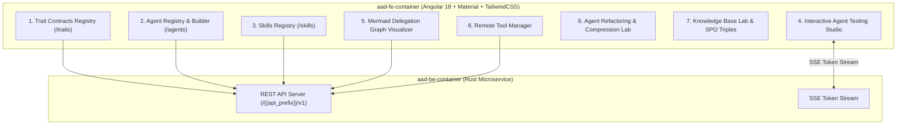
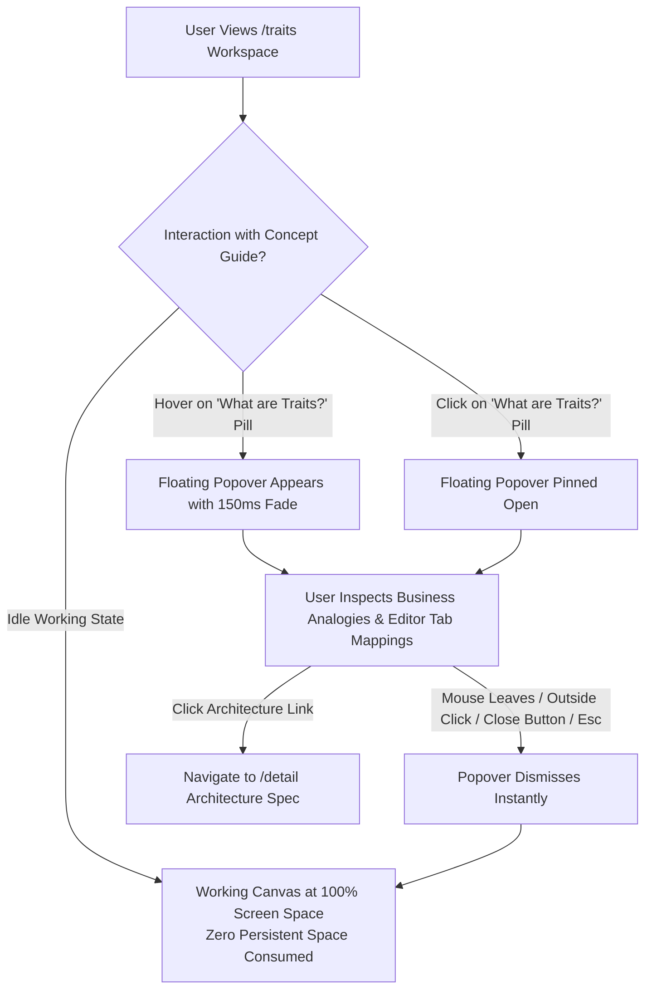

# Agent Development UI & Testing Kit PRD

## Overview
The **Agent Development UI & Testing Kit** provides an interactive web dashboard for developing, testing, visualising, refactoring, and debugging declarative AI agents and project memory stored in **Agent-As-Data (AAD)**.

Built using **Angular 18+ (Standalone Components, Angular Material, RxJS, and TailwindCSS)** following the architectural container patterns established in `sward-warden/sw-fe-container`, this container serves as the primary visual IDE and testing studio for agent developers.

---

## Architecture & Container Structure

Following `sward-warden`, the frontend is containerized in `aad-fe-container`:



## UI Consistency & Standard Global Navigation

### Global Top Bar & Navigation Menu Specification
All views across the application must share an identical, standardized top bar (`h-14 bg-white border-b border-slate-200 shadow-sm`) and navigation menu to ensure a seamless, uniform developer experience:
- **Left Context / Title Area & Quick View Switcher**: Displays a pill badge/container with the module icon, current workspace name (e.g. `Agents Registry`, `Traits Registry`, `Skills Registry`, `Workbench`, `Interactive Testing Studio`, `Knowledge & SPO Tuple Inspector`), and an interactive dropdown affordance (`expand_more` or `unfold_more`):
  - **Click-to-Switch Navigation**: Clicking directly on the view title or icon opens a dropdown menu (`matMenu`) listing all available platform workspaces with their canonical icons and labels, enabling instant one-click switching directly from the title.
  - **Visual Affordance**: Styled with smooth hover feedback (`hover:bg-slate-100/80 px-2 py-1 -ml-2 rounded-lg cursor-pointer transition-colors select-none flex items-center gap-1.5`) and subtle chevron indication so developers immediately discover that the current view title is a navigation switcher.
- **Zero-Footprint Concept Guide Standard**: Positioned directly adjacent to the workspace title across all core platform views as an interactive trigger pill (`[help_outline] What are [Concepts]?`):
  - **Zero Persistent Footprint**: Never consumes, shrinks, or shifts the active working canvas or editor scroll area (`flex-1 min-h-0 overflow-y-auto`).
  - **Interactive Popover Modes**: Hovering displays the floating card with a 200ms debounce; clicking pins the popover open until explicitly closed, dismissed by outside click, or by pressing `Esc`.
  - **Educational Content Hierarchy**:
    1. **Business Analogy**: Plain-English mental model (e.g., Hiring Job Certifications, Digital Teammates, Standard Operating Procedures, Project Rooms, Pre-Production Sandbox).
    2. **Functional Mapping**: Direct 3-part mapping to the view's specific form tabs, schema panels, or execution consoles.
    3. **Architecture Bridge**: Contextual link to `/detail` (`Explore [Domain] Architecture →`) for engineering specifications.
  - **Reusable Component Architecture**: Implemented as a standalone, reusable Angular component (`<app-concept-guide>`) accepting typed configuration for badge, title, icon, trigger label, analogy, tab mappings, and architecture links to guarantee 100% visual and behavioral parity across all views.
- **Primary View Action (Left of Menu)**: Contextual creation button styled consistently with a solid fill (`mat-flat-button color="primary"`), e.g., `+ New Trait`, `+ New Skill`, `+ New Agent`, or `+ New Thread`. Clicking this initializes a clean form in-place without triggering full route reloads.
- **Secondary View Actions**: A secondary action button (`Sync Embeddings`) located on the top bar for both the Agent Registry and Skills Registry views. This action triggers the synchronization of the respective entity's embeddings into the vector database.
- **Global Navigation (Hamburger Menu)**: An `appMenu` triggered by a standard hamburger icon (`menu`) providing one-click routing across all top-level workspaces:
  - `verified` -> `/traits` (Trait Contracts)
  - `dns` -> `/tools` (Tools)
  - `extension` -> `/skills` (Skills)
  - `app_registration` -> `/agents` (Agents)
  - `bug_report` -> `/interactive-testing` (Interactive Testing Studio)
  - `account_tree` -> `/network-visualizer` (Network Graph Visualizer)
  - `build_circle` -> `/refactoring-lab` (Refactoring & Compression Lab)
  - `library_books` -> `/knowledge-inspector` (Knowledge & SPO Tuple Inspector)
  - `search` -> `/agent-context` (Agent Context View)
  - `work` -> `/workbench` (Workbench)
- **Top Bar Secondary Controls**: Divider line, layout/view toggle icon (`view_column`), and user profile avatar badge (`BG`).

### Appearance & Styling Uniformity
- **Layout Consistency**: 2-column split view across all major registries and studios (collapsible sidebar list with search/filter on the left, full edit/blueprint or execution workspace on the right).
- **Form Layout Standard**: For Traits, Tools, Skills, and Agents edit views, the fields `Name`, `Owner`, `Description`, and `Tags` must be presented as the top lines on the view with consistent labels (`Name`, `Owner`, `Description`, `Tags`).
- **Card Parity**: Sidebar cards across Agents, Skills, Tools, and the Interactive Testing Studio must share unified card styling (icon, title, version/meta tags, description snippet, and attached items summary badges like `N Skills` / `N Tools`).

### Conceptual & Descriptive Consistency Standard
A primary goal of the Agent-As-Data Studio is **absolute consistency across the application, particularly in how domain concepts, workflows, and entities are described**:

- **Unified Mental Models Across All Surfaces**: When describing domain entities across the application (on the `/home` onboarding overview, `/detail` architecture specification, top bar concept guides, form field hints, tooltips, and documentation), descriptions must reinforce an identical set of canonical metaphors and avoid confusing jargon drift.
- **Canonical Concept Lexicon & Analogies**:
  1. 📚 **Knowledge Base & Inspector (`/knowledge-inspector`)**: **"Company Brain & Institutional Memory"** — A single searchable truth consolidating documents, guidelines, and graph relationships so AI teammates never hallucinate.
  2. 🛡️ **Traits (`/traits`)**: **"Job Roles & Safety Rules"** — The *Hiring & Certification* analogy: verifiable credentials that specify approved tools, unbreakable corporate policy rules, and automated data protection guardrails.
  3. 🤖 **Agents (`/agents`)**: **"Digital Teammates"** — Autonomous worker personas with specialized prompts, assigned skills, tools, and required/implemented Traits.
  4. 🧩 **Skills (`/skills`)**: **"Standard Operating Procedures (SOPs)"** — Reusable, deterministic capability packages with typed schemas that any agent can execute.
  5. 💬 **Workbenches (`/workbench`)**: **"Active Project Rooms"** — Sandboxed collaboration spaces with isolated filesystems and continuous conversational threads for multi-turn execution.
  6. 🧪 **Testing Studio (`/interactive-testing`)**: **"Pre-Production Sandbox"** — Safe staging ground to preview outputs, inspect prompt guidelines, and verify trait compliance before going live.
  7. 🕸️ **Network Graph (`/network-visualizer`)**: **"Org Chart & Delegation Map"** — Interactive visualization of team hierarchies and trait interface relationships.
  8. 🛠️ **Refactoring Lab (`/refactoring-lab`)**: **"AI Governance & Quality Control"** — Automated detection of duplicate agents, overlapping skills, and rule contradictions.
- **Zero Descriptive Divergence**: If an entity is described using a specific mental model on `/home`, every other view in the system (including top bar concept popovers and contextual help) must reinforce and build upon that exact same mental model rather than introducing competing synonyms or disparate framing.

- **Interactive Testing Studio Alignment with Skills Layout**:
  - **Collapsible Sidebar**: Left-hand target entity selector with smooth collapse/expand toggle (`w-72` expanded / `w-16` collapsed) matching Skills Registry navigation.
  - **Entity Filter & Search**: Pinned search input filtering across both agents and skills.
  - **Entity Context & Prompt Inspector**: Selection of an agent or skill displays the entity's full **Description** and **System Prompt / Definition** (`agent_definition` for agents, `definition` for skills) in an inspectable, collapsible card directly within the testing workspace so developers can reference instructions while testing.
  - **Unified Visual Hierarchy**: Consistent top action bar, status badges, and Material styling.
- **Independent Card List Scrolling & Viewport Isolation Standard**:
  - **Fixed Viewport Shell**: The global application shell (`app-root`, `html`, `body`, and `router-outlet + *`) is strictly locked to `100%` viewport height with `overflow: hidden`, preventing the outer page, browser window, or top navigation bar from ever scrolling.
  - **Isolated List Scrolling**: Any collection or list of objects/cards (including sidebar lists on `/skills`, `/agents`, `/traits`, `/tools`, `/workbench`, and `/network-visualizer`, cluster/redundancy columns in `/refactoring-lab`, entity selectors in `/interactive-testing`, RAG chunk results, and SPO tuple results in `/knowledge-inspector`) must be contained in a dedicated scroll container (`flex-1 min-h-0 overflow-y-auto`).
  - **User Interaction Expectation**: When a user hovers their mouse over a list of cards (e.g. the list of skills on `/skills` or target entities on `/interactive-testing`) and scrolls with their mouse wheel or trackpad, only the list of cards scrolls vertically. The top bar, search bar, and opposite workspace pane remain entirely stationary.
  - **Detail Form & Inner Container Scrolling**: The main detail/editor workspace pane independently scrolls its own form content when required without bubbling scroll events to the outer viewport shell.

---

## Key UI Modules & Features

### 0. Home Page Landing (`/` and `/home`)
- **Casual Business User Orientation & Single-Occurrence Link Standard**:
  - **Conceptual Simplification Rule**: To avoid confusing cognitive clutter and decision paralysis, **every destination link on the landing page is represented strictly once**. Redundant duplicate buttons across headers, heroes, and footer lists are eliminated in favor of a clean, linear story.
  - **Plain-English Business Value Proposition**:
    - Explains the core business problem: Institutional wisdom is scattered across wikis, emails, and heads. Generic AI chats hallucinate, lack company context, and offer zero safety guarantees.
    - Presents the solution: Agent-As-Data is an **Enterprise AI Brain & Digital Teammate Studio** that transforms company memory into certified AI colleagues who follow strict corporate rules.
  - **4 Unified Sequential Gateway Pillars** (Each destination represented exactly once):
    1. 🧠 **Company Knowledge Base (`/knowledge-inspector`)**: Teach the AI your business. Ingest documentation, policies, and process playbooks into an interconnected organizational brain.
    2. 🛡️ **Job Roles & Safety Rules (`/traits`)**: Establish enforceable job certifications with **Traits**. Specifies approved tools, non-negotiable company policies, and automatic data protection.
    3. 💼 **Project Workbenches (`/workbench`)**: Dedicated project rooms where humans and AI teammates collaborate on files, documents, and multi-turn tasks in isolated environments.
    4. 🧪 **AI Testing Studio (`/interactive-testing`)**: Live preview sandbox where teams can test prompts and observe AI responses before deploying them on active projects.
  - **Single Bridge to Technical Architecture (`/detail`)**: A single, clean footer banner directing engineers and architects to the full technical blueprint, 5-phase data flow, and code contracts.

### 0b. System Architecture & Technical Deep-Dive (`/detail`)
- **Comprehensive Platform Architecture Orientation**: Dedicated route providing an exhaustive technical map of the Agent-As-Data system:
  - **5-Stage System Workflow Lifecycle**: End-to-end data flow (Knowledge & Context $\rightarrow$ Declarative Specs $\rightarrow$ Governance $\rightarrow$ Verification $\rightarrow$ Workbench Execution).
  - **Trait Contracts Deep-Dive ("Interfaces for Autonomous AI")**:
    - The problem: Brittle hardcoded agent UUIDs, prompt drift, zero security guarantees.
    - The solution: Decoupled behavioral contracts with abstract delegation (`uses_traits`) and dynamic binding (`implements_traits`).
    - The 4 pillars: Capability Requirements, Behavioral Invariants, Evaluation Rubrics, and Inherited Baseline Guardrails.
  - **10 Core Workspaces Launchpad Matrix**: Detailed responsive cards with capability tags and direct routing for all platform modules (`/workbench`, `/agents`, `/traits`, `/skills`, `/tools`, `/interactive-testing`, `/network-visualizer`, `/refactoring-lab`, `/knowledge-inspector`, `/agent-context`).
  - **Platform Operational Guarantees**: Highlights fail-fast configuration, immutable version lineage, strict entity referencing, and distributed run safety.

### 1. Declarative Agent Registry & Builder Module (`/agents`)
- **Visual Agent Editor**: Form fields for `name`, `description`, `tags`, `implements_traits`, `uses_traits`, `model`, `agent_definition` (system prompt), `tools`, `available_skills`, and `available_agents`.
  - **`implements_traits`**: Traits this agent actively implements/satisfies.
  - **`uses_traits`**: Traits this agent depends on or delegates to (without implementing them).
  - **Active Trait Filtering & Hover Descriptions**: Search filter for active implemented traits and tooltips displaying contract descriptions on hover.
- **Skill & Tool Count on Cards**: Agent sidebar cards display `N Skills` and `N Tools` counts to provide at-a-glance dependency insight.
- **Guardrail Configurator**: Visual JSON/rule builder for `incoming_guardrails` and `outgoing_guardrails`.
- **RBAC Group Assignment**: Interface to select `owner_id`, `read_groups`, `write_groups`, and `execute_groups`.
- **Version Lineage Viewer**: Inspect historical snapshots from `agent_revisions` with visual side-by-side diffing.

### 2. Skills Registry Module (`/skills`)
- **Visual Skill Editor**: Form fields for `name`, `description`, `tags`, `definition` (instructions), `implements_traits`, `uses_traits`, `attached_tools`, and `attached_skills`.
- **Skill & Tool Count on Cards**: Skill sidebar cards mirror the agent card layout — displaying `N Skills` and `N Tools` counts for at-a-glance dependency insight (consistent UI parity with the Agent Registry).
- **Promote to Agent**: One-click `POST /{{api_prefix}}/v1/skills/:id/promote` converts a skill into a full declarative agent.
- **Schemas & Mappings Tab**: Dedicated sub-tab for editing `input_schema`, `output_schema`, and `implementation` (JSONB) configuration.

### 3. Trait Contracts Registry (`/traits`)
- **Trait Definition Editor**: CRUD workspace for `name`, `description`, `owner_id`, `capability_requirements`, `behavioral_invariants`, `evaluation_criteria`, `tags`, and `guardrails`.
- **Idempotent Create**: Trait creation uses upsert semantics (`ON CONFLICT (name) DO UPDATE`) so duplicate names update in place rather than failing with a constraint error.
- **Sync with Backend**: Trait editor actions (create, update, delete) are verified by integration tests (`test_journey_11_trait_editor_ui.robot`) to confirm UI and backend remain in sync.

#### Zero-Footprint Concept Reinforcement ("What are Traits?")
To bridge the mental model between the business-level descriptions introduced on `/home` and the operational contract builder on `/traits`, the Trait Registry exposes an on-demand concept guide that reinforces core mental models **without consuming or shrinking any active working real estate**:

- **Zero Working Area Loss**: The workspace area (`flex-1 min-h-0 overflow-y-auto p-6`) retains 100% of its vertical and horizontal dimensions. No static top banners, sticky alerts, or push-down cards are added to the primary editor viewport.
- **Top Bar Anchor**: Positioned directly adjacent to the `Traits Registry` header title as an interactive trigger pill (`[help_outline] What are Traits?`).
- **Interactive Floating Overlay / Popover**:
  - **Hover & Click Modes**: Hovering over the trigger pill smoothly reveals the floating card with a 150ms debounce; clicking pins the popover open until explicitly closed or dismissed via outside click or `Esc`.
  - **Card Content Architecture**:
    - **Header & Analogy**: Re-articulates the certified hiring analogy: *"Think of Traits like verified job certifications. They define what tools the AI is allowed to touch, what company policies it must never violate, and what data protection guardrails stay active."*
    - **Tri-Fold Mapping to Editor Tabs**: Directly maps each plain-English benefit to the 3 functional blueprint tabs of the Trait editor:
      1. 🛠️ **Capability Requirements**: Tools, state access, and environmental interactions the agent must possess.
      2. 🛡️ **Behavioral Invariants**: Unbreakable corporate policy rules the agent MUST ALWAYS or MUST NEVER violate.
      3. 🔒 **Evaluation Criteria & Guardrails**: Scoring rubrics, judging criteria, and automated safety fences.
    - **Technical Architecture Bridge**: Includes a direct link to `/detail` (`Explore Trait Contract Architecture →`) for architects requiring formal interface theory.




### 4. Interactive Agent Testing Studio (`/interactive-testing`)

```mermaid
flowchart TD
    subgraph TestingStudioLayout ["Interactive Testing Studio Layout (Skills Registry Alignment)"]
        subgraph LeftSidebar ["Left Sidebar (Collapsible: w-72 / w-16)"]
            SidebarHeader["Header + Collapse/Expand Toggle"]
            SearchInput["Search Filter (Agents & Skills)"]
            EntityList["Scrollable Entity Cards List\n(Name, Type, Version, Tags, N Skills / Tools)"]
        end
        
        subgraph RightWorkspace ["Right Workspace (Execution & Inspection)"]
            TopActionBar["Top Bar: Entity Title, Model Selector (e.g. qwen2.5-coder:14b), Status (IDLE/RUNNING), Execute Button"]
            
            subgraph EntityInspector ["Selected Entity Context & Prompt Inspector"]
                EntityDesc["Description Panel (Expanded metadata & purpose)"]
                PromptViewer["System Prompt / Definition Inspector\n(agent_definition / skill definition in formatted block)"]
            end
            
            subgraph ExecutionControls ["Execution & Streaming Console"]
                TestInputs["Prompt Input + Optional Webhook URL + Model Override"]
                TerminalLog["Dark Terminal Window (Real-time SSE token stream, logs, tool invocations)"]
                FinalOutputCard["Final LLM Output Inspector (Parsed output from LLM + Agent/Skill)"]
            end
        end
    end

    LeftSidebar -->|Select Agent or Skill| EntityInspector
    ExecutionControls -->|Execute Request| BackendAPI["POST /{{api_prefix}}/v1/agents/:id/execute\n(or /{{api_prefix}}/v1/skills/:id/execute)"]
    BackendAPI -->|Rig-Core + Local Ollama (qwen2.5-coder:14b)| LLMRuntime["Ollama Runtime (http://localhost:11434)"]
    LLMRuntime -->|SSE Token Stream & Final Text| TerminalLog
    LLMRuntime -->|Final LLM Response| FinalOutputCard
```

- **Skills-Aligned Layout & Styling**:
  - **Collapsible Entity Sidebar**: Responsive left panel (`w-72` expanded / `w-16` collapsed) with toggle control and scroll isolation.
  - **Entity Cards with Metadata Badges**: Renders unified card styling with icons (`smart_toy` for agents, `extension` for skills), name, version pills (`v1.0.0`), description snippets, and attached items badges (`N Skills`, `N Tools`).
- **Live Description & System Prompt / Definition Inspector**:
  - Automatically loads and displays the active entity's **Description** and full **Prompt / Definition** (`agent_definition` for agents, `definition` for skills).
  - Presented in an inspectable, collapsible context card with monospace formatting and easy copy/reference controls, allowing developers to inspect behavioral instructions and constraints directly alongside test executions.
- **Rig-Powered Execution with Local Ollama Integration**:
  - Execution requests dispatch to the backend execution engine powered by `rig-core`.
  - Configured to connect to the developer's local Ollama instance (`http://localhost:11434` / `OLLAMA_API_BASE_URL`), defaulting to models such as `qwen2.5-coder:14b` or the agent's defined model.
  - Injects `agent_definition` / `definition` as the system context prompt, passing the developer's test input through the Rig completion pipeline.
  - Directly supports executing both Agents and Skills, providing unified inspection across deterministic and reasoning entities.
- **Final LLM Output & Telemetry Inspector**:
  - Renders the complete, finalized output text from the LLM + Agent/Skill execution.
  - Accompanied by real-time SSE token streaming, status badges (`IDLE`, `RUNNING`, `COMPLETED`, `FAILED`), execution latency, and guardrail validation audit checks in the dark terminal console (`bg-slate-950`).
- **Dynamic Trait Mapping Overrides**: UI controls to override `trait_mappings` during test executions (e.g. mapping `trait:SecurityAuditor` to a custom test agent UUID).
- **Contract Verification Tester**: Live badge showing pass/fail status of `verify-contract` semantic fit and trait compatibility checks.

### 5. Agent Delegation Network Visualizer (`/network-visualizer`)
- **Interactive Mermaid / Canvas Graph**: Visualizes agent hierarchies, sub-agent delegation links (`available_agents`), and skill dependencies (`available_skills`).
- **Live Filtering**: Filter visual graph by trait interface, ownership group, or tag.

### 6. Agent Refactoring & Compression Lab (`/refactoring-lab`)
- **Overlap & Duplication Scanner**: Trigger cluster analysis (`POST /{{api_prefix}}/v1/agents/refactor/analyze`) to discover duplicate or conflicting agents.
- **Harmonization & Merge Diff Viewer**: Review suggested merges or deliberate contradiction labels before applying changes to `agent_revisions`.

### 7. Knowledge & SPO Tuple Inspector (`/knowledge-inspector`)
- **Hybrid Knowledge Search**: RAG vector query input (`POST /{{api_prefix}}/v1/knowledge/search`) displaying semantic chunk similarity scores alongside Subject-Predicate-Object relation tuples (`knowledge_tuples`).
- **Graph Traversal Tree**: Interactive multi-hop entity graph visualizer.

### 8. Remote Tool Manager (`/tools`)
- **Tool Ingestion & Server Registration**: Form to register external MCP servers via stateless HTTP POST JSON-RPC 2.0 (`POST /{{api_prefix}}/v1/agents/tools/register`), architected for seamless routing across Istio Ingress Gateways and Kubernetes services. Eagerly validates connectivity and fetches tool capabilities on submission.
- **Cached Tool & Schema Browser**: Inspect discovered tool listings, parameter schemas (JSON Schema v7), descriptions, and type signatures retrieved from remote servers.
- **Freshness & Manual Sync Trigger ("Sync Now")**: Action button on each tool card triggering `POST /{{api_prefix}}/v1/agents/tools/:id/sync` to instantly re-query the remote server for new or updated tools.
- **Sync Health & Status Indicators**: Visual status pills indicating synchronization state (`synced` [green], `syncing` [blue spinner], `degraded / failed` [amber/red with tooltip displaying `last_sync_error`]) and human-readable `last_synced_at` timestamp.
- **Pre-configured Sample MCP Server**: Quick-fill or pre-configured target pointing to the dedicated sample container `aad-mcp-container` (`http://localhost:8082/mcp` or `http://agent-as-data-mcp:8080/mcp`) exposing the `hello` verification tool.

### 9. Workbench (Benches, Threads & Workspace Memory) (`/workbench`)
- **Bench-Scoped Workspace Model**:
  - The Workbench operates under a hierarchical **Bench** project structure. Each Bench owns an isolated filesystem directory (`/tmp/workspace/benches/<bench_id>`) and encapsulates multiple conversation threads and shared working memory.
  - Detailed architecture and interactions are specified in [Workbench Benches, Threads & Workspace Memory PRD](./workbench-bench-thread-prd.md).
- **Navigation & Layout**:
  - **Top Bar Context & Breadcrumb**: Displays an active Bench pill badge and breadcrumb navigation (`Workbench > <Bench Name> > <Thread Title>`).
  - **Left Sidebar**:
    - **Header**: Scoped Bench Switcher dropdown with inline `+ New Bench` (no modals) and inline rename (`edit` pencil).
    - **Threads List**: Searchable thread cards strictly scoped to the active Bench, supporting inline creation (`+ New Thread`), inline renaming, and safe two-step inline deletion.
  - **Right Workspace**: Resizable split-pane area containing:
    - **Conversation Pane (Left)**: Conversational chat interface for the active thread with click-to-edit header title.
    - **Editor & Memory Pane (Right)**: Multi-tab workspace featuring `[ Files ]` (shared bench filesystem explorer and editor) and `[ Bench Memory ]` (developer scratchpad and project invariants editor).
  - **Smart Routing**: URL schema `/workbench/:benchId/:threadId` with automatic forwarding to the most recent Bench and Thread when visiting `/workbench`.

### 10. Agent Context View (`/agent-context`)
- **Semantic Entity Search**: A dedicated text input field allowing the user to provide natural language context. Upon pressing Enter, the view performs a RAG-type semantic search against the vector database.
- **Matching & Scoring**: The system scores the separated embeddings (name, description, prompt) and picks the best matching Agents and Skills.
- **Trace Depth Selection**: Provides a trace depth style tool (similar to the network graph analyzer) to configure and select the total number of Agents and Skills returned by the search.
- **Match Feedback & Reasoning**: For each returned Agent and Skill, the view displays detailed feedback explaining the semantic similarity match, the calculated score, and reasoning on why it is a good fit for the provided context.

### 11. Robot Framework Integration Testing Suite (Ref: `sward-warden/integration-tests`)
- **Declarative User Journey Robot Tests**: `/integration-tests/tests/*.robot` test cases mapping 1-to-1 to all 12 user journeys, covering 24 tests total (all currently passing).
- **Python Integration Libraries**: Custom Python helper modules (`AADRequests.py`) extending Robot Framework for authenticated REST requests, database seeding, and state verification.
- **Idempotent Seed Test**: `test_seed_exemplar_data.robot` seeds the database with exemplar data using upsert semantics — safe to re-run at any time without constraint conflicts.
- **UI Journey Tests (Playwright/Browser Library)**: `test_journey_11_trait_editor_ui.robot` drives a headless Chromium instance to verify the Trait Editor UI lifecycle (create, persist, delete) in sync with the backend REST API.
- **Local Dev & Garden Test Runners**: `run-tests-local.sh` local pre-flight runner verifying backend (`http://localhost:8080`) and frontend (`http://localhost:4200`) before running `robot` suites, integrated into Kubernetes via `garden.yml` (`kind: Test`).

---

## User Journeys: Testing Agents, Skills & Traits via UI

### Journey 1: Interactive Agent & Skill Testing via Playground
**Scenario**: A developer finishes modifying an agent's system prompt or a skill's instructions and wants to verify its behavior before saving.
1. The developer navigates to the **Interactive Agent Testing Studio** (`/interactive-testing`).
2. They select the agent or skill from the collapsible left sidebar list.
3. The right workspace displays the entity's complete **Description** and **System Prompt / Definition** (`agent_definition` or `definition`) in an inspectable panel, allowing the developer to examine the exact active prompt guidelines during the test.
4. The developer provides a test input payload and clicks **Execute**.
5. The UI opens a real-time SSE stream, passing the input to the backend, which is powered by the `rig-core` LLM integration.
6. Tokens are streamed back to the dark terminal window in real-time alongside tool call invocations, reasoning logs, and guardrail statuses.

### Journey 2: Trait Contract Verification Testing
**Scenario**: A developer has built a new agent that is intended to map to the `SecurityAuditor` trait and wants to test if it satisfies the contract.
1. In the **Interactive Agent Testing Studio**, the developer sets up a dynamic trait mapping, overriding the `SecurityAuditor` trait with the new agent's UUID.
2. Before execution, the UI invokes `POST /{{api_prefix}}/v1/agents/verify-contract`.
3. The live verification tester displays a pass/fail badge indicating if the semantic fit and compatibility checks succeeded, preventing a full run if the contract fails.

### Journey 3: Skill Execution Determinism vs. Agent Reasoning
**Scenario**: A developer wants to verify that a registered Skill operates deterministically compared to an Agent's probabilistic reasoning.
1. The developer runs a deterministic test suite for a `json-log-formatter` Skill within the UI.
2. The UI directly triggers the skill and validates the JSON output against the required schema.
3. Contrastingly, they run a probabilistic test for a reasoning Agent in the playground, observing the varying generated tokens and LLM decision-making process.

---

## Technical Stack Alignment (Ref: `sward-warden/sw-fe-container`)


- **Framework**: Angular 18+ (Standalone Components, Signals, RxJS 7.8+).
- **UI Library**: Angular Material 18 (`@angular/material`), Material Symbols (`material-symbols`).
- **Styling**: TailwindCSS (`tailwindcss`, `@tailwindcss/forms`, `@tailwindcss/container-queries`), Fontsource Inter (`@fontsource/inter`).
- **Visualization**: `mermaid.js` for interactive diagram rendering.
- **Container Build**: Multi-stage `Dockerfile` (`node:22-alpine` build + `nginx:alpine` runtime).
- **SPA Ingress Routing**: Custom `nginx.conf` handling static asset caching (`1y`), CORS map headers, health checks (`/alive`, `/ready`), and fallback SPA routing (`try_files $uri /index.html`).
- **Garden & Kubernetes Orchestration**: Deployment definition in `garden.yml` (`kind: Deploy`, `type: helm`, `oci://ghcr.io/polecatworks/mfe-shell/helm/nginx-view`).
- **Multi-Arch CI/CD Pipeline**: GitHub Actions workflow (`.github/workflows/aad-fe-docker-publish.yml`) featuring `dorny/paths-filter`, GHCR manifest inspection by Git content SHA, parallel `linux/amd64` and `linux/arm64` Buildx compilation, multi-arch manifest merging, and automated dev rollout via `kubectl rollout restart`.

---

## Related PRDs & Specs

- [Master PRD](./agent-as-data-prd.md)
- [Agent Registry PRD](./agent-registry-execution-prd.md)
- [Knowledge System PRD](./knowledge-data-system-prd.md)
