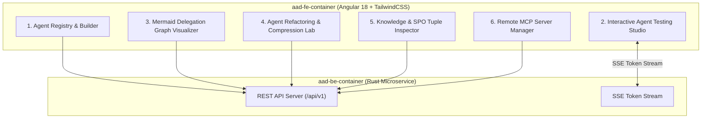

# Agent Development UI & Testing Kit PRD

## Overview
The **Agent Development UI & Testing Kit** provides an interactive web dashboard for developing, testing, visualising, refactoring, and debugging declarative AI agents and project memory stored in **Agent-As-Data (AAD)**.

Built using **Angular 18+ (Standalone Components, Angular Material, RxJS, and TailwindCSS)** following the architectural container patterns established in `sward-warden/sw-fe-container`, this container serves as the primary visual IDE and testing studio for agent developers.

---

## Architecture & Container Structure

Following `sward-warden`, the frontend is containerized in `aad-fe-container`:

---

## Key UI Modules & Features

### 1. Declarative Agent Registry & Builder Module
- **Visual Agent Editor**: Form fields for `name`, `description`, `tags`, `implements_traits`, `model`, `agent_definition` (system prompt), `tools`, `available_skills`, and `available_agents`.
- **Guardrail Configurator**: Visual JSON/rule builder for `incoming_guardrails` and `outgoing_guardrails`.
- **RBAC Group Assignment**: Interface to select `owner_id`, `read_groups`, `write_groups`, and `execute_groups`.
- **Version Lineage Viewer**: Inspect historical snapshots from `agent_revisions` with visual side-by-side diffing.

### 2. Interactive Agent Testing Studio (Playground)
- **Live Execution Workbench**: Test synchronous execution (`POST /api/v1/agents/:id/execute`) and prompt discovery execution (`search-and-execute`).
- **Real-Time SSE Token Streaming**: Renders streaming tokens, reasoning logs, and tool call invocations in real-time.
- **Dynamic Trait Mapping Overrides**: UI controls to override `trait_mappings` during test executions (e.g. mapping `trait:SecurityAuditor` to a custom test agent UUID).
- **Contract Verification Tester**: Live badge showing pass/fail status of `verify-contract` semantic fit and trait compatibility checks.

### 3. Agent Delegation Network Visualizer
- **Interactive Mermaid / Canvas Graph**: Visualizes agent hierarchies, sub-agent delegation links (`available_agents`), and skill dependencies (`available_skills`).
- **Live Filtering**: Filter visual graph by trait interface, ownership group, or tag.

### 4. Agent Refactoring & Compression Lab
- **Overlap & Duplication Scanner**: Trigger cluster analysis (`POST /api/v1/agents/refactor/analyze`) to discover duplicate or conflicting agents.
- **Harmonization & Merge Diff Viewer**: Review suggested merges or deliberate contradiction labels before applying changes to `agent_revisions`.

### 5. Knowledge & SPO Tuple Inspector
- **Hybrid Knowledge Search**: RAG vector query input (`POST /api/v1/knowledge/search`) displaying semantic chunk similarity scores alongside Subject-Predicate-Object relation tuples (`knowledge_tuples`).
- **Graph Traversal Tree**: Interactive multi-hop entity graph visualizer.

### 6. Remote MCP Server Manager
- **MCP Server Ingestion**: Register external MCP servers Stdio commands or SSE transport URLs (`POST /api/v1/agents/mcp/register`).
- **Cached Tool & Schema Browser**: Inspect cached tool argument schemas, descriptions, and type signatures retrieved from remote MCP servers.

---

## Technical Stack Alignment (Ref: `sward-warden/sw-fe-container`)

- **Framework**: Angular 18+ (Standalone Components, Signals, RxJS 7.8+).
- **UI Library**: Angular Material 18 (`@angular/material`), Material Symbols (`material-symbols`).
- **Styling**: TailwindCSS (`tailwindcss`, `@tailwindcss/forms`, `@tailwindcss/container-queries`), Fontsource Inter (`@fontsource/inter`).
- **Visualization**: `mermaid.js` for interactive diagram rendering.
- **Container Build**: Multi-stage `Dockerfile` (`node:22-alpine` build + `nginx:alpine` runtime).
- **SPA Ingress Routing**: Custom `nginx.conf` handling static asset caching (`1y`), CORS map headers, health checks (`/alive`, `/ready`), and fallback SPA routing (`try_files $uri /index.html`).
- **Garden & Kubernetes Orchestration**: Deployment definition in `garden.yml` (`kind: Deploy`, `type: helm`, `oci://ghcr.io/polecatworks/mfe-shell/helm/nginx-view`).
- **Multi-Arch CI/CD Pipeline**: GitHub Actions workflow (`.github/workflows/aad-fe-docker-publish.yml`) featuring `dorny/paths-filter`, GHCR manifest inspection by Git content SHA, parallel `linux/amd64` and `linux/arm64` Buildx compilation, multi-arch manifest merging, and automated dev rollout via `kubectl rollout restart`.

---

## Related PRDs & Specs

- [Master PRD](./agent-as-data-prd.md)
- [Agent Registry PRD](./agent-registry-execution-prd.md)
- [Knowledge System PRD](./knowledge-data-system-prd.md)
