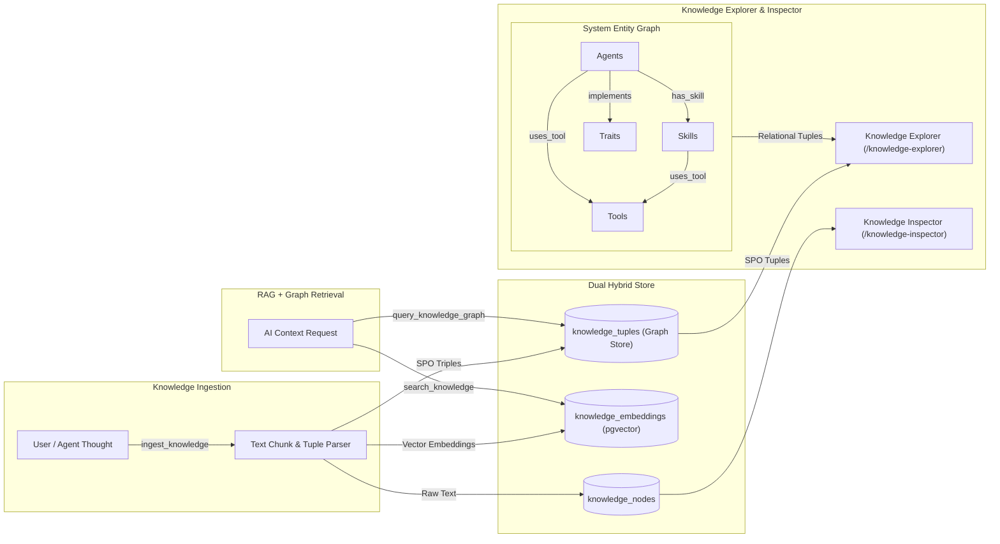

# Knowledge & Data System PRD

## Overview
The Knowledge & Data System in **Agent-As-Data (AAD)** serves as a persistent **Enterprise Brain & Knowledge Engine**. It captures unwritten developer thoughts, architectural decisions, business processes, and domain concepts from employees and AI agents. By transforming tacit knowledge into searchable vector chunks (`pgvector`) and relational concept graphs (`knowledge_tuples`), AAD enables human strategists and AI tools to perform deep reasoning on existing operations and future business ideas grounded in institutional memory.

## Core Capabilities

### 1. Hybrid Knowledge Storage
- **Text & Document Nodes**: Raw narrative notes, design docs, and architectural decisions stored in `knowledge_nodes`. Extended to include `description` and `tags` metadata to facilitate human browsing and categorization.
- **Semantic RAG Embeddings**: Automatic text chunking and vector indexing in `knowledge_embeddings` (`pgvector` with HNSW cosine similarity indices) to enable semantic vector queries (`POST /{{api_prefix}}/v1/knowledge/search`).
- **Graph Relational Triples**: Relational tuple storage (`subject`, `predicate`, `object`, `confidence`, `metadata`) in `knowledge_tuples` to capture concept maps (e.g., `User -> belongs_to -> Tenant`).

### 2. Knowledge Registry UI & Management (BREAD)
- **Unified UI/UX Structure**: Following the identical architectural structure of the Agency Registry, the Knowledge UI implements a dual-pane layout: a collapsible left sidebar for browsing knowledge nodes, and a right-side main workspace for creating, reading, and editing knowledge nodes.
- **BREAD Operations**: Full Browse, Read, Edit, Add, and Delete capabilities over knowledge items directly from the UI, supporting edits to `title`, `description`, `content`, and `tags`.

### 3. Knowledge Retrieval & Graph Traversal
- **Semantic Vector Search**: Nearest-neighbor retrieval over chunked text context given a user or agent prompt.
- **Multi-Hop Graph Queries**: Traversal endpoint (`POST /{{api_prefix}}/v1/knowledge/graph/traverse`) to discover connected entities and conceptual dependencies.
- **AI / LLM Integration**: Integration with AI via the `rig-core` crate and connection to an Ollama instance to process natural language queries over vector data (RAG).

### 4. Knowledge Editor (BREAD)
- **Interactive UI Workbench**: The Knowledge Inspector UI provides a two-pane layout: a left sidebar for discovering existing knowledge nodes, and a right workspace editor to modify the knowledge node directly.
- **Full BREAD API**: Full support for listing (`GET /v1/knowledge`), retrieving (`GET /v1/knowledge/{id}`), updating (`PUT /v1/knowledge/{id}`), creating (`POST /v1/knowledge`), and deleting (`DELETE /v1/knowledge/{id}`).
- **Graph Triple Editor**: Included in the UI is an explicit Knowledge Graph Triple editor which allows users to explicitly define schema components as Subject-Predicate-Object with adjustable confidence weights.

### 5. Knowledge Explorer & System Relational Tuples Graph (`/knowledge-explorer`)
- **Holistic System Knowledge Graph**: The Knowledge Explorer visualizes the entire Agent-As-Data ecosystem—Agents, Skills, Tools, Traits, and Knowledge Nodes—as an interconnected knowledge network.
- **Entity Relationships as Relational Tuples (SPO Triples)**: Structural connections between platform entities are modeled and exposed explicitly as Subject-Predicate-Object tuples:
  - `(Agent, has_skill, Skill)`
  - `(Agent, uses_tool, Tool)`
  - `(Agent, delegates_to, Agent)`
  - `(Agent, implements, Trait)`
  - `(Agent, requires_trait, Trait)`
  - `(Skill, uses_tool, Tool)`
  - `(Skill, composes_skill, Skill)`
  - `(Skill, implements, Trait)`
  - `(KnowledgeNode, predicate, KnowledgeNode / Concept)` derived from `knowledge_tuples`.
- **Canvas Edge Tuple Representation**:
  - All graph edges in the interactive network canvas (`vis-network`) must display directional arrows (`Subject -> Object`) and predicate labels (`uses_tool`, `has_skill`, `implements`, etc.).
  - Edge hover tooltips must present the complete formal tuple format: `(Subject) —[Predicate]→ (Object)`.
- **Entity Hydration Standard**: The explorer must fully hydrate agents and skills (retrieving their complete entity payloads including `attached_skills`, `attached_tools`, `attached_agents`, and trait implementations) to ensure zero missing structural relationships.
- **Selected Entity Tuple Inspector**:
  - When an entity node or edge is selected in the canvas, the right-hand inspection drawer displays a dedicated **Tuples / Relationships** section.
  - Groups inbound (`(Source) -> predicate -> [This]`) and outbound (`[This] -> predicate -> (Target)`) triples with one-click navigation to focus connected nodes.
- **Global Tuple Filter & Exploration Controls**:
  - Interactive filter controls allow toggling or isolating specific predicate types (e.g. filter by `uses_tool`, `has_skill`, `implements`, or factual knowledge triples).
  - Optional drawer/modal providing a tabular registry of all active system tuples.

### 6. Quality & Performance Safeguards
- **Entity Canonicalization & Synonym Resolution**: Vector similarity scans on subject/object names (`subject_canonical`, `object_canonical`) detect synonymous entities (e.g. `PostgreSQL` vs `Postgres`) to prevent graph fragmentation.
- **Graph Tuples Confidence Scoring**: Every extracted tuple carries a mandatory `confidence` score (0.0 to 1.0) to filter noisy or low-certainty relationships during reasoning queries.
- **Source Traceability & Cascade Pruning**: Tuples reference their originating `knowledge_nodes` via `source_node_id`. If a document is modified or deleted, stale tuples are automatically re-evaluated or cascade-deleted.
- **Automated Orphan & Decay Pruning**: Background pruning jobs purge unreferenced tuples with zero traversal hits and low confidence after a configurable retention period.
- **HNSW Vector Acceleration**: `knowledge_embeddings` uses PostgreSQL HNSW vector indexing to maintain sub-millisecond similarity lookup speeds as the knowledge base grows.
- **Reversible Migration Safeguards**: All DDL tables (`knowledge_nodes`, `knowledge_embeddings`, `knowledge_tuples`) and indices MUST be defined with paired forward (`.up.sql`) and reverse (`.down.sql`) migration scripts to support clean schema rollbacks.

## Knowledge System Flow

## Related PRDs & Specs
- [Agent-As-Data Core PRD](./agent-as-data-prd.md)
- [Agent Registry & Execution Engine PRD](./agent-registry-execution-prd.md)
- [Agent UI & Testing Kit PRD](./agent-ui-testing-kit-prd.md)
- [Detailed Schema Specification](../specs/agent-schema-spec.md)

