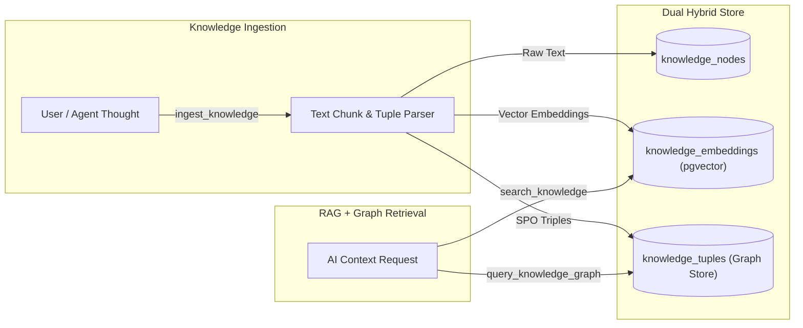

# Knowledge & Data System PRD

## Overview
The Knowledge & Data System in **Agent-As-Data (AAD)** serves as a persistent **Enterprise Brain & Knowledge Engine**. It captures unwritten developer thoughts, architectural decisions, business processes, and domain concepts from employees and AI agents. By transforming tacit knowledge into searchable vector chunks (`pgvector`) and relational concept graphs (`knowledge_tuples`), AAD enables human strategists and AI tools to perform deep reasoning on existing operations and future business ideas grounded in institutional memory.

## Core Capabilities

### 1. Hybrid Knowledge Storage
- **Text & Document Nodes**: Raw narrative notes, design docs, and architectural decisions stored in `knowledge_nodes`.
- **Semantic RAG Embeddings**: Automatic text chunking and vector indexing in `knowledge_embeddings` (`pgvector` with HNSW cosine similarity indices) to enable semantic vector queries (`POST /api/v1/knowledge/search`).
- **Graph Relational Triples**: Relational tuple storage (`subject`, `predicate`, `object`, `confidence`, `metadata`) in `knowledge_tuples` to capture concept maps (e.g., `User -> belongs_to -> Tenant`).

### 2. Knowledge Retrieval & Graph Traversal
- **Semantic Vector Search**: Nearest-neighbor retrieval over chunked text context given a user or agent prompt.
- **Multi-Hop Graph Queries**: Traversal endpoint (`POST /api/v1/knowledge/graph/traverse`) to discover connected entities and conceptual dependencies.
- **AI / LLM Integration**: Integration with AI via the `rig-core` crate and connection to an Ollama instance to process natural language queries over vector data (RAG).

### 4. Quality & Performance Safeguards
- **Entity Canonicalization & Synonym Resolution**: Vector similarity scans on subject/object names (`subject_canonical`, `object_canonical`) detect synonymous entities (e.g. `PostgreSQL` vs `Postgres`) to prevent graph fragmentation.
- **Graph Tuples Confidence Scoring**: Every extracted tuple carries a mandatory `confidence` score (0.0 to 1.0) to filter noisy or low-certainty relationships during reasoning queries.
- **Source Traceability & Cascade Pruning**: Tuples reference their originating `knowledge_nodes` via `source_node_id`. If a document is modified or deleted, stale tuples are automatically re-evaluated or cascade-deleted.
- **Automated Orphan & Decay Pruning**: Background pruning jobs purge unreferenced tuples with zero traversal hits and low confidence after a configurable retention period.
- **HNSW Vector Acceleration**: `knowledge_embeddings` uses PostgreSQL HNSW vector indexing to maintain sub-millisecond similarity lookup speeds as the knowledge base grows.
- **Reversible Migration Safeguards**: All DDL tables (`knowledge_nodes`, `knowledge_embeddings`, `knowledge_tuples`) and indices MUST be defined with paired forward (`.up.sql`) and reverse (`.down.sql`) migration scripts to support clean schema rollbacks.

## Knowledge System Flow

## Related PRDs & Specs
- [Agent-As-Data Core PRD](./agent-as-data-prd.md)
- [Agent Registry & Execution Engine PRD](./agent-registry-execution-prd.md)
- [Detailed Schema Specification](../specs/agent-schema-spec.md)

