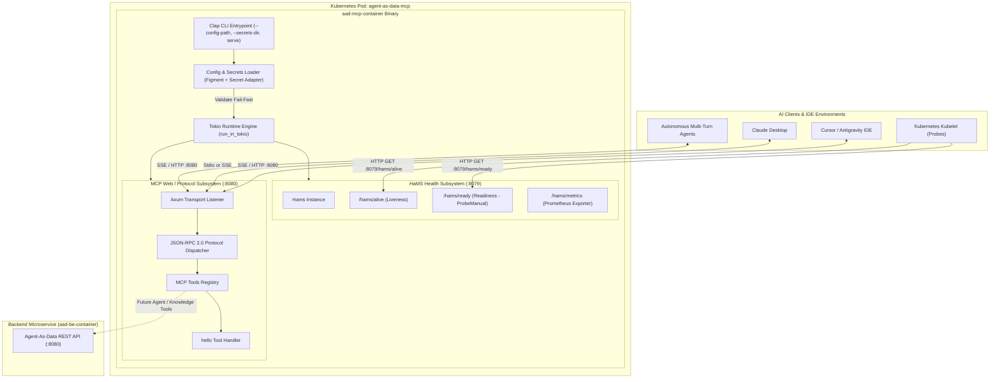
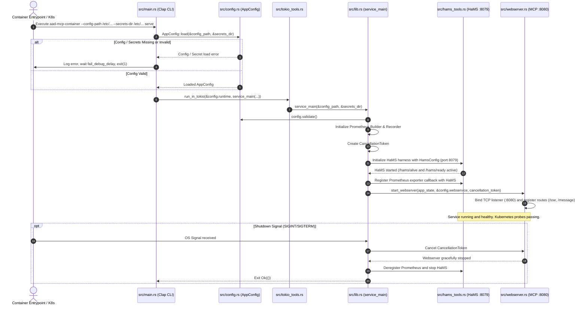

# MCP Server Container (`aad-mcp-container`) PRD

## Overview
This document defines the requirements, architecture, container specifications, and initial tool contracts for the dedicated **Model Context Protocol (MCP) Server Container (`aad-mcp-container`)** within the **Agent-As-Data (AAD)** ecosystem. 

While the primary backend microservice ([aad-be-container](./agent-as-data-prd.md)) provides persistent storage, declarative agent versioning, and execution pipelines, the MCP Server container provides an isolated, highly accessible interface for AI clients (such as IDEs, desktop assistants, and autonomous agents) to communicate with AAD capabilities using the standardized Model Context Protocol (MCP).

The code implementation strictly adheres to the established architectural pattern of `aad-be-container` (Clap CLI entrypoint, centralized configuration and secrets loader, fail-fast validation, HaMS health monitoring sidecar on health port `8079`, and web transport listener). Deployment assets include a dedicated Helm chart (`charts/agent-as-data-mcp`) copied and adapted from the existing backend Helm chart.

As a baseline milestone, the container build packages an operational MCP server exposing a canonical verification tool: `hello`, which accepts a `name` string input and returns a friendly greeting.

---

## Core Objectives

1. **Dedicated Container Build (`aad-mcp-container`)**:
   - Establish a standalone multi-stage container build producing the image `agent-as-data-mcp:latest`.
   - Parity with repository standards: Makefile targets (`aad-mcp-dev`, `aad-mcp-docker`, `aad-mcp-docker-run`, `build-mcp`), Garden deployment definitions, and Docker Compose workflows.
2. **Architectural Parity with Backend Microservice**:
   - **CLI Entrypoint (`clap`)**: Structured command parsing with `--config-path`, `--secrets-dir`, and subcommands (`serve`, `version`).
   - **Centralized Config & Secret Loading**: Hierarchical loading via `Figment` (YAML configuration + `AAD_MCP__*` environment variable overrides + secret directory file provider) with fail-fast validation and configurable `fail_debug_delay`.
   - **HaMS Health Monitoring Sidecar**: Integrate the `hams` crate to serve liveness (`/hams/alive`), readiness (`/hams/ready`), and Prometheus metrics (`/hams/metrics`) on a dedicated health port (`8079`).
   - **Tokio Runtime & Graceful Shutdown**: Structured initialization via `tokio_tools::run_in_tokio` and graceful termination coordinated through `tokio_util::sync::CancellationToken`.
3. **Dedicated Helm Chart (`charts/agent-as-data-mcp`)**:
   - Copied and adapted from `charts/agent-as-data` to provide native Kubernetes deployment manifests (`Deployment`, `Service`, `ConfigMap`, `_helpers.tpl`).
   - Pre-configured with dual ports: MCP web transport (`8080`) and HaMS health monitoring (`8079`).
   - Liveness and readiness probes pre-configured to query HaMS endpoints.
4. **Model Context Protocol (MCP) Compliance**:
   - Implement the JSON-RPC 2.0 based Model Context Protocol specification.
   - Support protocol lifecycle handshakes (`initialize`, `initialized`, `ping`).
   - Expose discoverable tool listings (`tools/list`) with strict JSON Schema definitions.
5. **Configurable Dual Transport Support**:
   - **SSE / HTTP Transport**: Primary transport for containerized cloud and cluster deployments (e.g. Kubernetes, Garden, Docker Compose), exposing an SSE stream endpoint and message submission endpoint.
   - **Stdio Transport**: Alternative transport mode allowing the container or binary to run directly attached to standard input/output for local IDE integrations (e.g., Claude Desktop, Cursor, Antigravity IDE).
6. **Baseline Tool Verification (`hello`)**:
   - Provide a basic, robust `hello` tool accepting a user's name and returning a greeting.
   - Serve as the foundational smoke-test and integration verification tool for the MCP container pipeline before registering complex enterprise tools.

---

## System Architecture & Runtime Lifecycle



---

## Application Startup & Service Orchestration Sequence

The container follows the exact startup sequence of the backend microservice:



---

## Tool Specification: `hello`

### 1. Tool Metadata & Schema
The `hello` tool is declared in the MCP tool registry with the following metadata and JSON Schema:

- **Name**: `hello`
- **Description**: `Generates a friendly greeting response for a specified user or entity name.`
- **Input Schema**:
```json
{
  "$schema": "http://json-schema.org/draft-07/schema#",
  "type": "object",
  "properties": {
    "name": {
      "type": "string",
      "description": "The name of the user, persona, or entity to greet.",
      "minLength": 1
    }
  },
  "required": ["name"],
  "additionalProperties": false
}
```

### 2. Request Contract (`tools/call`)
```json
{
  "jsonrpc": "2.0",
  "id": 1,
  "method": "tools/call",
  "params": {
    "name": "hello",
    "arguments": {
      "name": "World"
    }
  }
}
```

### 3. Response Contract
```json
{
  "jsonrpc": "2.0",
  "id": 1,
  "result": {
    "content": [
      {
        "type": "text",
        "text": "Hello, World!"
      }
    ],
    "isError": false
  }
}
```

### 4. Edge Cases & Validation Handling
- **Whitespace-only name**: Strips surrounding whitespace. If empty, returns an error message prompting for a valid name (`isError: true`).
- **Missing name property**: Schema validation rejects the invocation with `isError: true` and an instructive diagnostic message.
- **Special Characters**: Gracefully handles UTF-8 characters, punctuation, and international name formats without truncation or escaping glitches.

---

## Code Implementation & Architecture

The `aad-mcp-container` mirrors the structure of `aad-be-container`:

```
aad-mcp-container/
├── Cargo.toml                  # Service dependencies (Clap, Figment, Tokio, Hams, Axum, Serde)
├── Dockerfile                  # Multi-stage release container build
├── src/
│   ├── main.rs                 # Clap CLI parser, fail_debug_delay handling, run_in_tokio
│   ├── lib.rs                  # service_main orchestrator, HaMS startup, Prometheus hooks
│   ├── config.rs               # Centralized AppConfig, WebserviceConfig, HamsConfig, validation
│   ├── hams_tools.rs           # HaMS harness, ProbeManual readiness binding, cancellation
│   ├── tokio_tools.rs          # Tokio runtime builder (matching aad-be-container)
│   ├── metrics.rs              # Prometheus exporter hooks for HaMS
│   ├── state.rs                # Shared AppState (configuration, cancellation tokens)
│   ├── webserver/
│   │   ├── mod.rs              # Axum router setup (/sse, /message) and graceful shutdown
│   │   ├── sse.rs              # SSE transport session management
│   │   └── rpc.rs              # JSON-RPC 2.0 protocol dispatching
│   └── tools/
│       ├── mod.rs              # Tool trait and registry dispatch
│       └── hello.rs            # Hello greeting tool implementation
└── tests/
    └── hello_tool_test.rs      # Unit and integration tests
```

### Configuration Structure (`config.rs`)
To ensure structural consistency across the ecosystem, `aad-mcp-container` re-uses configuration data models from `aad-be-container`:

- **`WebServiceConfig`**: Reused directly to bind address and API prefix:
  ```rust
  #[derive(Deserialize, Serialize, Debug, Clone)]
  pub struct WebServiceConfig {
      pub address: String,
      pub api_prefix: String,
  }
  ```
- **`AppConfig`**: Unified fail-fast configuration aggregating backend standard modules:
  ```rust
  #[derive(Deserialize, Serialize, Debug, Clone)]
  pub struct AppConfig {
      pub webservice: WebServiceConfig,
      #[serde(serialize_with = "serialize_hams")]
      pub hams: HamsConfig,
      #[serde(default)]
      pub runtime: ThreadRuntime,
      pub debugging: DebuggingConfig,
  }
  ```

#### Configuration File (`config/default.yaml`)
```yaml
webservice:
  address: "0.0.0.0:8080"
  api_prefix: "/api"

hams:
  name: "aad-mcp"
  version: "0.1.0"
  port: 8079

runtime:
  threads: 2
  stack_size: 3000000
  name: "aad-mcp-worker"

debugging:
  environment: "development"
  log_level: "info"
  fail_debug_delay: "0s"
```

---

## Helm Chart Specification (`charts/agent-as-data-mcp`)

A dedicated Helm chart is copied and adapted directly from `charts/agent-as-data`.

### 1. Directory Structure
```
charts/agent-as-data-mcp/
├── Chart.yaml                  # Chart metadata (name: agent-as-data-mcp)
├── values.yaml                 # Default deployment values
├── configs/
│   └── default.yaml            # Default container configuration template
└── templates/
    ├── _helpers.tpl            # Name, fullname, label, and config checksum templates
    ├── configmap.yaml          # ConfigMap mounted to /etc/aad-mcp/config.yaml
    ├── deployment.yaml         # Deployment with dual ports & HaMS probes
    └── service.yaml            # Kubernetes service exposing http (:8080) and hams (:8079)
```

### 2. `Chart.yaml`
```yaml
apiVersion: v2
name: agent-as-data-mcp
description: Helm chart for Agent-As-Data MCP Server microservice
type: application
version: 0.1.0
appVersion: "0.1.0"
```

### 3. Default `values.yaml`
```yaml
imagePullSecrets: []
replicaCount: 1

image:
  repository: agent-as-data-mcp
  pullPolicy: IfNotPresent
  tag: "latest"

service:
  type: ClusterIP
  port: 8080
  hamsPort: 8079

resources:
  limits:
    cpu: 250m
    memory: 256Mi
  requests:
    cpu: 50m
    memory: 64Mi

env: []
volumeMounts: []
volumes: []
podAnnotations: {}

config:
  webservice:
    address: "0.0.0.0:8080"
    api_prefix: "/api"
  hams:
    name: "aad-mcp"
    version: "0.1.0"
    port: 8079
  runtime:
    threads: 2
    stack_size: 3000000
    name: "aad-mcp-worker"
  debugging:
    environment: "development"
    log_level: "info"
    fail_debug_delay: "0s"
```

### 4. Container Command & Probes in `deployment.yaml`
- **Command**:
  ```yaml
  command: ["/usr/local/bin/aad-mcp-container", "--config-path", "/etc/aad-mcp/config.yaml", "--secrets-dir", "/etc/aad-mcp/secrets", "serve"]
  ```
- **Ports**:
  - `name: http`, `containerPort: 8080`
  - `name: hams`, `containerPort: 8079`
- **Probes**:
  - **Liveness Probe**: HTTP GET `/hams/alive` on port `hams` (`8079`), initial delay 5s, period 10s.
  - **Readiness Probe**: HTTP GET `/hams/ready` on port `hams` (`8079`), initial delay 5s, period 10s.

---

## Container Build & Local Tooling

### Makefile Targets & Environment Variable Port Overrides
The root `Makefile` provides port variables with `?=` default assignments allowing arbitrary environment overrides for local serving:
- Defaults: `aad-mcp_PORT ?= 8082`, `aad-mcp_HEALTH_PORT ?= 8078` (preventing conflicts with `aad-be` on `8080`/`8079`).
- Local targets dynamically inject runtime overrides:
  - `AAD_MCP__WEBSERVICE__ADDRESS="0.0.0.0:$(aad-mcp_PORT)"`
  - `AAD_MCP__HAMS__PORT="$(aad-mcp_HEALTH_PORT)"`
- Targets:
  - `aad-mcp-dev`: Run MCP dev server locally with auto-port cleanup.
  - `aad-mcp-watch`: Run MCP server with `cargo watch` recompilation.
  - `aad-mcp-test`: Run cargo test across `aad-mcp-container`.
  - `aad-mcp-docker`: Build container image `agent-as-data-mcp:latest`.
  - `aad-mcp-docker-run`: Run container locally with port mapping `-p $(aad-mcp_PORT):8080 -p $(aad-mcp_HEALTH_PORT):8079`.
  - `build-mcp`: Alias for `aad-mcp-docker`.

### FluxCD GitOps Integration (`fluxcd-dev/`)
1. **OCIRepository & HelmRelease (`fluxcd-dev/agent-as-data-mcp.yaml`)**:
   - `OCIRepository`: Points to `oci://ghcr.io/polecatworks/agent-as-data/helm/agent-as-data-mcp`.
   - `HelmRelease`: Deploys `agent-as-data-mcp` into `agent-as-data-dev` with image `ghcr.io/polecatworks/agent-as-data-mcp:main`.
2. **Istio VirtualService Routing (`fluxcd-dev/virtualservice.yaml`)**:
   - Routes ingress traffic prefixed with `/mcp` directly to `agent-as-data-mcp:8080`.

### CI/CD Automation (`.github/workflows/`)
1. **PR Build & Test (`ci.yml`)**:
   - Automated detection of changes to `aad-mcp-container/**`.
   - Runs `cargo check` and `cargo test` on every PR affecting the MCP server.
   - Dual Helm chart linting for `charts/agent-as-data` and `charts/agent-as-data-mcp`.
2. **Multi-Arch Docker Build & Publish (`aad-mcp-docker-publish.yml`)**:
   - Builds multi-arch container images (`linux/amd64` and `linux/arm64`) using cargo-chef build caching.
   - Pushes to `ghcr.io/polecatworks/agent-as-data-mcp` tagged with `main`, `latest`, and `sha-*`.
   - Automated dev cluster rollout restart on `push` to `main`.
3. **Integration & Package Retention**:
   - `integration-test.yaml` tracks MCP changes and resolves dynamic `AAD_MCP_IMAGE` and `AAD_MCP_TAG`.
   - `cleanup-dev-packages.yml` enforces 2-week container retention policy on dev packages.

### Garden Integration (`garden.yml`)
Add a Deploy entry for `agent-as-data-mcp` using Helm:
```yaml
---
kind: Deploy
type: helm
name: agent-as-data-mcp
description: "Deploy Agent-As-Data MCP Server service"
dependencies:
  - deploy.ghcr-external-secret
source:
  path: charts/agent-as-data-mcp
spec:
  values:
    image:
      repository: ${var.aad-mcp-image || "agent-as-data-mcp"}
      tag: ${var.aad-mcp-tag || "latest"}
      pullPolicy: IfNotPresent
```

---

## Acceptance Criteria

1. **Clean Container Build**: `docker build -t agent-as-data-mcp:latest aad-mcp-container` builds cleanly without warnings.
2. **Backend Architecture Parity**:
   - Application supports `--config-path` and `--secrets-dir` flags.
   - Loads and validates configuration fail-fast with `fail_debug_delay` support.
   - Starts HaMS sidecar on port `8079` serving `/hams/alive` and `/hams/ready`.
3. **Helm Chart Parity**:
   - `helm lint charts/agent-as-data-mcp` passes cleanly.
   - Deployment template mounts configuration and configures HaMS liveness/readiness probes.
4. **Tool Discovery**: `tools/list` returns the `hello` tool definition and input schema.
5. **Greeting Tool Execution**:
   - Invoking `tools/call` with `{"name": "Antigravity"}` returns `{"content": [{"type": "text", "text": "Hello, Antigravity!"}], "isError": false}`.
   - Missing or empty `name` returns a descriptive validation error with `isError: true`.
