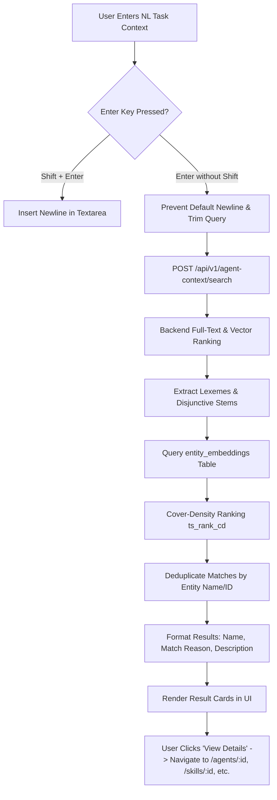
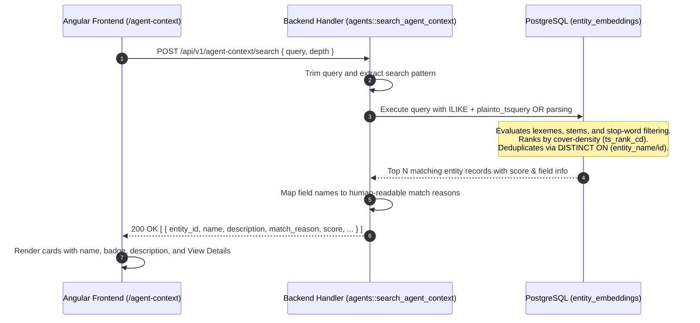

# Semantic Search & Agent Context Discovery Page PRD

## Overview
This PRD outlines the **Agent Context Search & Discovery** feature for the Agent-As-Data UI (`/agent-context`), allowing users to query registered agent artifacts (Agents, Skills, Traits, Tools) using natural language task context. The system processes natural language queries against entity representations stored in PostgreSQL (`entity_embeddings`), delivering ranked, deduplicated, and user-friendly discovery cards.



## User Experience & Interface Specifications

### 1. Natural Language Task Context Input
- **Dedicated Textarea**: A multiline text input allowing users to express complex, real-world task goals (e.g., *"i need an agent that can be used to design accounting systems"*).
- **Enter-to-Submit Interaction**:
  - Pressing **Enter** triggers immediate search execution.
  - The default browser behavior of inserting a newline character into `<textarea>` is intercepted on `keydown` (`event.preventDefault()`) to ensure searches do not fail or introduce trailing `\n` characters.
  - **Shift + Enter** continues to allow manual multi-line context formatting.
- **Fail-Safe Trimming**: The search query is trimmed both on the client side before dispatch and on the backend service to strip extraneous whitespace.

### 2. Result Presentation & Aesthetics
- **Card Title**: Resolves and displays the human-readable **name** of the matching object (e.g. `FinancialAuditorAgent`, `ComplianceChecking`), accompanied by a badge for its entity type (`agents`, `skills`, `tools`, `traits`).
- **Match Reason Badge**: An explicit, informative badge detailing why the entity was surfaced (e.g. `✓ Matched on entity description`, `✓ Matched on entity name`, `✓ Matched on agent prompt`, `✓ Matched on skill definition`).
- **Entity Description**: Full descriptive text rendered cleanly below the match badge.
- **Matched Content Snippet**: Displays matching snippet content when the query matches secondary fields (e.g. prompt or skill definition).
- **Omission of Raw IDs**: Internal database UUIDs are omitted from the user-facing card display to maintain a clean, high-level discovery experience.
- **Zero Boilerplate**: Generic placeholder text (e.g. *"Semantic similarity based on..."* or *"Semantic similarity matched well with query"*) is strictly excluded.
- **Direct Navigation**: Each card includes a **View Details** action button that routes directly to the entity's native management view (`/agents/:id`, `/skills/:id`, `/traits/:id`, `/tools/:id`).

## Search Engine & Backend Architecture

### 1. Hybrid Semantic & Full-Text Retrieval


- **Query Tokenization & Stemming**: Queries are processed using PostgreSQL's `plainto_tsquery('english', ...)` to strip stop words (*"i"*, *"need"*, *"an"*, *"that"*, *"can"*, *"be"*, *"to"*) and extract linguistic stems (*"accounting"* $\rightarrow$ *"account"*, *"systems"* $\rightarrow$ *"system"*).
- **Disjunctive Stem Evaluation**: Terms are combined into a disjunctive OR query (`|`) to match multi-concept prompts against disparate entity descriptions and prompts.
- **Cover-Density Ranking (`ts_rank_cd`)**: Results are ranked by proximity and density of matching terms, surfacing entities that satisfy multiple concepts (e.g. agents matching both *"accounting"* and *"agent"*) ahead of single-word matches.
- **Exact Match Elevation**: Verbatim substring matches are boosted to top rank with high confidence scores (`98%`), while multi-token matches scale appropriately between `60%` and `96%`.
- **Entity Deduplication**: Query results utilize `DISTINCT ON (COALESCE(name, entity_id::text))` to ensure that an entity matching across multiple fields (e.g. both name and description) is returned only once with its highest-scoring match.

## Backend Route & API Contract

### Request: `POST /api/v1/agent-context/search` (and alias `/api/v1/agents/context/search`)
```json
{
  "query": "i need an agent that can be used to design accounting systems",
  "depth": 5
}
```

### Response: `200 OK`
```json
[
  {
    "entity_id": "276e3a21-6c8d-45ad-a438-d0adf3afb6bb",
    "entity_type": "agents",
    "name": "FinancialAuditorAgent",
    "description": "A detail-oriented accounting agent specialized in financial audits, general ledger reconciliation, and strict adherence to global financial regulations.",
    "field_name": "description",
    "content": "A detail-oriented accounting agent specialized in financial audits, general ledger reconciliation, and strict adherence to global financial regulations.",
    "score": 0.95,
    "match_reason": "Matched on entity description"
  }
]
```

## Cross References
- [Agent UI & Testing Kit PRD](./agent-ui-testing-kit-prd.md)
- [Agent Registry & Execution PRD](./agent-registry-execution-prd.md)
- [Master PRD](./agent-as-data-prd.md)
