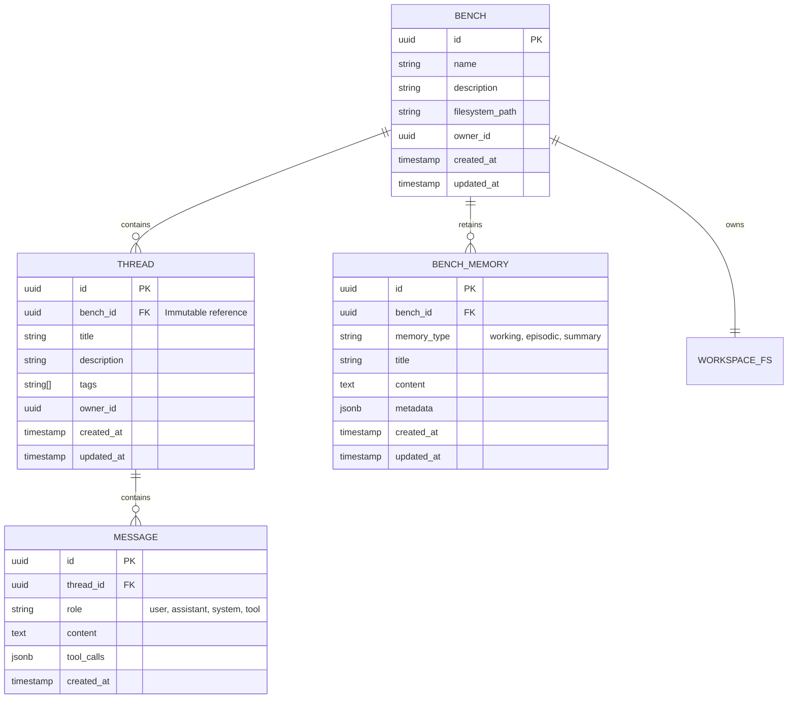
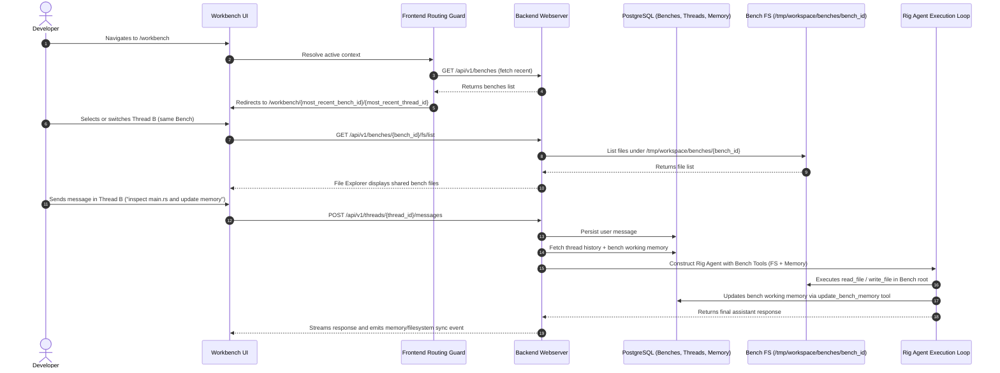
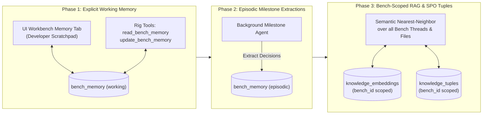

# Workbench Benches, Threads & Workspace Memory PRD

## Overview
This document defines the requirements, domain models, interaction design, and architectural standards for **Benches**, **Threads**, and **Bench Memory** within the **Agent-As-Data (AAD)** Workbench. 

A **Bench** represents an isolated, persistent project workspace containing a shared filesystem environment, a collection of contextual conversation threads, and associated project memory. **Threads** are conversational workflows executed within the context of a specific Bench.

---

## Objectives & Core Tenets

1. **Bench Scoped Filesystem**: The workspace filesystem environment is strictly owned by the Bench (`/tmp/workspace/benches/<bench_id>`). All conversation threads within a Bench share and manipulate this common file tree.
2. **Immutable Thread-to-Bench Association**: Every Thread belongs to exactly one Bench from inception. Thread assignment to a Bench is permanent and immutable.
3. **Modal-Free, Inline UX**: Creating, editing, and renaming Benches and Threads occurs entirely inline without disruptive modal popups. Destructive operations (deletion) require an intentional two-step inline confirmation where the confirmation button is offset from the trigger button to prevent accidental clicks.
4. **Transparent Working & Episodic Memory**: Benches provide shared memory to preserve project decisions, invariants, and guidelines across threads. This begins with an explicit, developer-editable and tool-accessible **Working Memory** (Phase 1) and progresses to a **Hierarchical Hybrid Memory System** incorporating episodic milestone extractions and vector-indexed retrieval (Phase 2 & 3).
5. **Clear Visual Context & Smart URL Routing**: Users must always have immediate visual clarity over which Bench and Thread are active. The URL schema supports deep linking (`/workbench/:benchId/:threadId`) with intelligent fallback forwarding to the most recent active Bench and Thread.

---

## Domain Entity Model



### 1. The Bench Entity (`benches`)
- **`id`**: Unique UUID primary key.
- **`name`**: Required human-readable name of the bench (e.g., `aad-core-refactor`, `auth-service`).
- **`description`**: Optional textual description of the bench's objective.
- **`filesystem_path`**: Local canonical workspace path: `/tmp/workspace/benches/<bench_id>`. (Supports future extension to map to external Git repositories or host directories).
- **`owner_id`**: User identifier owning the bench.
- **Timestamps**: `created_at` and `updated_at`.

### 2. The Thread Entity (`threads`)
- **`id`**: Unique UUID primary key.
- **`bench_id`**: Mandatory foreign key referencing `benches.id`. Once established upon creation, this association is **immutable**.
- **`title`**: Human-readable conversational title (inline editable).
- **`description`**: Optional description or summary.
- **`tags`**: Array of string tags for filtering and indexing.
- **`owner_id`**: User identifier.
- **Timestamps**: `created_at` and `updated_at`.

### 3. Bench Memory (`bench_memory`)
- **`id`**: Unique UUID primary key.
- **`bench_id`**: Foreign key referencing `benches.id`.
- **`memory_type`**: Type classification:
  - `working`: Core project brief, active invariants, architecture rules, and scratchpad (always editable and inspectable).
  - `episodic`: Key decisions, architectural milestones, and invariant logs recorded over time.
  - `summary`: Compact rolling summary synthesized across threads.
- **`content`**: Markdown/text body containing the memory content.
- **`metadata`**: JSONB payload storing tags, source thread IDs, or extraction confidence scores.

---

## Architectural Data Flow & Filesystem Scoping



---

## Workbench User Experience & Interaction Design

### 1. Viewport Hierarchy & Navigation Layout (Option A Model)

```
+----------------------------------------------------------------------------------------------------+
|  Top Bar: [AAD Workbench] > [Bench: Core Engine ▾] > [Thread: Bugfix #102]      [+ New Thread] [BG]|
+------------------------------------+-----------------------------------+---------------------------+
| Sidebar                            | Chat Pane                         | Editor / Memory Pane      |
|                                    |                                   |                           |
| [ Active Bench Selector  [✎] [▾] ] | Thread Title [✎]                  | [ Files ] [ Bench Memory ]|
| [+ New Bench (inline)]             | --------------------------------- | ------------------------- |
| [ Search threads...              ] | Agent / User Messages             | Shared File Editor /      |
|                                    |                                   | Markdown Scratchpad       |
| Thread Cards List:                 |                                   |                           |
| - Thread 1 (active)                |                                   |                           |
| - Thread 2                         |                                   |                           |
| - Thread 3                         | Input: [ Send a message...     ]  |                           |
+------------------------------------+-----------------------------------+---------------------------+
```

### 2. Scoped Bench Switcher & Management (Sidebar Header)
- **Bench Selector**: A dropdown picker in the sidebar header displaying the active Bench name with an active indicator badge.
- **Inline Bench Creation (No Modals)**:
  - Clicking `+ New Bench` expands an inline row at the top of the bench dropdown/selector.
  - Features an inline text input (`Placeholder: Bench name...`) with confirmation (`Enter` or checkmark icon) and cancellation (`Escape` or cross icon).
  - Upon submission, `POST /api/v1/benches` creates the bench, initializes `/tmp/workspace/benches/<bench_id>`, auto-creates an initial default thread ("General"), and transitions the view to the new bench.
- **Inline Bench Renaming**:
  - A pencil icon (`edit`) next to the active Bench name toggles the title into an inline editable input field.
  - Pressing `Enter` or blurring commits `PATCH /api/v1/benches/:id` with the updated name.
- **Inline Two-Step Bench & Thread Deletion**:
  - Clicking `Delete` does **not** trigger a modal alert.
  - Instead, an inline confirmation banner replaces the delete control with an intentional layout offset:
    ```
    [ Delete Bench ]  --->  Click  --->  [ Cancel ] ... (offset spacing) ... [ Confirm Delete Bench ]
    ```
  - The confirmation button is deliberately placed away from the original button position to prevent accidental double-clicks from inadvertently deleting the entity.

### 3. Thread Management within Active Bench
- **List Scope**: The thread list in the sidebar strictly renders threads belonging to the active Bench.
- **Inline Thread Creation**:
  - A persistent `+ New Thread` button (in the top bar and at the top of the thread list) creates a new thread bound to the current `bench_id`.
  - Automatically selects the new thread and places focus on the conversational input.
- **Inline Thread Renaming**:
  - Supported directly via click-to-edit on the chat pane header title, as well as a hover pencil action on the sidebar thread card.
- **Thread Immutability**:
  - Threads cannot be transferred or moved across Benches. If a conversation concept shifts to a different project, a new thread is created in the target Bench.

### 4. Active Bench Visual Clarity & Breadcrumbs
- **Top Bar Pill Badge**: The global top bar displays an indigo pill badge identifying the active Bench: `Bench: <Bench Name>`.
- **Global Breadcrumb**: A navigation breadcrumb (`Workbench > <Bench Name> > <Thread Title>`) provides immediate context of location within the system hierarchy.
- **Dynamic Route Forwarding**:
  - Navigating to `/workbench` automatically inspects the user's most recently active Bench and redirects to `/workbench/:benchId`.
  - Navigating to `/workbench/:benchId` automatically inspects the Bench's threads, selecting the most recently updated thread and redirecting to `/workbench/:benchId/:threadId`.
  - If a Bench has no threads, a default initial thread is automatically scaffolded.

---

## Phased Bench Memory System



### Phase 1: Explicit Working Memory / Scratchpad (Core Foundation)
- **Description**: An explicit, transparent memory document attached directly to the Bench.
- **Developer Experience**:
  - The right-hand pane in the Workbench features toggle tabs: `[ Files ]` and `[ Bench Memory ]`.
  - The `Bench Memory` tab presents a rich Markdown editor containing the active project context, architecture invariants, active tasks, and cross-thread notes.
  - The developer can directly edit, refine, or prune this memory at any time.
- **Agent Integration**:
  - Injected into the system preamble of all agents running in any thread under this Bench.
  - Native Rig tools:
    - `read_bench_memory`: Allows the agent to inspect the full working memory document.
    - `update_bench_memory`: Allows the agent to append or update architectural decisions and notes.

### Phase 2: Episodic Milestone Extraction (Autonomous Decisions)
- **Description**: Automatically logs key decisions, architectural milestones, and invariant rules established during conversational threads.
- **Operation**:
  - When an assistant completes a multi-turn task (e.g. creating a new service or choosing a schema), it can propose an episodic memory entry.
  - Stored as structured episodic logs (`memory_type = 'episodic'`) linked to the originating `thread_id` and `message_id`.
  - Displayed in the UI as a collapsible "Decision Log / Timeline" under the Bench Memory tab.

### Phase 3: Bench-Scoped RAG & Knowledge System Integration
- **Description**: Leverages AAD's `knowledge-data-system-prd.md` (`pgvector` + `knowledge_tuples`) scoped by `bench_id`.
- **Operation**:
  - Thread messages and file modifications within the bench are continuously chunked and embedded with `bench_id` partition keys.
  - Rig agents gain access to semantic vector search and SPO relation queries constrained to the current Bench's knowledge pool, preventing prompt bloat while allowing infinite context retrieval across hundreds of threads.

---

## API Specifications

### 1. Bench Endpoints (`/api/v1/benches`)
- `GET /api/v1/benches`: List all benches for the current user/tenant.
- `POST /api/v1/benches`: Create a new bench (`{ name: string, description?: string }`). Automatically scaffolds `/tmp/workspace/benches/<bench_id>`.
- `GET /api/v1/benches/:id`: Get bench metadata, stats, and default thread ID.
- `PATCH /api/v1/benches/:id`: Rename or update bench details (`{ name?: string, description?: string }`).
- `DELETE /api/v1/benches/:id`: Delete a bench, all associated threads, and clean up the bench workspace filesystem.

### 2. Thread Endpoints Scoped to Bench
- `GET /api/v1/benches/:benchId/threads`: List all threads belonging to the specified bench.
- `POST /api/v1/benches/:benchId/threads`: Create a new thread tied immutably to the bench (`{ title: string, description?: string, tags?: string[] }`).
- `PATCH /api/v1/threads/:id`: Rename or update thread title, tags, or description.
- `DELETE /api/v1/threads/:id`: Delete a thread and its messages.

### 3. Bench Filesystem Endpoints (`/api/v1/benches/:benchId/fs`)
- `POST /api/v1/benches/:benchId/fs/list`: List files in the bench workspace directory.
- `GET /api/v1/benches/:benchId/fs/read/*filepath`: Read content of a file within the bench workspace.
- `POST /api/v1/benches/:benchId/fs/write`: Write or update file content in the bench workspace.
- `POST /api/v1/benches/:benchId/fs/delete`: Delete a file from the bench workspace.

### 4. Bench Memory Endpoints (`/api/v1/benches/:benchId/memory`)
- `GET /api/v1/benches/:benchId/memory`: Retrieve active working memory and episodic decision logs for the bench.
- `PUT /api/v1/benches/:benchId/memory`: Update the working memory content.
- `POST /api/v1/benches/:benchId/memory/decision`: Append an episodic decision entry.

---

## Security & Path Traversal Safeguards

1. **Bench Directory Containment**: All filesystem operations executed by users or agents must be strictly validated via `resolve_safe_path` against `/tmp/workspace/benches/<bench_id>`.
2. **Cross-Bench Isolation**: An agent running in `Bench A` has no access to `/tmp/workspace/benches/<bench_id_b>`. Path traversal attempts (`..`, symlinks pointing outside the bench root) must immediately fail with `PermissionDenied`.
3. **Database Consistency**: Deleting a Bench cascades to associated `threads`, `messages`, and `bench_memory` records within an atomic database transaction.

---

## Related PRDs & Specifications

- [Master PRD](./agent-as-data-prd.md)
- [Agent Development UI & Testing Kit PRD](./agent-ui-testing-kit-prd.md)
- [Workspace Filesystem Tools PRD](./workspace-filesystem-tools-prd.md)
- [Knowledge & Data System PRD](./knowledge-data-system-prd.md)
