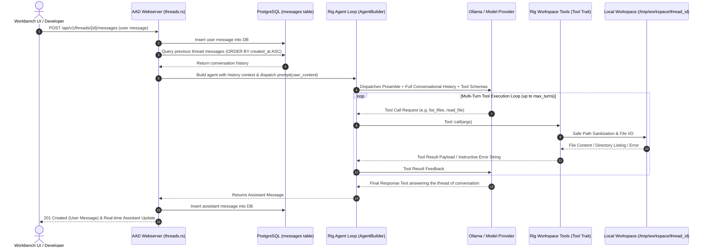
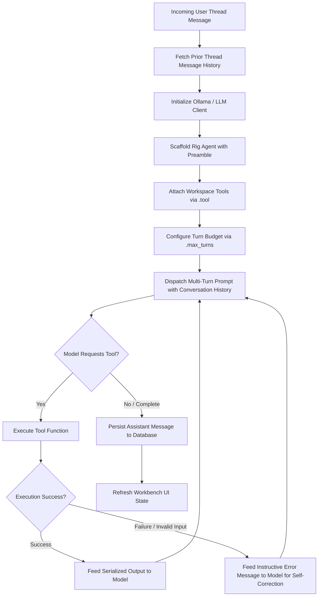

# Workspace Filesystem Tools & Agent Tool Execution PRD

## Overview
This document defines the requirements and architectural standards for workspace filesystem tools and agent tool execution within **Agent-As-Data (AAD)**. When a multiuser conversational thread is created in the Workbench, it establishes a dedicated, isolated workspace directory (`/tmp/workspace/<thread_id>`). This PRD formalizes how native Rust tools and external MCP tools are defined, bound to Rig agents via the `Tool` trait and `AgentBuilder`, and executed in an autonomous multi-turn loop.

## Objectives
1. **Thread Isolation**: Each thread must maintain an isolated filesystem directory located at `/tmp/workspace/<thread_id>`.
2. **Conversational History & Thread Continuity**: Every message sent to an agent within a thread must provide the agent with the chronological conversational history of that thread. The agent must respond directly to the ongoing thread of conversation, interpreting and addressing the latest question in the context of prior messages, instructions, and tool outputs.
3. **Standardized Rig Tool Implementations**: Expose safe workspace filesystem tools (`read_file`, `write_file`, `replace_in_file`, `list_files`, `delete_file`, `rename_file`) implemented in accordance with Rig's `Tool` trait architecture and JSON schema definitions.
4. **Autonomous Multi-Turn Execution**: Leverage Rig's `AgentBuilder` multi-turn agent loop (`.tool(...)`, `.max_turns(...)`) so the model autonomously selects tools, executes functions, receives structured outputs or errors, self-corrects, and formulates final user responses.
5. **Self-Correcting Error Recovery**: Format all tool execution errors as informative, instructive feedback for the LLM rather than failing the prompt.
6. **Path Traversal Security**: Strictly enforce workspace containment to prevent any access outside `/tmp/workspace/<thread_id>`.

---

## Agent Tool Execution Architecture



---

## Core Features & Tool Specifications

### 1. Workspace Lifecycle & Isolation
- **Directory Scaffolding**: Upon creation of a `Thread` (via `POST /{{api_prefix}}/v1/threads/create` or lazy access), the system automatically provisions `/tmp/workspace/<thread_id>`.
- **Idempotency**: Directory creation must be idempotent (`create_dir_all`).
- **Security Boundary**: All file operations must be validated against `resolve_safe_path` to guarantee canonical paths strictly begin with `/tmp/workspace/<thread_id>/`. Path traversal attempts (`..`, symlink escapes, absolute paths) must be rejected with `PermissionDenied`.

### 2. Filesystem Tool Interfaces (`Tool` Trait)

All workspace tools must implement Rig's `rig_core::tool::Tool` trait with typed arguments, JSON schema definitions, and model-oriented descriptions.

| Tool Name | Arguments | Description | Output |
|---|---|---|---|
| `list_files` | `dir_path: Option<String>` | Lists files and subdirectories under the workspace path. | `ListFilesOutput { files: Vec<String> }` |
| `read_file` | `filepath: String` | Reads text content of a file relative to workspace root. | `ReadFileOutput { content: String }` |
| `write_file` | `filepath: String, content: String` | Creates or overwrites a file; automatically scaffolds parent folders. | `WriteFileOutput { success: bool, message: String }` |
| `replace_in_file` | `filepath: String, search_string: String, replace_string: String` | Targeted search-and-replace for modifying specific blocks. | `ReplaceInFileOutput { success: bool, message: String }` |
| `delete_file` | `filepath: String` | Deletes a specified file or directory. | `DeleteFileOutput { success: bool, message: String }` |
| `rename_file` | `filepath: String, new_filepath: String` | Renames or moves a file/directory within workspace. | `RenameFileOutput { success: bool, message: String }` |

### 3. Agent Integration & Execution Loop



#### Best Practices for Rig Tool Attachment & Prompting:
1. **`AgentBuilder` Attachment**:
   ```rust
   let agent = client
       .agent(&config.llm.model)
       .preamble("You are a workspace assistant operating within an isolated developer workspace directory.")
       .tool(ListFilesTool { thread_id })
       .tool(ReadFileTool { thread_id })
       .tool(WriteFileTool { thread_id })
       .tool(ReplaceInFileTool { thread_id })
       .tool(DeleteFileTool { thread_id })
       .tool(RenameFileTool { thread_id })
       .max_turns(5)
       .build();
   ```
2. **Multi-Turn Conversational History & Rig `with_history` Pattern**:
   - For every incoming user message, retrieve previous thread messages (`ORDER BY created_at ASC`) from the database.
   - Construct structured `rig::completion::Message` turns (`Message::user(...)`, `Message::assistant(...)`).
   - Dispatch the conversational turn using Rig's first-class `agent.prompt(user_content).with_history(history).await?` pattern rather than packing unstructured string transcripts into a single completion prompt.
   - The agent must interpret and respond to the specific thread of conversation, answering questions, addressing instructions, and adapting its actions based on cumulative context.
3. **Autonomous Tool Execution Loop via Rig `Agent`**:
   - The agent must be constructed via Rig's `AgentBuilder` (`client.agent(model).preamble(...).tool(...).build()`).
   - The agent must autonomously execute the tool call loop: when the LLM outputs a tool call (e.g. `list_files`, `read_file`), Rig automatically invokes the tool, captures the output, appends the tool result to the prompt context, and prompts the model again until the model returns a final textual answer to the user. Raw JSON tool-call representations must never be sent to the user as final assistant messages.
   - **Model Output Normalization**: When open-weight models (e.g. Qwen2.5-Coder via Ollama) emit tool invocations formatted as JSON or XML tags (e.g. `{"name": "list_files", "arguments": {...}}`) in the assistant message content rather than through native provider tool call envelopes, the execution pipeline must normalize and detect this payload, execute the corresponding tool against the workspace, append the tool result to the conversation context, and prompt the model for the final human-readable response.
4. **Turn Budgeting & Adaptive Timeout**:
   - Configure `.max_turns(5)` (or higher) to give the model headroom to call multiple tools sequentially.
   - Configure execution timeouts respecting `config.llm.timeout_secs` without artificial clamps that prematurely abort live model inference.
5. **Instructive Error Feedback & Dynamic Fallback**:
   - When a tool fails (e.g. file does not exist), return clear contextual guidance (e.g. `File 'notes.txt' not found. Available workspace files are: ['todo.md', 'draft.txt']`) so the model can adjust arguments on the next turn.
   - If the LLM service is temporarily offline, fallback processing must dynamically interpret the specific user question and workspace state rather than echoing static strings.

### 4. Advanced Tool Capabilities (Roadmap)
- **Tool-RAG (`ToolEmbedding`)**: For agents with large tool catalogs (e.g. tools, skills, database queries), implement `ToolEmbedding` to retrieve only the top `N` relevant tools via vector similarity (`.dynamic_tools(n, index, toolset)`).
- **Model Context Protocol (MCP)**: Attach external tool servers dynamically using `AgentBuilder::rmcp_tool(...)` / `ToolServerHandle`.
- **Tool Servers**: Run high-throughput or shared mutable tools in isolated Tokio tasks via `ToolServer`.

---

## Related Specifications
- [09-backend-modular-architecture-spec.md](../specs/09-backend-modular-architecture-spec.md): Modular router and webserver architecture.
- [10-workbench-spec.md](../specs/10-workbench-spec.md): Workbench UI file management and chat integration.
- [Master PRD](./agent-as-data-prd.md): Core platform capabilities and execution engine.

