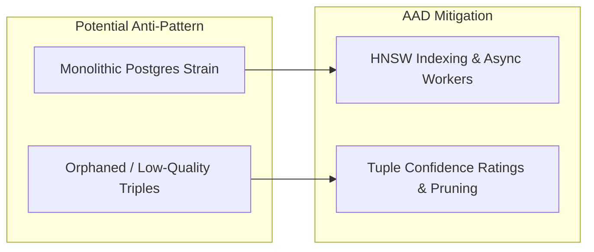

# Market & Technical Landscape Analysis: Agent-As-Data (AAD)

This document provides a technical comparative analysis, market positioning evaluation, and architectural validation for **Agent-As-Data (AAD)** relative to existing AI agent orchestration and memory platforms.

---

## 1. Executive Summary & Market Positioning

**Agent-As-Data (AAD)** is a **declarative, data-centric platform** that unifies three distinct software patterns into a single microservice:
1. **Agent Registry & Storage**: Agents represented as declarative relational records (`PostgreSQL`) with version control (`agent_revisions`) and guardrails.
2. **Long-Term Project Brain & Knowledge System**: Dual hybrid retrieval combining semantic text chunk vector search (`pgvector`) with structural entity graph relation tuples (`subject`, `predicate`, `object`).
3. **Native Interoperable Interface**: Native Model Context Protocol (MCP) server for seamless IDE (Cursor, Antigravity) and assistant (Claude Desktop) integration.

```mermaid
graph TD
    subgraph Market Landscape
        Frameworks["Orchestration Frameworks<br/>(LangChain, LangGraph, CrewAI)"]
        MemoryOS["Stateful Memory OS<br/>(MemGPT / Letta)"]
        KnowledgeGraph["GraphRAG / Vector DBs<br/>(Neo4j, Pinecone, Qdrant)"]
    end

    subgraph AAD Core ["Agent-As-Data (AAD)"]
        Registry["Declarative Agent Registry & Versioning"]
        DualKnowledge["Hybrid RAG + SPO Knowledge Graph"]
        NativeMCP["Native MCP Interoperability (Stdio/SSE)"]
    end

    Frameworks -->|Declarative Manifests| Registry
    MemoryOS -->|Unified Project Memory| DualKnowledge
    KnowledgeGraph -->|Single Engine Storage| DualKnowledge
    NativeMCP <-->|Exposes Capabilities| AAD Core
```

---

## 2. Competitive Landscape & Comparison (Pros vs. Cons)

| Platform / Tool | Focus / Paradigm | Pros | Cons | Relationship to AAD |
| :--- | :--- | :--- | :--- | :--- |
| **LangChain / LangGraph** | Code-centric graph orchestration SDK (Python/TS). | Highly flexible, vast integration ecosystem, active community. | Imperative code dependency; updating agent behavior requires redeploying codebase; heavy memory management burden. | **Complemented**: AAD acts as the declarative registry and memory store that LangGraph agents query at runtime. |
| **Letta (formerly MemGPT)** | Stateful memory management OS for single LLM agents. | Advanced self-editing memory tiers (Core, Recall, Archival memory). | Specialized primarily for agent memory state; lacks native relational tuple graphs and multi-agent versioned registries. | **Complements & Overlaps**: Letta manages single-agent conversational context; AAD manages multi-agent registries and project-level Knowledge Graphs. |
| **Microsoft Semantic Kernel / Copilot Studio** | Enterprise plugin & agent registry framework. | Strong enterprise governance, C#/.NET integration, declarative plugin manifests. | Heavy vendor lock-in to Microsoft/Azure ecosystem; lacks native lightweight SPO graph tuple engine out-of-the-box. | **Competes & Supersedes**: AAD offers an open-source, Rust-native, K8s-ready microservice equivalent with built-in pgvector & SPO graph store. |
| **GraphRAG + Vector DBs (Neo4j, Qdrant)** | Knowledge graph & vector retrieval engines. | Deep multi-hop graph traversals and scalable vector search. | Requires managing multi-database infrastructure (separate Graph DB + Vector DB); complex schema syncing. | **Superseded in Scope**: AAD unifies RAG vector chunks (`pgvector`) and SPO Graph tuples into a single PostgreSQL instance for unified queries. |

---

## 3. What Does Agent-As-Data Do That Is Unique?

1. **Unified Relational, Vector, & Graph Engine in Postgres**:
   - Rather than deploying Neo4j for graphs + Pinecone for vectors + Postgres for agent metadata, AAD leverages `pgvector` alongside a lightweight `knowledge_tuples` (Subject-Predicate-Object) relational engine inside Postgres.
2. **Declarative "Agent-As-Data" Paradigm**:
   - Treats agent identity, prompts, incoming/outgoing guardrails, and tools as **first-class database records**. Updating an agent's persona or safety rules requires a simple SQL/API write (`PUT /api/v1/agents/:id`), which instantly creates an immutable version snapshot (`agent_revisions`) without rebuilding or redeploying code binaries.
3. **Native MCP Server First-Class Citizen**:
   - AAD does not treat MCP as an afterthought adapter. It natively implements `mcp-server-rs`, exposing `search_agents`, `execute_agent`, `ingest_knowledge`, `search_knowledge`, and `query_knowledge_graph` to IDEs (Cursor, Antigravity) and assistants (Claude Desktop).

---

## 4. Architectural Analysis: Standard Pattern vs. Anti-Pattern Evaluation

> [!TIP]
> **Verdict**: Agent-As-Data is **firmly aligned with modern architectural standards**, addressing key industry pain points associated with hardcoded AI applications.

### Alignment with Industry Standards
- **Prompt-as-Data & Decoupled Configuration**: Moving prompts, tools, and guardrails out of code binaries into databases is the industry gold standard for production AI governance (as championed by Microsoft, AWS Bedrock Agent Core, and Anthropic).
- **Hybrid RAG + Knowledge Graph (GraphRAG)**: Combining unstructured vector similarity with explicit SPO relationship tuples is state-of-the-art for preventing LLM hallucinations and enabling multi-hop reasoning.
- **Model Context Protocol (MCP)**: Standardizing tool execution and context retrieval via MCP is the emerging industry standard for AI assistant interoperability.

### Potential Anti-Pattern Pitfalls & Mitigation Strategies



1. **Database Bottleneck / Single Point of Strain**:
   - *Risk*: Combining vector embeddings, graph tuples, and execution logs into Postgres could cause performance bottlenecks under high throughput.
   - *Mitigation*: AAD uses HNSW index tuning in `pgvector` and separates read-heavy search operations from async execution background jobs (`executions` table).
2. **Unstructured Tuple Inflation**:
   - *Risk*: Allowing unvalidated Subject-Predicate-Object tuples can result in dirty graph data.
   - *Mitigation*: AAD includes a `confidence` float rating and `source_node_id` foreign keys in `knowledge_tuples` to allow automated graph pruning.
