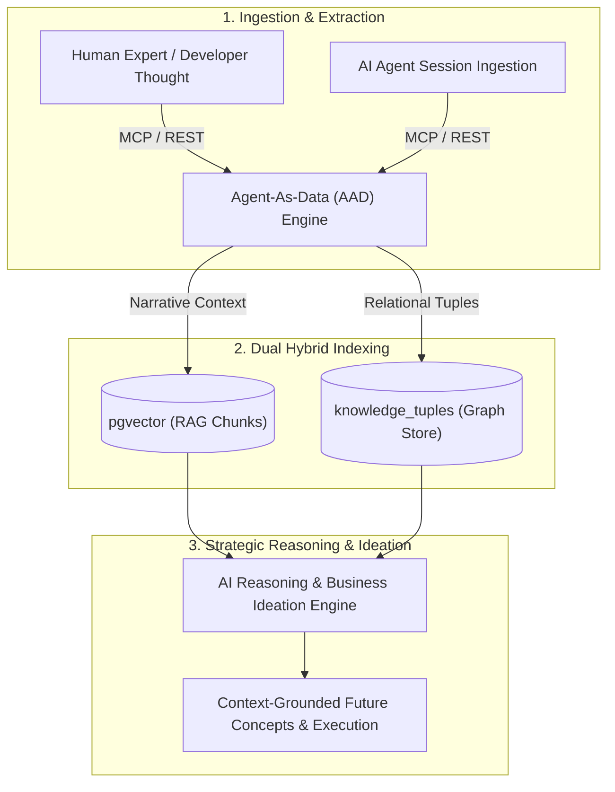

# Research: Enterprise Tacit Knowledge Capture & AI Reasoning

This research document analyzes the market need, technical architecture, and strategic impact of using **Agent-As-Data (AAD)** for **Enterprise Tacit Knowledge Capture and Strategic AI Reasoning**.

---

## 1. The Enterprise Problem: Tacit Knowledge & Process Loss

Enterprise organizations lose tremendous momentum and institutional wisdom due to **unwritten tacit knowledge**:
- **Developer & Architect Intuition**: Design trade-offs, historical dead-ends, and performance workarounds often exist only in senior engineers' heads.
- **Unstructured Business Processes**: Workflows, compliance shortcuts, and customer edge cases are scattered across chat channels or unwritten team conventions.
- **Conceptual Blind Spots in AI**: General-purpose LLMs lack context regarding an enterprise's unique domain models, legacy rules, and strategic constraints.

---

## 2. Technical Mechanisms for Tacit Knowledge Retention

To reliably capture and reason over tacit knowledge, AAD combines **two distinct knowledge representations**:

### A. Unstructured Narrative Memory (RAG via `pgvector`)
- Captures raw developer explanations, meeting notes, architectural rationales, and post-mortems.
- Embedded using dense vector models for semantic nearest-neighbor retrieval when users ask open-ended conceptual questions (`POST /api/v1/knowledge/search`).

### B. Structured Conceptual Mapping (Subject-Predicate-Object Tuples)
- Tacit processes are decomposed into explicit entity relationship triples:
  - `[Order Processing] -> requires -> [Inventory Reserve Lock]`
  - `[Legacy Billing API] -> deprecated_by -> [Stripe Connector v2]`
  - `[Tenant Isolation Policy] -> enforced_by -> [Wasm Guardrail Filter]`
- Enables multi-hop graph traversal (`POST /api/v1/knowledge/graph/traverse`) so AI agents can trace dependencies and business rules before proposing new features or business ideas.

---

## 3. Future Conceptualization & Strategic Reasoning Flow

When an enterprise evaluates a **new business proposal or software concept**, AAD acts as an institutional context engine:

1. **Idea Ingestion**: A manager or AI strategist inputs a new business concept:
   > *"We want to offer instant refunds for enterprise tenants."*
2. **Context Retrieval & Constraint Reasoning**:
   - **Semantic RAG**: Retrieves historical post-mortems regarding past billing bugs or fraud risks.
   - **Graph Traversal**: Traces `[Refund Policy] -> constrained_by -> [Tenant Audit Logging]` and `[Instant Refund] -> requires -> [Stripe Reserve Balance]`.
3. **Context-Grounded Synthesis**: The AI engine synthesizes a comprehensive design proposal that natively adheres to the enterprise's accumulated institutional rules.

---

## 4. Summary & PRD Integration

This enterprise vision has been formalized into the core product requirements:
- **[Master PRD](../prds/agent-as-data-prd.md)**: Updated overview to reflect Enterprise Tacit Knowledge Capture.
- **[Knowledge System PRD](../prds/knowledge-data-system-prd.md)**: Updated to detail dual hybrid indexing (`pgvector` RAG + `knowledge_tuples` Graph).
