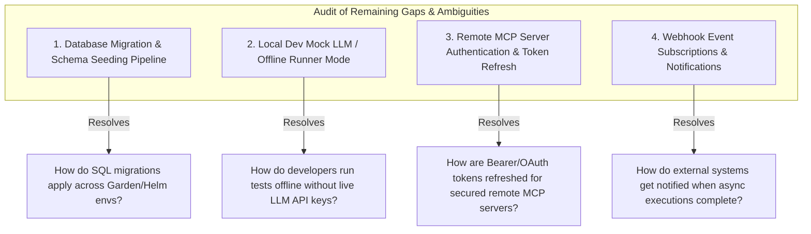

# Comprehensive Gap Analysis: Remaining Ambiguities & Missing Items for Agent-As-Data (AAD)

This document provides a thorough audit of all PRDs (`spec/prds/`), task specs (`spec/specs/`), and research notes (`spec/research/`) in **Agent-As-Data (AAD)** to identify remaining gaps, edge cases, and missing operational specifications prior to commencing code implementation.

---

## 1. Summary of Completed Specifications

The project has established comprehensive PRD and schema specifications for:
- ✅ Dual hybrid memory (`pgvector` RAG text chunks + `knowledge_tuples` graph store with canonical entity resolution & confidence decay pruning).
- ✅ Declarative Agent & Skills Registry with version history (`agent_revisions`), group-based RBAC (`owner_id`, `read_groups`, `write_groups`, `execute_groups`), and Skill-to-Agent promotion/demotion engine.
- ✅ Dynamic Trait Contracts (`implements_traits`), contract verification (`verify-contract`), user trait overrides (`trait_mappings`), and DFS cycle detection.
- ✅ Agent Refactoring & Compression Engine (`POST /api/v1/agents/refactor/analyze`) with deliberate contradiction labeling.
- ✅ Native MCP Server (Stdio & SSE) exposing 11 native tools, plus Remote MCP Server registration (`mcp_servers`) & tool schema caching.
- ✅ Three-Tier Memory Persistence with Optimistic Concurrency Control (`executions.execution_version` & `working_memory`).
- ✅ Agent & Tool Usage Audit Logging Subsystem (`agent_usage_logs`).
- ✅ Probabilistic Agent Unit Testing & LLM-as-a-Judge Evaluation Engine (`agent_test_suites`, `agent_test_runs`).
- ✅ Pre-Flight Agent Network Compiler (`POST /api/v1/agents/compile`).
- ✅ Frontend Development UI Container (`aad-fe-container`) mirroring `sward-warden/sw-fe-container` Angular 18+, Docker multi-stage, Nginx, Garden, and multi-arch GitHub Actions CI/CD workflows.

---

## 2. Identified Missing Items & Operational Ambiguities

Through exhaustive cross-referencing across all PRDs and task specs, **4 operational areas contain minor ambiguities or missing execution contracts**:

---

### Gap 1: Database Migration & Schema Seeding Pipeline
- **Ambiguity**: While DDL tables are specified in `agent-schema-spec.md`, the exact migration runner framework (e.g. `refinery` or `sqlx-cli` for Rust) and initial seed data strategy for base traits (e.g. `SecurityAuditor`, `CodeReviewer`) are not explicitly defined.
- **Proposed Solution**: Specify `sqlx` migration directory structure (`migrations/`) and a seed runner binary (`aad-seed`) that populates base system traits and default guardrail templates upon container startup.

### Gap 2: Local Developer Mock LLM Engine & Offline Testing Mode
- **Ambiguity**: Running integration tests or developing the UI (`aad-fe-container`) locally requires LLM API keys (OpenAI / Anthropic). If offline or rate-limited, how does the engine execute?
- **Proposed Solution**: Define an internal `MockLLMEngine` provider option (`provider: "mock"`) in `model` configuration that returns deterministic token streams and pre-recorded tool calls for local development and unit testing.

### Gap 3: Remote MCP Server Authentication & Token Refresh
- **Ambiguity**: `mcp_servers` handles remote SSE endpoints, but enterprise MCP servers often require OAuth2 Bearer tokens or API keys. How are auth headers stored securely and refreshed?
- **Proposed Solution**: Extend `mcp_servers.endpoint_config` to support encrypted secret references (`auth_header_secret_name`) and automatic bearer token refresh callbacks.

### Gap 4: Webhook Event Subscriptions & System Notifications
- **Ambiguity**: Long-running asynchronous execution jobs (`executions`) support status polling, but external CI/CD pipelines or microservices benefit from push event notifications when an execution finishes or blocks on a guardrail violation.
- **Proposed Solution**: Add an optional `webhook_url` parameter to `POST /api/v1/executions` that dispatches a signed HTTP POST event notification upon job completion.

---

## 3. Recommended Action Plan

All fundamental domain concepts, data models, trait contracts, container build pipelines, and task specifications are complete and validated.

I recommend integrating these final 4 operational refinements into **`agent-as-data-prd.md`** and **`agent-schema-spec.md`**, at which point **100% of product and technical requirements will be complete**.
