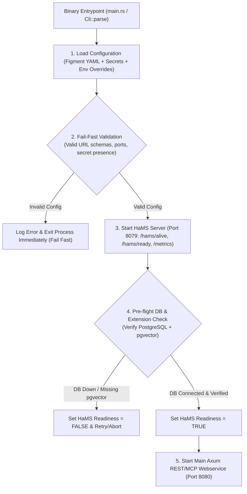

# Research: HaMS Health Monitoring & Fail-Fast Startup Pattern

This research document details the **Health Monitoring System (HaMS)** endpoints (`/hams/alive`, `/hams/ready`, `/metrics`) and the **Fail-Fast Early Startup Validation Pattern** adopted from **`PolecatWorks/sward-warden/sw-be-container`** for **Agent-As-Data (AAD)**.

---

## 1. Architectural Overview & HaMS Integration

In `sward-warden`, backend services use `hams` (`https://github.com/PolecatWorks/hams.git`) to manage liveness, readiness, and OpenTelemetry/Prometheus metrics out-of-band:
- **HaMS Server**: Runs a lightweight sidecar HTTP health server exposing `/hams/alive`, `/hams/ready`, and Prometheus metrics on an independent health port (e.g. `8079`).
- **Fail-Fast Early Startup Validation**: Configuration loading, environment variables, secret files, database connectivity, and required vector extensions are validated **at application entrypoint startup** before opening the main webservice listener. If any validation step fails, the application aborts immediately with diagnostic logs and an optional `fail_debug_delay`.

---

## 2. HaMS Probe & Endpoint Specifications

| Endpoint | Transport & Port | Probe Type | Purpose & Behavior |
| :--- | :--- | :--- | :--- |
| `GET /hams/alive` | Health Port (`8079`) | Liveness Probe | Returns `HTTP 200 OK` if the process is running and not deadlocked. |
| `GET /hams/ready` | Health Port (`8079`) | Readiness Probe | Returns `HTTP 200 OK` if database pool is connected and `pgvector` extension is active; returns `HTTP 503 Service Unavailable` during startup or DB disruption. |
| `GET /metrics` | Health Port (`8079`) | Prometheus Metrics | Exposes OpenTelemetry metrics (`agent_executions_total`, `rag_search_duration_seconds`, `guardrail_failures`). |

---

## 3. Fail-Fast Configuration & Secret Validation Rules

To prevent runtime errors deep in execution workflows:
1. **Config Struct Validation**: Uses `figment` and strict struct deserialization for `DatabaseConfig`, `WebServiceConfig`, `HamsConfig`, and `StartupCheckConfig`.
2. **Pre-Flight Secret Check**: Verifies that database password files or secret environment variables exist and are non-empty before attempting pool creation.
3. **Pre-Flight Extension Verification**: During startup, queries `SELECT extname FROM pg_extension WHERE extname = 'vector'`. Aborts startup immediately if `pgvector` is missing from PostgreSQL.

---

## 4. Sub-PRDs & Task Specs Integration Summary

- **Agent Registry PRD**: Section 1 updated to mandate HaMS liveness/readiness probes and Fail-Fast early startup validation.
- **Task Spec 01 (`01-core-storage-spec.md`)**: Updated Section 1 to include HaMS dependency (`hams`), config validation, and pre-flight PostgreSQL extension verification.
