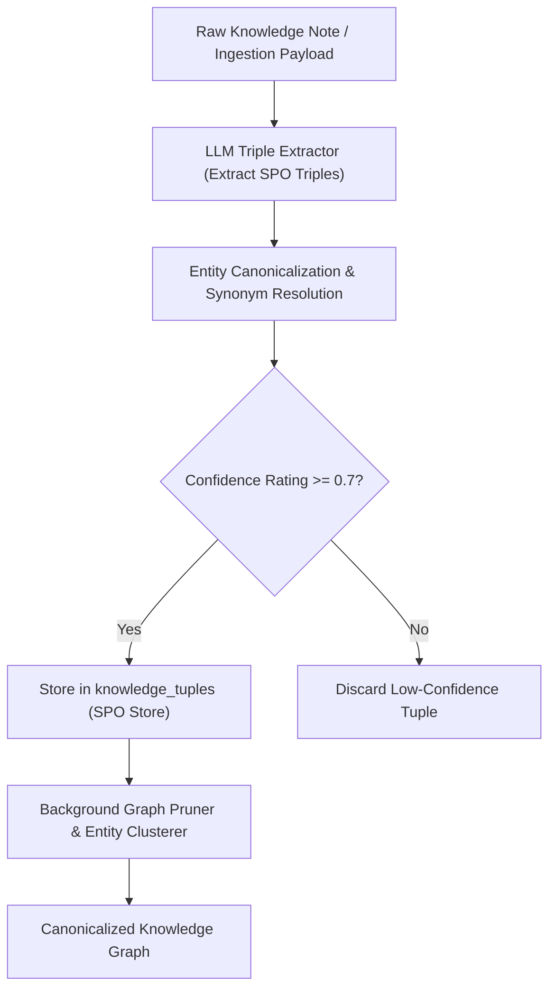

# Research: Automated Knowledge Graph Extraction, Entity Resolution & Pruning Strategy

This research document analyzes techniques for **Automated Knowledge Graph Extraction, Synonymous Entity Resolution, Confidence Scoring, and Graph Pruning** in **Agent-As-Data (AAD)**.

---

## 1. The Core Challenge in Enterprise Knowledge Graphs

When extracting Subject-Predicate-Object (`knowledge_tuples`) from unstructured developer notes:
- **Entity Synonymy & Ambiguity**: The same entity might be referred to as `PostgreSQL`, `Postgres`, `PG`, or `relational-db`.
- **Relationship Hallucination**: Automated LLM triple extraction can generate weak or false predicates.
- **Graph Bloat**: Accumulating low-value or orphaned tuples over time slows down multi-hop graph traversals (`POST /api/v1/knowledge/graph/traverse`).



---

## 2. Technical Evaluation of Graph Quality Strategies

| Mechanism | Strategy & Implementation | Benefit to AAD |
| :--- | :--- | :--- |
| **1. Vector-Based Entity Resolution** | Generates embeddings for subject and object names in `knowledge_tuples` to detect synonymous entity nodes (e.g. similarity > 0.92 between `Postgres` and `PostgreSQL`). | Merges duplicate nodes under a single canonical entity alias. |
| **2. Mandatory Confidence Ratings** | Assigns a `confidence` score (0.0 to 1.0) to every extracted triple based on extraction certainty. | Prevents speculative LLM facts from corrupting architectural memory. |
| **3. Source Traceability (`source_node_id`)** | Binds every tuple back to its originating `knowledge_nodes` text document. | If a document is updated or deleted, associated tuples are automatically re-extracted or cascade purged. |
| **4. Automated Decay & Orphan Pruning** | Background job purges tuples with low confidence or zero traversal hits after `N` days. | Keeps multi-hop graph traversals (`POST /api/v1/knowledge/graph/traverse`) fast and lightweight. |

---

## 3. Recommended Tuple Data Model & Pruning Rules

```sql
-- Enhanced Knowledge Graph Tuples Table
CREATE TABLE IF NOT EXISTS knowledge_tuples (
    id UUID PRIMARY KEY DEFAULT gen_random_uuid(),
    subject VARCHAR(255) NOT NULL,
    subject_canonical VARCHAR(255), -- Resolved canonical entity name
    predicate VARCHAR(255) NOT NULL,
    object VARCHAR(255) NOT NULL,
    object_canonical VARCHAR(255), -- Resolved canonical entity name
    confidence FLOAT NOT NULL DEFAULT 1.0,
    traversal_count INT NOT NULL DEFAULT 0,
    source_node_id UUID REFERENCES knowledge_nodes(id) ON DELETE CASCADE,
    metadata JSONB NOT NULL DEFAULT '{}'::jsonb,
    created_at TIMESTAMPTZ NOT NULL DEFAULT NOW(),
    updated_at TIMESTAMPTZ NOT NULL DEFAULT NOW()
);
```

---

## 4. PRD Integration Summary

- **Knowledge System PRD**: Section 3 updated with Entity Canonicalization, Confidence Thresholds, and Automated Graph Pruning.
- **Master PRD**: Data Model updated for `knowledge_tuples` canonical fields.
