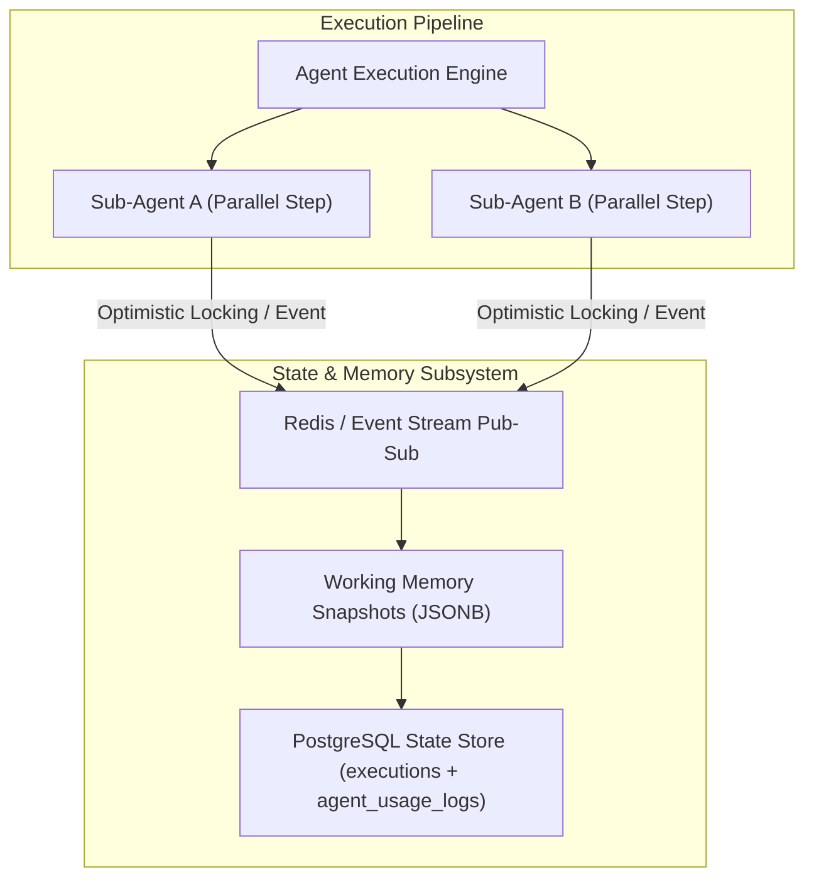

# Research: Distributed Multi-Agent State Synchronization & Working Memory Persistence

This research explores software patterns, concurrency primitives, and architecture options for **Distributed Multi-Agent State Synchronization and Working Memory Persistence** in **Agent-As-Data (AAD)**.

---

## 1. The Core Problem: Concurrency & State in Agentic Execution

When AI agents execute long-running asynchronous workflows, delegate tasks to sub-agents, or run parallel reasoning loops, they encounter fundamental state management challenges:
- **Race Conditions**: Two sub-agents updating the same execution context simultaneously.
- **Memory Decay & Context Loss**: Long-running agents exceeding context windows without persistent working memory snapshots.
- **Transactional Consistency**: Ensuring that if a sub-agent execution fails, parent state changes roll back cleanly.



---

## 2. Technical Evaluation of State Sync Patterns

| Pattern | How It Works | Concurrency Control | Pros & Strengths | Cons & Trade-offs | AAD Recommendation |
| :--- | :--- | :--- | :--- | :--- | :--- |
| **1. Event-Sourcing (Append-Only Event Stream)** | Every agent decision, tool call, and memory delta is saved as an immutable event record. | Naturally thread-safe (append-only). | Perfect audit trail; seamless replay & debugging. | Requires state reconstruction to build current snapshot view. | **Adopt for Audit Logging (`agent_usage_logs`)**. |
| **2. Optimistic Concurrency Control (OCC) with Version Locking** | Agent executions include a `state_version` integer. Updates verify `WHERE state_version = expected_version`. | High concurrency; rejects stale writes. | Prevents silent overwrite when sub-agents execute in parallel. | Requires retry handling when version conflict occurs. | **Adopt for Working Memory Snapshots**. |
| **3. Transactional Distributed Locks (ShedLock / Redis Lock)** | Acquires a temporary lock on `execution_id` while updating working memory state. | Strict serialization. | Guarantees single-writer safety during critical guardrail transitions. | Potential bottleneck for fast parallel agent runs. | **Adopt for Guardrail Interceptor Pipeline**. |

---

## 3. Working Memory Persistence Architecture for AAD

To provide clean state synchronization, AAD implements a **Three-Tier Memory Persistence Stack**:

### Tier 1: Short-Term Working Memory (Execution Context)
- In-memory working context during active LLM token generation loops.

### Tier 2: State Snapshot Store (PostgreSQL `executions` Table)
- Every execution step increments `execution_version` and saves a snapshot of `working_memory` (JSONB) using Optimistic Concurrency Control (OCC).

```sql
-- Optimistic locking example on executions state
UPDATE executions 
SET working_memory = $1, 
    execution_version = execution_version + 1,
    updated_at = NOW()
WHERE id = $2 AND execution_version = $3;
```

### Tier 3: Immutable Event Ledger (`agent_usage_logs`)
- Append-only telemetry log recording every tool call, guardrail event, and state transition.

---

## 4. Integration into PRDs & Specs

- **Agent Registry PRD**: Updated Section 9 with Distributed State Synchronization & OCC rules.
- **Master PRD**: Updated Architectural Safeguards to mandate OCC version locking for multi-agent runs.
