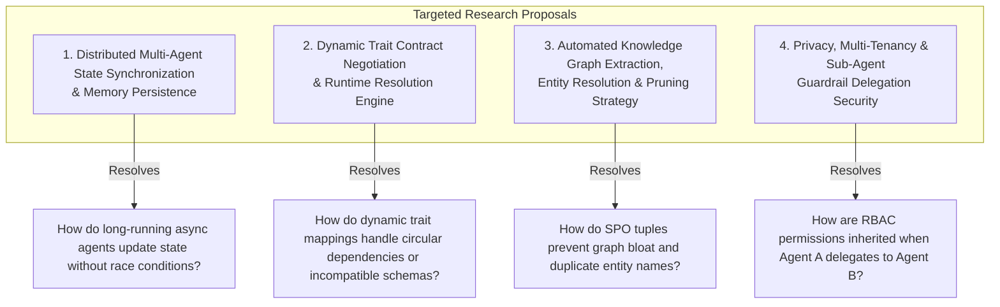

# Research Roadmap: Identifying Ambiguities & Expansion Areas for Agent-As-Data (AAD)

This document provides a comprehensive review of all captured PRDs, research notes, and task specifications in **Agent-As-Data (AAD)**, identifying remaining technical ambiguities, architectural gaps, and proposed research topics to expand the project definitions.

---

## 1. Summary of Captured Architecture & Concepts

To date, the project has documented:
1. **Master & Sub-PRDs** (`spec/prds/`):
   - Dual hybrid storage: `pgvector` RAG text chunks + Subject-Predicate-Object (`knowledge_tuples`) graph store.
   - Declarative agent registry with version history (`agent_revisions`), incoming/outgoing guardrail interceptors, sync streaming & async executions.
   - Dual-layer **Agent Traits & Contract Accountability** (`implements_traits` + `verify-contract`).
   - Agent Refactoring & Compression Engine (`POST /api/v1/agents/refactor/analyze`).
   - Visual Mermaid network graph generation (`visualize_agents`).
   - Group-based Access Control (`owner_id`, `read_groups`, `write_groups`, `execute_groups`).
   - Remote MCP Server Ingestion & Tool Schema Caching (`mcp_servers`).
   - Developer UI & Testing Studio (`aad-fe-container` using Angular 18+ & TailwindCSS).
   - Probabilistic Agent Unit Testing & LLM-as-a-Judge Evaluation Engine (`agent_test_suites`, `agent_test_runs`).
   - Agent & Tool Usage Audit Logging Subsystem (`agent_usage_logs`).
   - Managed Skills Registry & Skill-to-Agent Promotion/Demotion Lifecycle (`skills`).

2. **Research Base** (`spec/research/`):
   - Market Landscape & Pros/Cons vs. AutoGen, CrewAI, and LangGraph.
   - Enterprise Tacit Knowledge Capture & AI Strategic Reasoning.
   - Enterprise Product Landscape (Glean, Microsoft GraphRAG, Guru, Notion AI).
   - Agent Trait Contracts & Dual-Layer Validation (Schema + Semantic Vector Fit).
   - Skills vs. Agents Architectural Distinction & Developer Guidance.

---

## 2. Identified Ambiguities & Proposed Research Roadmap

Despite extensive coverage, **4 key technical areas contain ambiguities or underspecified mechanisms** that warrant targeted research before proceeding to implementation:

---

### Proposed Research Topic 1: Distributed Multi-Agent State Synchronization & Memory Persistence
- **Ambiguity / Gap**: While we have defined `executions` and `agent_usage_logs`, the mechanism for how an agent updates its working memory during multi-turn long-running tasks without race conditions or state corruption is underspecified.
- **Research Goal**: Evaluate event-sourcing, transactional state snapshots, and Redis/Postgres pub-sub mechanisms for state sync in multi-agent execution flows.

### Proposed Research Topic 2: Dynamic Trait Contract Negotiation & Runtime Resolution Engine
- **Ambiguity / Gap**: We established `implements_traits`, `verify-contract`, and runtime `trait_mappings`. However, if an agent references a trait interface with complex nested sub-traits or circular references, how does the resolution engine fail-fast or fallback gracefully?
- **Research Goal**: Investigate contract negotiation patterns, graph resolution algorithms for sub-agent dependencies, and fallback strategies when a user's mapped agent fails semantic fit verification.

### Proposed Research Topic 3: Automated Knowledge Graph Extraction, Entity Resolution & Pruning Strategy
- **Ambiguity / Gap**: We have `knowledge_tuples` with confidence scores and source node linkages, but automated extraction of Subject-Predicate-Object triples from raw unstructured developer notes can introduce duplicate or synonymous entity names (e.g. `PostgreSQL` vs `Postgres`).
- **Research Goal**: Research entity resolution, graph deduplication algorithms, and LLM-assisted tuple extraction prompts to maintain knowledge graph quality over time.

### Proposed Research Topic 4: Privacy, Multi-Tenancy & Sub-Agent Delegation Security
- **Ambiguity / Gap**: We introduced `owner_id`, `read_groups`, `write_groups`, and `execute_groups`. However, when **Agent A** (owned by Team X) delegates a sub-task to **Agent B** (owned by Team Y), how are security contexts, data redaction, and prompt injection guardrails inherited across organizational boundaries?
- **Research Goal**: Research RBAC context propagation, token delegation security, and multi-tenant isolation patterns in agentic microservices.

---

## 3. Next Steps & Recommendation

I recommend conducting research on these topics in `spec/research/` to solidify these definitions before finalizing implementation specs.
