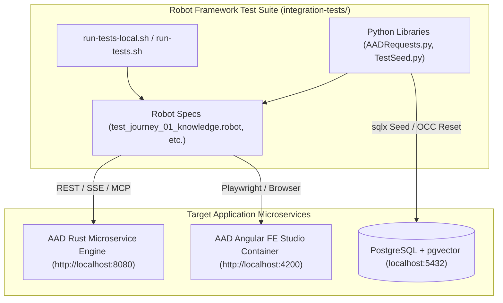

# Research: Robot Framework Integration Testing Architecture

This research document analyzes the Robot Framework integration testing pattern from **`PolecatWorks/sward-warden/integration-tests`** and outlines its adoption for **Agent-As-Data (AAD)**.

---

## 1. Reference Pattern Analysis (`sward-warden/integration-tests`)

In `sward-warden`, Robot Framework serves as the primary integration testing tool:
- **Directory Structure**: `/integration-tests/tests/*.robot` containing declarative test cases.
- **Python Keyword Helpers**: Custom Python modules (e.g. `AuthRequests.py`, `TestSeed.py`) extending Robot Framework with custom HTTP authentication and database seeding.
- **Local Dev Test Runner**: `run-tests-local.sh` verifying backend (`http://localhost:8080`) and frontend (`http://localhost:4200`) before invoking `robot`.
- **Garden & CI Integration**: Runs inside Kubernetes via `garden.yml` (`kind: Test`) and GitHub Actions pipelines.
- **Traceability**: Each `.robot` test case explicitly references PRD requirements and user journey scenarios.

---

## 2. Adoption Strategy for Agent-As-Data (AAD)

1. **User Journeys as Robot Test Suites**:
   - Each end-to-end user journey in `user-journeys-spec.md` (Journeys 1 through 9) maps 1-to-1 to a Robot Framework test file (`test_journey_01_knowledge_ingestion.robot`, `test_journey_05_preflight_compiler.robot`, etc.).
2. **Integration Test Suite Directory**: Create `/integration-tests/` mirroring `sward-warden`:
   - `/integration-tests/tests/`: Declarative `.robot` test files.
   - `/integration-tests/lib/`: Python custom libraries (`AADRequests.py`, `TestSeed.py`).
   - `/integration-tests/run-tests-local.sh`: Local dev environment script.
   - `/integration-tests/garden.yml`: Garden Helm/Kubernetes integration test deployment.
3. **Traceability Matrix**: Every `.robot` test case includes documentation linking back to its task spec (`01` to `08`) and user journey (`1` to `9`).

---

## 3. PRD & Spec Integration Summary

- **Agent UI PRD**: Updated Section 4 to include Robot Framework integration testing.
- **Task Specs README**: Updated to reflect Robot Framework integration test suites validating user journeys.
