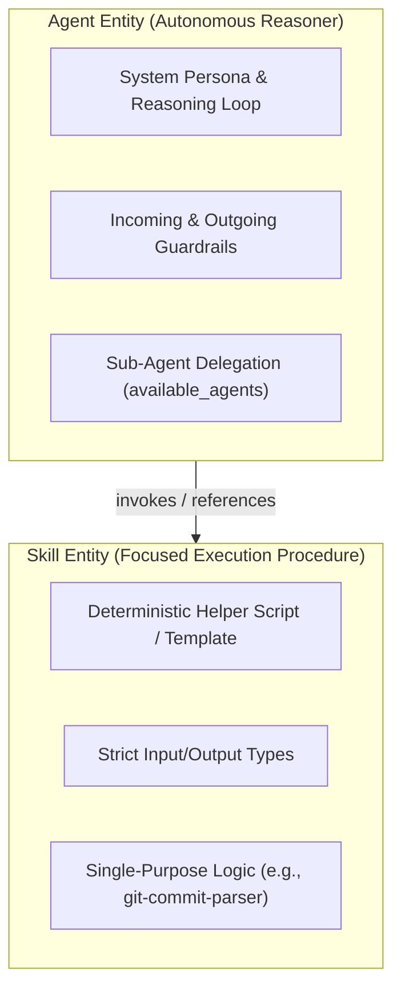
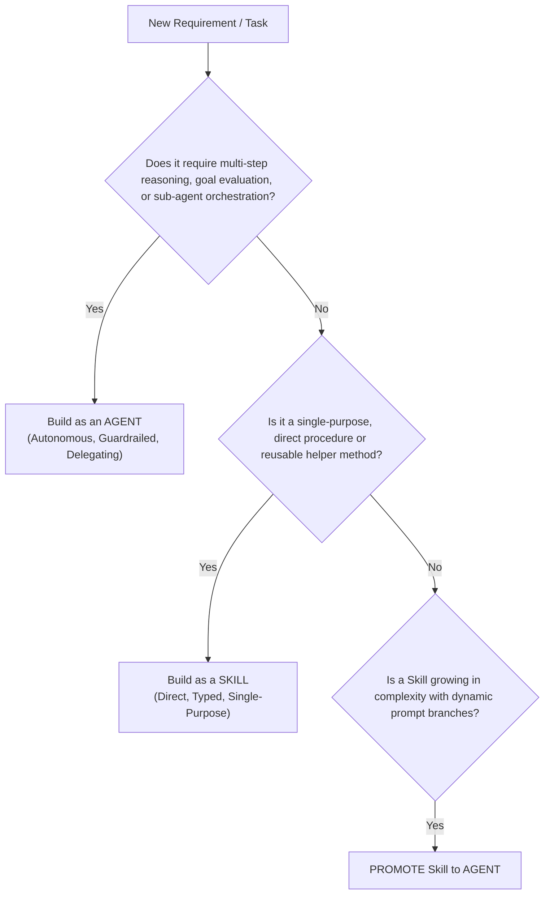

# Skills vs. Agents Architecture & Lifecycle Research

This research document analyzes the conceptual distinction, structural differences, usage guidance, and promotion lifecycle between **Skills** and **Agents** within **Agent-As-Data (AAD)**.

---

## 1. Conceptual Distinction: Agents vs. Skills

In multi-agent systems, confusing **Agents** (autonomous reasoning entities) with **Skills** (deterministic, procedure-oriented execution units) leads to bloated prompts and unmaintainable architectures.



### Comparative Analysis Matrix

| Metric / Aspect | Agent | Skill |
| :--- | :--- | :--- |
| **Primary Nature** | **Autonomous Reasoner**: Evaluates goals, plans multi-step actions, and makes decisions. | **Focused Procedure**: Direct, single-purpose function or execution script. |
| **State & Scope** | Multi-turn conversation context, dynamic planning, tool selection. | Stateless or single-turn execution with explicit inputs & outputs. |
| **Dependencies** | Can delegate to sub-agents (`available_agents`), execute tools, and reference skills (`available_skills`). | References underlying tools/code; does **not** orchestrate sub-agents. |
| **Guardrails & Evaluation** | Requires dual-layer evaluation (Deterministic + Probabilistic LLM-as-a-Judge). | Primarily deterministic unit test verification (Schema & assertion matching). |
| **PostgreSQL Table** | `agents` & `agent_revisions` | `skills` & `skill_revisions` |

---

## 2. Structural Schema & Data Model Comparison

```sql
-- Dedicated Managed Skills Table
CREATE TABLE IF NOT EXISTS skills (
    id UUID PRIMARY KEY DEFAULT gen_random_uuid(),
    name VARCHAR(255) UNIQUE NOT NULL,
    description TEXT NOT NULL,
    tags TEXT[] NOT NULL DEFAULT '{}',
    current_version INT NOT NULL DEFAULT 1,
    owner_id UUID NOT NULL,
    read_groups TEXT[] NOT NULL DEFAULT '{}',
    write_groups TEXT[] NOT NULL DEFAULT '{}',
    input_schema JSONB NOT NULL DEFAULT '{}'::jsonb,
    output_schema JSONB NOT NULL DEFAULT '{}'::jsonb,
    implementation JSONB NOT NULL DEFAULT '{}'::jsonb, -- Code snippet, template, or MCP tool mapping
    created_at TIMESTAMPTZ NOT NULL DEFAULT NOW(),
    updated_at TIMESTAMPTZ NOT NULL DEFAULT NOW()
);
```

---

## 3. Developer Guidance: When to Use an Agent vs. a Skill



### When to Create a Skill
- The logic is **single-purpose and deterministic** (e.g. parsing a git diff, extracting SQL statements, formatting markdown tables).
- The operation takes fixed inputs, returns structured outputs, and does not require complex reasoning loops.
- You want multiple agents to share the exact same execution utility without duplicating code.

### When to Create an Agent
- The task requires **autonomous planning, decision-making, or multi-turn goal execution** (e.g., security auditor, PR code reviewer, database migration planner).
- The task needs pre/post-execution safety guardrails, trait contract enforcement, or sub-agent delegation.

---

## 4. Promotion & Demotion Lifecycle Rules

1. **Skill -> Agent Promotion**:
   - **Trigger**: When a managed `Skill` evolves to include dynamic LLM reasoning branches, complex guardrails, or attempts to delegate sub-tasks.
   - **Mechanism**: Endpoint `POST /api/v1/skills/:id/promote` converts the skill's implementation into an `agent_definition`, wraps it in default guardrails, creates an entry in `agents`, and deprecates the original skill.
2. **Agent -> Skill Demotion**:
   - **Trigger**: When an `Agent` prompt is refactored and simplified down to a single deterministic tool wrapper without reasoning loops.
   - **Mechanism**: Endpoint `POST /api/v1/agents/:id/demote` extracts its input/output schema into a managed `Skill` entry.

---

## 5. PRD & Specification References
- **Master PRD**: [Section 13 - Managed Skills Subsystem](../prds/agent-as-data-prd.md)
- **Agent Registry PRD**: [Section 8 - Skills Management & Promotion](../prds/agent-registry-execution-prd.md)
- **Schema Spec**: [PostgreSQL DDL Tables](../specs/agent-schema-spec.md)
