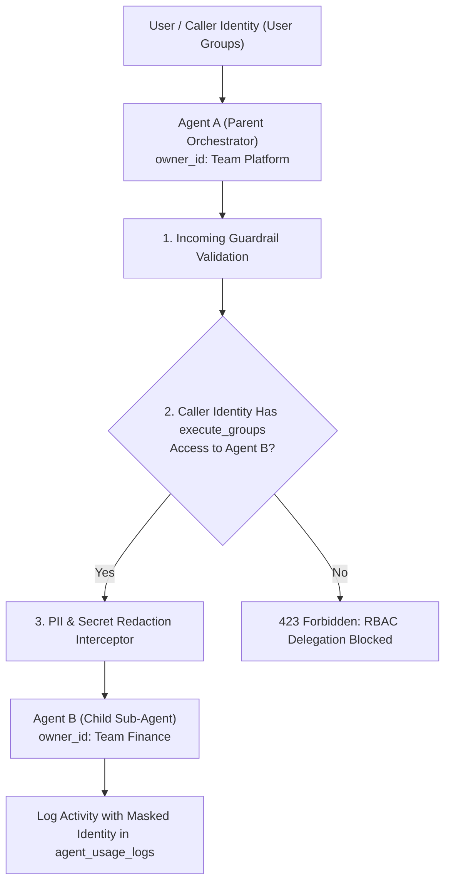

# Research: Privacy, Multi-Tenancy & Sub-Agent Delegation Security

This research explores **RBAC Permission Inheritance, Token Delegation Security, Data Redaction, and Multi-Tenant Isolation** across parent-child agent delegation boundaries in **Agent-As-Data (AAD)**.

---

## 1. Security Context in Sub-Agent Delegation

In a multi-team enterprise environment, agents belong to different ownership groups:
- **Agent A** (e.g. `code-reviewer-orchestrator`, owned by Team Platform).
- **Agent B** (e.g. `financial-audit-agent`, owned by Team Finance).

When Agent A delegates a sub-task to Agent B:
1. **Permission Check**: Does the caller executing Agent A have `execute_groups` access to Agent B?
2. **Context Leakage**: Does Agent A pass sensitive source code or PII to Agent B that Agent B's owner should not see in audit logs (`agent_usage_logs`)?
3. **Prompt Injection Escalation**: Can a malicious payload sent to Agent A exploit Agent B's elevated capabilities?



---

## 2. Security Capabilities & Delegation Matrix

| Security Layer | Requirement & Pattern | AAD Implementation |
| :--- | :--- | :--- |
| **1. RBAC Context Inheritance** | When Agent A calls Agent B, the caller's explicit identity (`caller_identity`) is propagated. | Delegation fails if `caller_identity` is not in Agent B's `execute_groups`. |
| **2. Dynamic Data Redaction** | Sensitive variables, API keys, or PII passed between sub-agents must be masked. | Pre-delegation guardrail interceptor strips secrets using regex & entity redaction models. |
| **3. Guardrail Boundary Protection** | Child agents evaluate their own `incoming_guardrails` regardless of parent trust level. | Prevents prompt injection payload escalation across sub-agent boundaries. |
| **4. Scoped Audit Logging** | `agent_usage_logs` records `caller_identity`, `parent_agent_id`, and `child_agent_id`. | Full auditability of multi-agent delegation chains. |

---

## 3. Recommended Security Policy & Architecture

```json
// Example Sub-Agent Delegation Security Payload
{
  "parent_agent_id": "a0eebc99-9c0b-4ef8-bb6d-6bb9bd380a11",
  "target_agent_id": "b2eebc99-9c0b-4ef8-bb6d-6bb9bd380a44",
  "caller_context": {
    "user_id": "usr_bengreene",
    "groups": ["platform-devs", "security-auditors"]
  },
  "redaction_policy": {
    "mask_pii": true,
    "strip_secrets": true
  }
}
```

---

## 4. PRD Integration Summary

- **Agent Registry PRD**: Section 1 updated to detail RBAC Context Inheritance and Delegation Security Boundaries.
- **Master PRD**: Section 11 updated for Sub-Agent Security & Redaction Interceptors.
