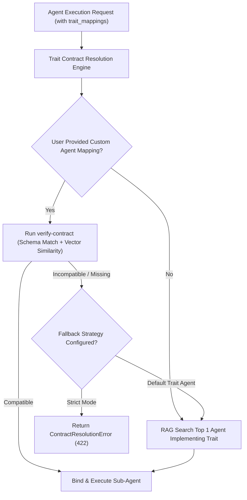

# Research: Dynamic Trait Contract Negotiation & Sub-Agent Dependency Resolution Engine

This research explores resolution algorithms, fallback mechanisms, and contract negotiation strategies for **Dynamic Trait Resolution & Dependency Graphs** in **Agent-As-Data (AAD)**.

---

## 1. Problem Definition: Dynamic Sub-Agent Trait Resolution

When an agent delegates a task to an abstract trait interface (e.g. `implements_traits: ["SecurityAuditor"]`) rather than a hardcoded UUID:
1. **Trait Resolution Graph**: AAD must locate candidate agents implementing `SecurityAuditor`.
2. **User Trait Overrides**: If the user passes `trait_mappings: { "SecurityAuditor": "custom_agent_uuid" }`, AAD must verify that `custom_agent_uuid` actually satisfies the trait contract.
3. **Circular Dependencies**: Prevent recursive loops (e.g. Agent A delegates to Trait B -> Agent B delegates to Trait A).
4. **Fallback & Negotiation**: If a mapped agent fails semantic fit verification or schema matching, how does the system gracefully negotiate a fallback?



---

## 2. Dynamic Trait Resolution & Contract Negotiation Matrix

| Feature / Mechanism | Behavior & Implementation | Safety & Error Handling |
| :--- | :--- | :--- |
| **1. User Trait Override (`trait_mappings`)** | Client passes runtime UUID mappings for abstract traits out of scope for the current user. | Executes `POST /api/v1/agents/verify-contract` prior to execution. |
| **2. Topological Cycle Prevention** | Builds a Depth-First Search (DFS) DAG of the delegation tree before execution. | Throws `ERR_CIRCULAR_DELEGATION` if a cycle is detected. |
| **3. Schema Negotiation & Soft Compatibility** | Compares input/output JSON schemas. If optional fields differ, applies default field hydration. | If required schema fields are missing, flags `ERR_SCHEMA_MISMATCH`. |
| **4. Graceful Fallback Chain** | If a custom mapped agent fails verification, AAD can attempt fallback to the default system agent for that trait if permitted. | Controlled by `strict_trait_resolution: boolean` flag in request payload. |

---

## 3. Recommended Engine Architecture for AAD

```sql
-- Trait Definition Table
CREATE TABLE IF NOT EXISTS agent_traits (
    id UUID PRIMARY KEY DEFAULT gen_random_uuid(),
    trait_name VARCHAR(255) UNIQUE NOT NULL,
    description TEXT NOT NULL,
    input_schema JSONB NOT NULL DEFAULT '{}'::jsonb,
    output_schema JSONB NOT NULL DEFAULT '{}'::jsonb,
    required_guardrails JSONB NOT NULL DEFAULT '{}'::jsonb,
    created_at TIMESTAMPTZ NOT NULL DEFAULT NOW()
);
```

---

## 4. PRD Integration Summary

- **Agent Registry PRD**: Section 2 updated to include Trait Negotiation, DFS cycle detection, and fallback rules.
- **Master PRD**: Data Model updated to include `agent_traits`.
