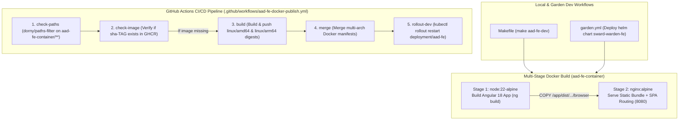

# UI Build Process, Containerization & CI/CD Architecture Reference (`aad-fe-container`)

This document analyzes the frontend container build pipeline, Docker multi-stage configuration, Garden/Helm development workflows, and GitHub Actions CI/CD automation in **`sward-warden/sw-fe-container`** and details how **Agent-As-Data (`aad-fe-container`)** mirrors this exact architecture.

---

## 1. Architectural Overview & Component Structure

Following `PolecatWorks/sward-warden`, frontend UI applications are built as standalone containerized microfrontends deployed via Nginx and Helm:



---

## 2. Directory Structure of `aad-fe-container`

```
agent-as-data/
├── aad-fe-container/              # Mirroring sw-fe-container
│   ├── Dockerfile                 # Multi-stage Docker build (node:22-alpine + nginx:alpine)
│   ├── nginx.conf                 # SPA routing (try_files /index.html) & CORS headers
│   ├── angular.json               # Angular 18+ build configuration
│   ├── tailwind.config.js         # TailwindCSS configuration
│   ├── package.json               # Dependencies (Angular Material, RxJS, Mermaid, SSE)
│   ├── tsconfig.json              # TypeScript compilation settings
│   └── src/                       # Standalone Angular 18 components & UI workbench
├── .github/
│   └── workflows/
│       └── aad-fe-docker-publish.yml # Multi-arch GHCR build & automated rollout
├── garden.yml                     # Garden project definition for K8s deployment
└── Makefile                       # Developer task runner (make aad-fe-dev)
```

---

## 3. Containerization Specification (`Dockerfile` & `nginx.conf`)

### Multi-Stage `Dockerfile` Pattern
```dockerfile
# Stage 1: Build Angular application
FROM node:22-alpine AS build
WORKDIR /app

# Install build tools for native modules on arm64/x86_64 Alpine
RUN apk add --no-cache python3 make g++

COPY package.json package-lock.json .npmrc* ./
RUN npm install --no-audit --no-fund

# Install Rollup's native module specifically for target architecture
RUN if [ "$(uname -m)" = "x86_64" ]; then \
      npm install @rollup/rollup-linux-x64-musl; \
    else \
      npm install @rollup/rollup-linux-arm64-musl; \
    fi

COPY . .
RUN npm run build

# Stage 2: Serve static production assets via Nginx
FROM nginx:alpine

LABEL org.opencontainers.image.title="Agent-As-Data FE"
LABEL org.opencontainers.image.description="Agent-As-Data Developer Studio & Workbench (Angular)"
LABEL org.opencontainers.image.source="https://github.com/PolecatWorks/agent-as-data"

COPY --from=build /app/dist/aad-fe-container/browser /usr/share/nginx/html
COPY nginx.conf /etc/nginx/conf.d/default.conf

EXPOSE 8080
CMD ["nginx", "-g", "daemon off;"]
```

### Nginx SPA Ingress Configuration (`nginx.conf`)
```nginx
map $http_origin $cors_origin {
    default "";
    "~^http://localhost(:\d+)?$" "$http_origin";
}

server {
    listen 8080;
    server_name localhost;
    root /usr/share/nginx/html;

    location /alive { return 200; access_log off; }
    location /ready { return 200; access_log off; }

    # SPA Router fallback to index.html
    location / {
        alias /usr/share/nginx/html/;
        index index.html index.htm;
        try_files $uri $uri/ /index.html;
    }
    error_page 404 /index.html;

    location ~* \.(js|css|png|jpg|jpeg|gif|ico|svg|json)$ {
        expires 1y;
        add_header Cache-Control "public, no-transform";
        add_header 'Access-Control-Allow-Origin' $cors_origin;
    }
}
```

---

## 4. Multi-Arch CI/CD Pipeline (`aad-fe-docker-publish.yml`)

1. **Path-Based Triggering**: Uses `dorny/paths-filter@v3` to only trigger builds when `aad-fe-container/**` or its workflow changes.
2. **Digest Check**: Calculates content SHA `git log -1 --format=%H -- aad-fe-container/` and skips build if the image tag `sha-<SHA>` already exists in GHCR.
3. **Parallel Multi-Platform Build**: Matrix build on `linux/amd64` and `linux/arm64` using Docker Buildx and GitHub runner tags.
4. **Manifest Merging**: Merges platform digests into unified multi-arch image tags in GHCR (`ghcr.io/polecatworks/agent-as-data-fe`).
5. **Automated Dev Rollout**: Triggers `kubectl rollout restart deployment/aad-fe-nginx-view` upon merging to `main`.

---

## 5. Integration with PRDs & Specs
- **Agent Development UI PRD**: Updated `agent-ui-testing-kit-prd.md` to reference `aad-fe-container` build process and Docker pipeline.
- **Master PRD**: Updated `agent-as-data-prd.md` Section 10 containerization specs.
