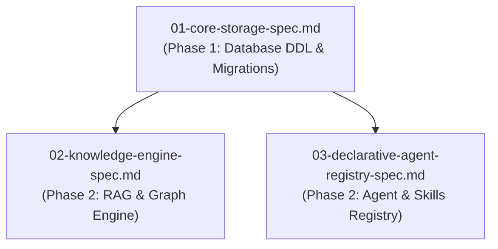

# Spec 01: Core Storage & Database Migrations

**Status**: `draft`

## Overview & Scope
This specification defines the foundation layer for **Agent-As-Data (AAD)**: PostgreSQL database extension initialization (`pgvector`), DDL schema tables, `sqlx` migration runner setup, and base trait/guardrail data seeders.

## Dependencies & References
- **Build Order Phase**: **Phase 1 (Foundation)** - Must be implemented first.
- **Dependencies**: None (Root foundational spec).
- **PRD References**: [Agent-As-Data Master PRD](../prds/agent-as-data-prd.md), [Knowledge & Data System PRD](../prds/knowledge-data-system-prd.md), [Agent Registry PRD](../prds/agent-registry-execution-prd.md).
- **Related Specs**: Precedes [02-knowledge-engine-spec.md](./02-knowledge-engine-spec.md) and [03-declarative-agent-registry-spec.md](./03-declarative-agent-registry-spec.md).



---

## 1. DDL Schema Implementation

```sql
-- Enable vector extension
CREATE EXTENSION IF NOT EXISTS vector;

-- Base agents table
CREATE TABLE IF NOT EXISTS agents (
    id UUID PRIMARY KEY DEFAULT gen_random_uuid(),
    name VARCHAR(255) NOT NULL,
    description TEXT,
    tags TEXT[] NOT NULL DEFAULT '{}',
    implements_traits TEXT[] NOT NULL DEFAULT '{}',
    current_version INT NOT NULL DEFAULT 1,
    owner_id UUID NOT NULL,
    read_groups TEXT[] NOT NULL DEFAULT '{}',
    write_groups TEXT[] NOT NULL DEFAULT '{}',
    execute_groups TEXT[] NOT NULL DEFAULT '{}',
    incoming_guardrails JSONB NOT NULL DEFAULT '{}'::jsonb,
    outgoing_guardrails JSONB NOT NULL DEFAULT '{}'::jsonb,
    agent_definition JSONB NOT NULL DEFAULT '{}'::jsonb,
    model JSONB NOT NULL DEFAULT '{}'::jsonb,
    tools JSONB NOT NULL DEFAULT '[]'::jsonb,
    available_skills JSONB NOT NULL DEFAULT '[]'::jsonb,
    available_agents JSONB NOT NULL DEFAULT '[]'::jsonb,
    created_at TIMESTAMPTZ NOT NULL DEFAULT NOW(),
    updated_at TIMESTAMPTZ NOT NULL DEFAULT NOW()
);

-- Immutable version history table
CREATE TABLE IF NOT EXISTS agent_revisions (
    id UUID PRIMARY KEY DEFAULT gen_random_uuid(),
    agent_id UUID NOT NULL REFERENCES agents(id) ON DELETE CASCADE,
    version INT NOT NULL,
    snapshot JSONB NOT NULL,
    created_at TIMESTAMPTZ NOT NULL DEFAULT NOW(),
    UNIQUE(agent_id, version)
);

-- Execution tracking table
CREATE TABLE IF NOT EXISTS executions (
    id UUID PRIMARY KEY DEFAULT gen_random_uuid(),
    agent_id UUID NOT NULL REFERENCES agents(id),
    agent_version INT NOT NULL,
    execution_version INT NOT NULL DEFAULT 1,
    status VARCHAR(50) NOT NULL DEFAULT 'pending',
    working_memory JSONB NOT NULL DEFAULT '{}'::jsonb,
    request_payload JSONB NOT NULL,
    response_payload JSONB,
    webhook_url TEXT,
    error_message TEXT,
    started_at TIMESTAMPTZ,
    completed_at TIMESTAMPTZ,
    created_at TIMESTAMPTZ NOT NULL DEFAULT NOW()
);

-- Indices
CREATE INDEX IF NOT EXISTS idx_agents_name ON agents(name);
CREATE INDEX IF NOT EXISTS idx_agents_tags ON agents USING GIN(tags);
CREATE INDEX IF NOT EXISTS idx_agents_traits ON agents USING GIN(implements_traits);
```

---

## 2. Test Strategy & Verification Plan

### Integration Tests
- Verify `sqlx` migration runner executes cleanly against an empty PostgreSQL database with `vector` extension enabled.
- Test CRUD operations on `agents`, `agent_revisions`, and `executions`.
- Verify foreign key cascades and version constraint checks (`UNIQUE(agent_id, version)`).
