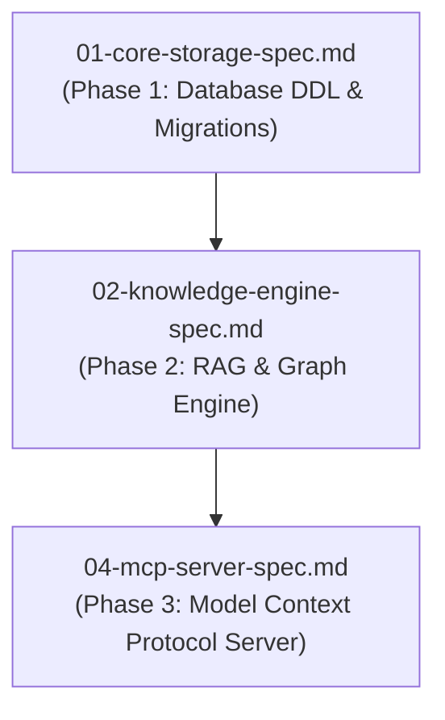

# Spec 02: Knowledge & RAG/Graph System

**Status**: `draft`


## Overview & Scope
This specification defines the **Enterprise Knowledge System**: text chunking, `pgvector` HNSW similarity indexing, Subject-Predicate-Object (`knowledge_tuples`) graph store with canonical entity resolution (`subject_canonical`, `object_canonical`), confidence scores, and multi-hop graph traversal.

## Dependencies & References
- **Build Order Phase**: **Phase 2 (Core Domain Engines)**.
- **Dependencies**: Depends on [01-core-storage-spec.md](./01-core-storage-spec.md) for base PostgreSQL schema.
- **PRD References**: [Knowledge & Data System PRD](../prds/knowledge-data-system-prd.md), [Agent-As-Data Master PRD](../prds/agent-as-data-prd.md).
- **Research References**: [knowledge-graph-extraction-pruning-research.md](../research/knowledge-graph-extraction-pruning-research.md).



---

## 1. Schema DDL Tables & Indices

```sql
-- Raw knowledge text nodes
CREATE TABLE IF NOT EXISTS knowledge_nodes (
    id UUID PRIMARY KEY DEFAULT gen_random_uuid(),
    topic VARCHAR(255) NOT NULL,
    title VARCHAR(255),
    content TEXT NOT NULL,
    metadata JSONB NOT NULL DEFAULT '{}'::jsonb,
    created_at TIMESTAMPTZ NOT NULL DEFAULT NOW(),
    updated_at TIMESTAMPTZ NOT NULL DEFAULT NOW()
);

-- RAG Vector Embeddings for chunked content
CREATE TABLE IF NOT EXISTS knowledge_embeddings (
    id UUID PRIMARY KEY DEFAULT gen_random_uuid(),
    node_id UUID NOT NULL REFERENCES knowledge_nodes(id) ON DELETE CASCADE,
    chunk_index INT NOT NULL,
    chunk_text TEXT NOT NULL,
    embedding vector(1536),
    created_at TIMESTAMPTZ NOT NULL DEFAULT NOW()
);

-- Knowledge Graph Tuples with Canonical Resolution
CREATE TABLE IF NOT EXISTS knowledge_tuples (
    id UUID PRIMARY KEY DEFAULT gen_random_uuid(),
    subject VARCHAR(255) NOT NULL,
    subject_canonical VARCHAR(255),
    predicate VARCHAR(255) NOT NULL,
    object VARCHAR(255) NOT NULL,
    object_canonical VARCHAR(255),
    confidence FLOAT NOT NULL DEFAULT 1.0,
    traversal_count INT NOT NULL DEFAULT 0,
    source_node_id UUID REFERENCES knowledge_nodes(id) ON DELETE CASCADE,
    metadata JSONB NOT NULL DEFAULT '{}'::jsonb,
    created_at TIMESTAMPTZ NOT NULL DEFAULT NOW()
);

-- Indices
CREATE INDEX IF NOT EXISTS idx_knowledge_embeddings_vector ON knowledge_embeddings USING hnsw (embedding vector_cosine_ops);
CREATE INDEX IF NOT EXISTS idx_knowledge_tuples_spo ON knowledge_tuples(subject, predicate, object);
```

---

## 2. API Endpoints & Contracts
- `POST /api/v1/knowledge`: Store document/chunk & extract SPO tuples.
- `POST /api/v1/knowledge/search`: RAG semantic vector similarity search.
- `POST /api/v1/knowledge/graph/traverse`: Multi-hop tuple graph traversal.

---

## 3. Test Strategy & Verification Plan
- Unit test vector embedding chunker and SPO triple extractor.
- Integration test `pgvector` HNSW cosine similarity search precision.
- Integration test multi-hop graph traversal queries.
