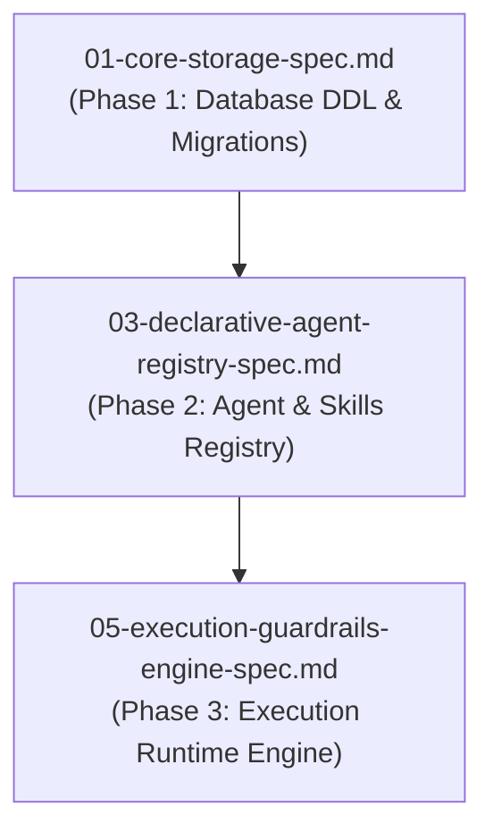

# Spec 03: Declarative Agent & Managed Skills Registry

**Status**: `draft`

## Overview & Scope
This specification defines the **Declarative Agent Registry, Managed Skills Subsystem, Skill-to-Agent Promotion/Demotion Engine, and Agent Traits Verification Contract System**.

## Dependencies & References
- **Build Order Phase**: **Phase 2 (Core Domain Engines)**.
- **Dependencies**: Depends on [01-core-storage-spec.md](./01-core-storage-spec.md) for base schema tables.
- **PRD References**: [Agent Registry PRD](../prds/agent-registry-execution-prd.md), [Agent-As-Data Master PRD](../prds/agent-as-data-prd.md).
- **Research References**: [agent-trait-contracts-research.md](../research/agent-trait-contracts-research.md), [skills-vs-agents-research.md](../research/skills-vs-agents-research.md), [subagent-delegation-security-research.md](../research/subagent-delegation-security-research.md).



---

## 1. Schema DDL & Tables

```sql
-- RAG Vector Embedding for Semantic Agent Discovery
CREATE TABLE IF NOT EXISTS agent_embeddings (
    agent_id UUID PRIMARY KEY REFERENCES agents(id) ON DELETE CASCADE,
    embedding vector(1536),
    content_hash VARCHAR(64) NOT NULL,
    updated_at TIMESTAMPTZ NOT NULL DEFAULT NOW()
);

-- Managed Skills Table
CREATE TABLE IF NOT EXISTS skills (
    id UUID PRIMARY KEY DEFAULT gen_random_uuid(),
    name VARCHAR(255) UNIQUE NOT NULL,
    description TEXT NOT NULL,
    tags TEXT[] NOT NULL DEFAULT '{}',
    current_version INT NOT NULL DEFAULT 1,
    owner_id UUID NOT NULL,
    read_groups TEXT[] NOT NULL DEFAULT '{}',
    write_groups TEXT[] NOT NULL DEFAULT '{}',
    input_schema JSONB NOT NULL DEFAULT '{}'::jsonb,
    output_schema JSONB NOT NULL DEFAULT '{}'::jsonb,
    implementation JSONB NOT NULL DEFAULT '{}'::jsonb,
    created_at TIMESTAMPTZ NOT NULL DEFAULT NOW(),
    updated_at TIMESTAMPTZ NOT NULL DEFAULT NOW()
);

CREATE INDEX IF NOT EXISTS idx_skills_name ON skills(name);
```

---

## 2. Core Capabilities & APIs
- **Agent CRUD & Revisions**: `/api/v1/agents` with automatic snapshot publishing to `agent_revisions`.
- **RBAC Delegation Security & Inheritance**: Propagates `caller_identity` down sub-agent calls, verifying access against child `execute_groups` (`423 Forbidden` on failure) and redacting secrets/PII before cross-team transfer.
- **RAG Discovery**: `POST /api/v1/agents/search` (Top-N cosine vector search).
- **Trait Verification**: `POST /api/v1/agents/verify-contract` (Semantic fit + schema match).
- **Skill Promotion**: `POST /api/v1/skills/:id/promote` & `POST /api/v1/agents/:id/demote`.


---

## 3. Test Strategy & Verification Plan
- Unit test skill promotion logic and revision snapshot immutability.
- Integration test vector search over agent prompt definitions.
- Integration test contract verification checks.
