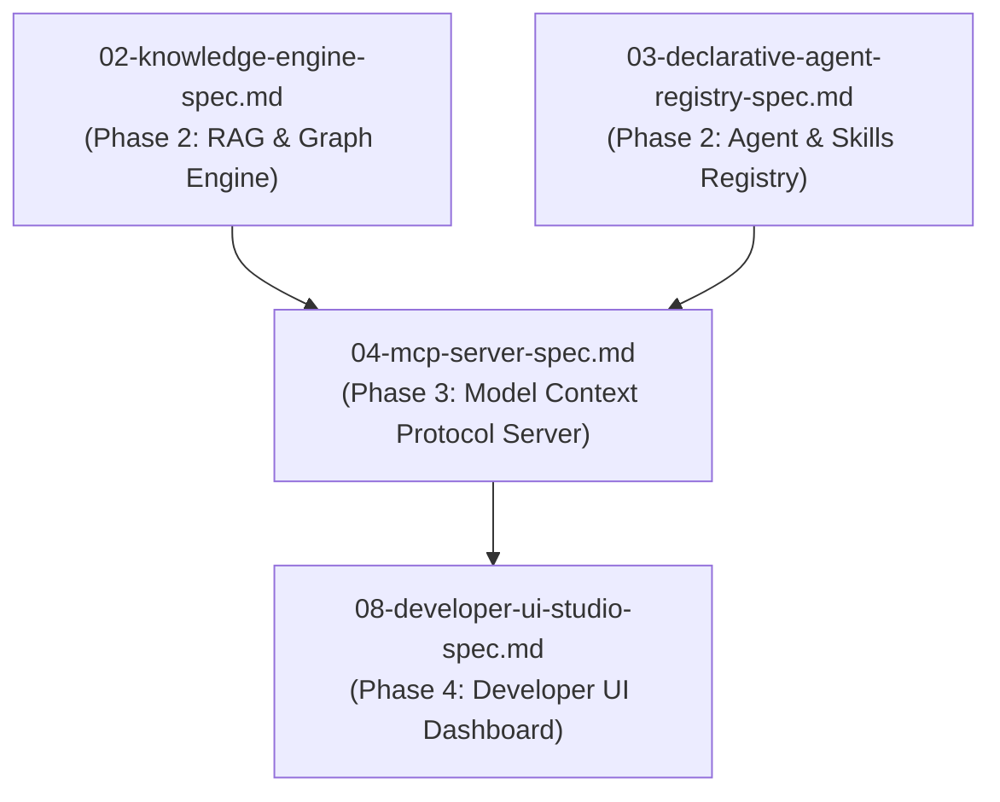

# Spec 04: Native Model Context Protocol (MCP) Server & Remote Registration

**Status**: `draft`


## Overview & Scope
This specification defines the **Native MCP Server (Stdio & SSE)**, exposing 11 native MCP tools (`search_agents`, `execute_agent`, `compile_agent_network`, `ingest_knowledge`, `search_knowledge`, `query_knowledge_graph`, etc.) and the **Remote MCP Server Registration & Tool Caching Subsystem**.

## Dependencies & References
- **Build Order Phase**: **Phase 3 (MCP & Protocol Integrations)**.
- **Dependencies**: Depends on [02-knowledge-engine-spec.md](./02-knowledge-engine-spec.md) and [03-declarative-agent-registry-spec.md](./03-declarative-agent-registry-spec.md).
- **PRD References**: [Agent-As-Data Master PRD](../prds/agent-as-data-prd.md), [Knowledge PRD](../prds/knowledge-data-system-prd.md), [Agent Registry PRD](../prds/agent-registry-execution-prd.md).



---

## 1. Remote MCP Server Cache Table Schema

```sql
CREATE TABLE IF NOT EXISTS mcp_servers (
    id UUID PRIMARY KEY DEFAULT gen_random_uuid(),
    server_name VARCHAR(255) UNIQUE NOT NULL,
    transport_type VARCHAR(50) NOT NULL, -- 'stdio', 'sse'
    endpoint_config JSONB NOT NULL DEFAULT '{}'::jsonb,
    cached_capabilities JSONB NOT NULL DEFAULT '{}'::jsonb,
    last_synced_at TIMESTAMPTZ NOT NULL DEFAULT NOW()
);

CREATE INDEX IF NOT EXISTS idx_mcp_servers_name ON mcp_servers(server_name);
```

---

## 2. Remote Registration API (`POST /api/v1/agents/mcp/register`)
- Registers remote Stdio/SSE MCP server endpoints.
- Automatically queries `tools/list`, `resources/list`, and `prompts/list`.
- Caches JSON schemas and generates RAG embeddings (`pgvector`) for remote tools.

---

## 3. Test Strategy & Verification Plan
- Integration test native MCP server over Stdio and SSE transport.
- Integration test remote MCP registration and tool schema parsing.
