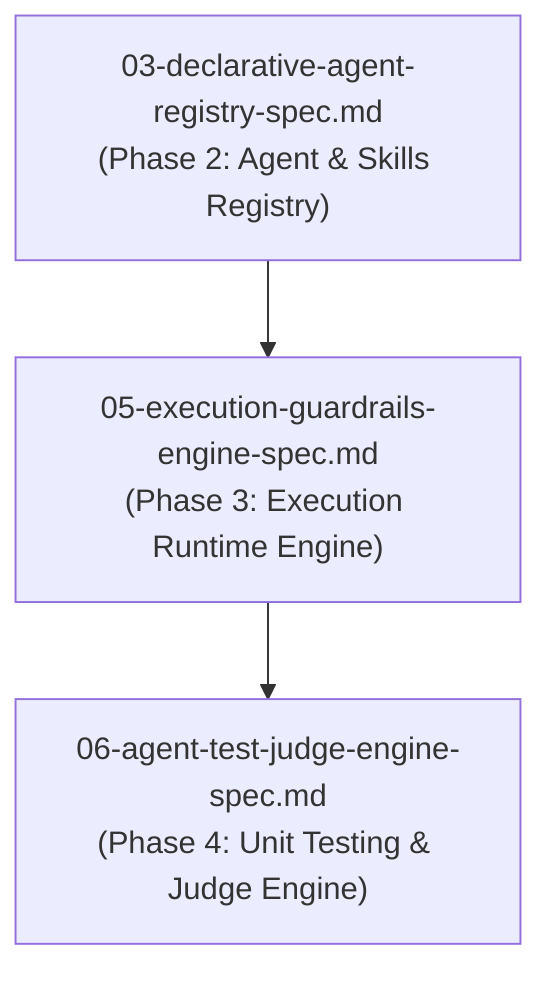

# Spec 05: Agent Execution Engine & Safety Guardrails

**Status**: `draft`

## Overview & Scope
This specification defines the **Synchronous/Streaming & Asynchronous Agent Execution Engine**, pre/post-execution Guardrail Interceptors, and the **Three-Tier Working Memory Persistence System with Optimistic Concurrency Control (OCC)**.

## Dependencies & References
- **Build Order Phase**: **Phase 3 (Execution Runtimes)**.
- **Dependencies**: Depends on [01-core-storage-spec.md](./01-core-storage-spec.md) and [03-declarative-agent-registry-spec.md](./03-declarative-agent-registry-spec.md).
- **PRD References**: [Agent Registry PRD](../prds/agent-registry-execution-prd.md), [Agent-As-Data Master PRD](../prds/agent-as-data-prd.md).
- **Research References**: [multi-agent-state-sync-research.md](../research/multi-agent-state-sync-research.md), [subagent-delegation-security-research.md](../research/subagent-delegation-security-research.md).

---

## 1. Core Execution Endpoints & Mechanics
- `POST /api/v1/agents/:id/execute`: Synchronous execution with real-time SSE token & tool call event streaming.
- `POST /api/v1/agents/search-and-execute`: Dynamic RAG agent discovery + streaming execution.
- `POST /api/v1/executions`: Asynchronous job creation with polling (`GET /api/v1/executions/:id`) and optional completion `webhook_url` dispatches.
- **Offline Mock Provider (`model: { "provider": "mock" }`)**: Deterministic internal execution engine returning pre-recorded token streams and mock tool call events for local development, CI pipelines, and offline testing without live API keys.

---

## 2. Guardrails & Concurrency Locking
- **Guardrail Interceptors**: pre-execution (`incoming_guardrails`) payload validation and post-execution (`outgoing_guardrails`) format/safety checks.
- **OCC Version Locking**: State updates verify `WHERE execution_version = expected_version` on `executions.working_memory`.
- **RBAC Delegation & Secret Redaction**: Inherits `caller_identity` down sub-agent delegation calls and masks PII/credentials.

---

## 3. Test Strategy & Verification Plan
- Unit test guardrail interceptor pass/fail filters.
- Integration test SSE token streaming endpoint.
- Integration test OCC version conflict retries on parallel agent executions.
