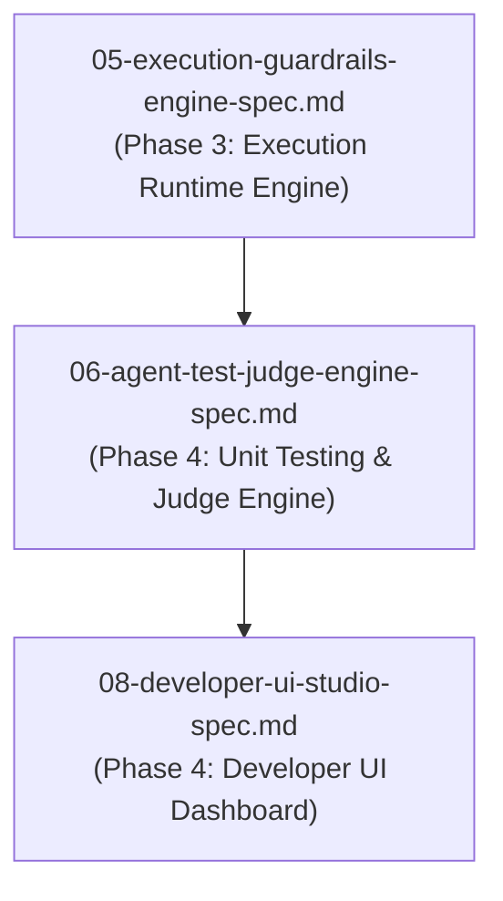

# Spec 06: Probabilistic Unit Testing & LLM-as-a-Judge Engine

**Status**: `draft`

## Overview & Scope
This specification defines the **Probabilistic Agent Unit Testing Subsystem**, regression detection gates, and the **LLM-as-a-Judge Evaluation Engine**.

## Dependencies & References
- **Build Order Phase**: **Phase 4 (Quality Assurance & Analytics)**.
- **Dependencies**: Depends on [03-declarative-agent-registry-spec.md](./03-declarative-agent-registry-spec.md) and [05-execution-guardrails-engine-spec.md](./05-execution-guardrails-engine-spec.md).
- **PRD References**: [Agent Registry PRD](../prds/agent-registry-execution-prd.md), [Agent-As-Data Master PRD](../prds/agent-as-data-prd.md).



---

## 1. Schema DDL & Tables

```sql
-- Agent Test Suites Table
CREATE TABLE IF NOT EXISTS agent_test_suites (
    id UUID PRIMARY KEY DEFAULT gen_random_uuid(),
    agent_id UUID NOT NULL REFERENCES agents(id) ON DELETE CASCADE,
    name VARCHAR(255) NOT NULL,
    test_cases JSONB NOT NULL DEFAULT '[]'::jsonb,
    created_at TIMESTAMPTZ NOT NULL DEFAULT NOW()
);

-- Agent Test Runs Table (Audit log for deterministic & Judge evaluation scores)
CREATE TABLE IF NOT EXISTS agent_test_runs (
    id UUID PRIMARY KEY DEFAULT gen_random_uuid(),
    agent_id UUID NOT NULL REFERENCES agents(id) ON DELETE CASCADE,
    agent_version INT NOT NULL,
    suite_id UUID REFERENCES agent_test_suites(id) ON DELETE SET NULL,
    status VARCHAR(50) NOT NULL,
    deterministic_results JSONB NOT NULL DEFAULT '{}'::jsonb,
    judge_evaluation JSONB NOT NULL DEFAULT '{}'::jsonb,
    created_at TIMESTAMPTZ NOT NULL DEFAULT NOW()
);

CREATE INDEX IF NOT EXISTS idx_agent_test_runs_agent ON agent_test_runs(agent_id, agent_version);
```

---

## 2. Testing API (`POST /api/v1/agents/:id/test`)
- Evaluates deterministic assertions (JSON schema, regex, required fields).
- Invokes independent Judge Agent to evaluate probabilistic outputs against natural language rubrics (0.0 to 1.0).
- Blocks regression updates to `agent_revisions` if pass rate or Judge scores drop below `judge_threshold`.

---

## 3. Test Strategy & Verification Plan
- Unit test deterministic assertion evaluation.
- Integration test Judge Agent rubric evaluation pipeline.
- Test CI/CD regression blocking logic when pass rate falls below threshold.
