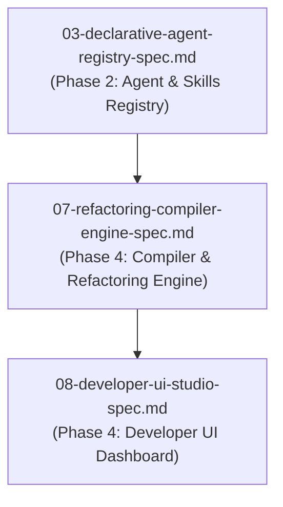

# Spec 07: Refactoring, Compression & Agent Compiler Engine

**Status**: `draft`

## Overview & Scope
This specification defines the **Agent Refactoring & Compression Engine** (`POST /api/v1/agents/refactor/analyze`) and the **Pre-Flight Agent Network Compiler** (`POST /api/v1/agents/compile`).

## Dependencies & References
- **Build Order Phase**: **Phase 4 (Advanced Network Analysis)**.
- **Dependencies**: Depends on [03-declarative-agent-registry-spec.md](./03-declarative-agent-registry-spec.md).
- **PRD References**: [Agent Registry PRD](../prds/agent-registry-execution-prd.md), [Agent-As-Data Master PRD](../prds/agent-as-data-prd.md).
- **Research References**: [trait-contract-negotiation-research.md](../research/trait-contract-negotiation-research.md).

---

## 1. Engine Capabilities & APIs
- **Refactoring & Overlap Analyzer (`POST /api/v1/agents/refactor/analyze`)**:
  - Scans `agent_embeddings` to find duplicate, redundant, or conflicting agents.
  - Merges duplicate capabilities into master agents and documents **deliberate contradictions**.
- **Pre-Flight Agent Network Compiler (`POST /api/v1/agents/compile`)**:
  - *Layer 1 (DAG Topology)*: DFS cycle detection (`ERR_CIRCULAR_DELEGATION`).
  - *Layer 2 (Contract Matching)*: Parent/child input-output JSON schema matching.
  - *Layer 3 (Semantic Cohesion)*: Cosine vector fit scoring (`pgvector`).

---

## 2. Test Strategy & Verification Plan
- Unit test DFS topological cycle detector on recursive agent graphs.
- Integration test refactoring cluster analysis endpoint.
- Integration test full 3-layer compilation scan over complex agent delegation hierarchies.
