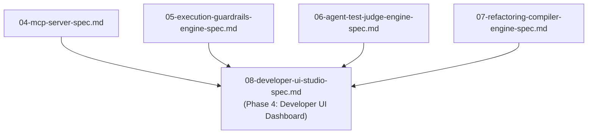

# Spec 08: Developer UI Container & Testing Studio (`aad-fe-container`)

**Status**: `complete`

## Overview & Scope
This specification defines the frontend web application container **`aad-fe-container`** built with **Angular 18+ (Standalone Components, Angular Material, RxJS, TailwindCSS, Fontsource Inter, and Mermaid.js)** mirroring the `sward-warden/sw-fe-container` architecture.

## Dependencies & References
- **Build Order Phase**: **Phase 4 (Developer UI & Workbench)**.
- **Dependencies**: Depends on [04-mcp-server-spec.md](./04-mcp-server-spec.md), [05-execution-guardrails-engine-spec.md](./05-execution-guardrails-engine-spec.md), [06-agent-test-judge-engine-spec.md](./06-agent-test-judge-engine-spec.md), and [07-refactoring-compiler-engine-spec.md](./07-refactoring-compiler-engine-spec.md).
- **PRD References**: [Agent UI & Testing Kit PRD](../prds/agent-ui-testing-kit-prd.md), [Agent-As-Data Master PRD](../prds/agent-as-data-prd.md).
- **Research References**: [ui-build-container-reference.md](../research/ui-build-container-reference.md).

---

## 1. UI Modules & Dashboard Layout
1. **Agent Registry & Builder**: Visual form editor, RBAC group assignment, version snapshot diff viewer.
2. **Interactive Testing Studio**: Live execution playground with real-time SSE token streaming and dynamic `trait_mappings` overrides.
3. **Mermaid Network Graph Visualizer**: Renderable agent delegation hierarchies (`visualize_agents`).
4. **Refactoring & Compression Lab**: Cluster analysis viewer and deliberate contradiction inspector.
5. **Knowledge & SPO Tuple Inspector**: Hybrid RAG search and multi-hop graph tree visualizer.
6. **Remote MCP Server Manager**: Remote MCP registration and cached tool schema browser.

---

## 2. Container Build & CI/CD Infrastructure
- **Dockerfile**: Multi-stage build (`node:22-alpine` Angular build + `nginx:alpine` runtime).
- **Nginx Config**: Static asset caching (`1y`), CORS headers, SPA routing (`try_files $uri /index.html`), health endpoints (`/alive`, `/ready`).
- **Garden & CI/CD**: Deployable via `garden.yml` Helm chart and multi-arch GitHub Actions pipeline (`aad-fe-docker-publish.yml`).

---

- Karma / Jasmine unit tests for Angular standalone components.
- Playwright / Cypress browser unit tests for SSE token streaming and Mermaid graph rendering.
- **Robot Framework Integration Test Suite (`/integration-tests/tests/`)**: Adopted from `sward-warden/integration-tests`. Declarative `.robot` test files (`test_journey_01_knowledge_ingestion.robot` through `test_journey_09_developer_ui_studio.robot`) executing end-to-end user journeys against backend (`http://localhost:8080`) and frontend container (`http://localhost:4200`) via `run-tests-local.sh` and Garden Kubernetes tests (`garden.yml`).

