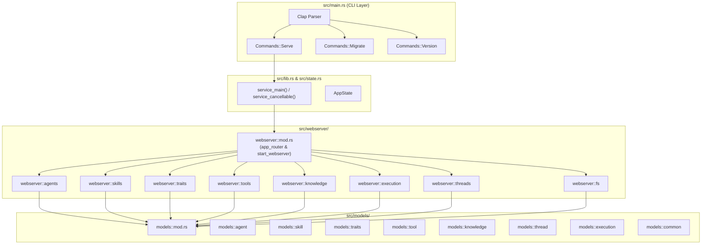

# Spec 09: Backend Modular Codebase Architecture Refactoring

**Status**: `complete`

## Overview & Scope
This specification defines the architectural refactoring of the backend (`aad-be-container`) codebase. The current structure has monolithic files (`main.rs` mixing CLI and full web server startup, `lib.rs` being a bare module list, routes declared inline in a single monolithic router block in `main.rs`, and handlers lumped into monolithic files). 

This refactoring establishes clean separation of concerns, modular domain routes, domain models, and application service orchestration following the pattern established in the Master PRD ([agent-as-data-prd.md](../prds/agent-as-data-prd.md#backend-modular-codebase-architecture)).

## Dependencies & References
- **Build Order Phase**: **Phase 5 (Architecture & Refactoring)**
- **PRD References**: [Agent-As-Data Master PRD](../prds/agent-as-data-prd.md#backend-modular-codebase-architecture).
- **Related Specs**: [01-core-storage-spec.md](./01-core-storage-spec.md) through [08-developer-ui-studio-spec.md](./08-developer-ui-studio-spec.md).



---

## 1. Architectural Blueprint & Target Layout

```
aad-be-container/src/
├── main.rs                 # CLI definition (Clap), early logger, loads config fail-fast, dispatches to lib.rs
├── lib.rs                  # Package metadata, exports, and top-level service orchestrators (service_main)
├── state.rs                # AppState definition and FromRef trait implementations
├── error.rs                # AppError with Axum IntoResponse status mappings
├── config.rs               # AppConfig, database/webservice/llm/hams configs, and validation
├── db.rs                   # Database pool creation and pgvector verification
├── hams_tools.rs           # HaMS sidecar initialization and probe helpers
├── tokio_tools.rs          # Tokio runtime setup & run_in_tokio executor
├── models/                 # Modular domain models and DTOs
│   ├── mod.rs              # Re-exports all domain models
│   ├── agent.rs            # Agent, AgentSearchRequest, RefactorAnalyze, CompileAgent, TestCase
│   ├── skill.rs            # Skill, SkillPromotion DTOs
│   ├── traits.rs           # TraitContract, Capability requirements
│   ├── tool.rs             # Tool, RegisterToolRequest/Response
│   ├── knowledge.rs        # IngestKnowledge, KnowledgeSearch, GraphTraverse
│   ├── thread.rs           # Thread, Message, CreateThreadRequest
│   ├── execution.rs        # ExecuteAgentRequest/Response, SearchAndExecute
│   └── common.rs           # PageOptions, ListPages, bump_minor_version
└── webserver/              # Explicit webservice router and domain handlers
    ├── mod.rs              # app_router, middleware (CORS, tracing), start_webserver
    ├── agents.rs           # /v1/agents CRUD, search, verify-contract, refactor, compile, test
    ├── skills.rs           # /v1/skills CRUD, promote, demote
    ├── traits.rs           # /v1/traits CRUD, list with pagination
    ├── tools.rs            # /v1/agents/tools register, list, delete
    ├── knowledge.rs        # /v1/knowledge ingest, search, graph traverse
    ├── execution.rs        # /v1/agents/{id}/execute, search-and-execute, /v1/executions/{id}
    ├── threads.rs          # /v1/threads CRUD, list, messages
    └── fs.rs               # /v1/threads/{id}/fs workspace operations (read, write, list, delete)
```

---

## 2. Responsibilities by Component

### A. CLI Binary Layer (`src/main.rs`)
- Parses CLI arguments (`--config-path`, `--secrets-dir`) using `clap`.
- Dispatches subcommands:
  - `Commands::Serve`: Calls `aad_be_container::service_main(config_path, secrets_dir)` in Tokio runtime.
  - `Commands::Migrate`: Runs `sqlx` migrations against target database.
  - `Commands::Version`: Prints package name and SemVer.
- Zero web routing logic or SQL statements.

### B. Library & Service Orchestration (`src/lib.rs`)
- Exposes `service_main` / `service_cancellable`.
- Orchestrates:
  1. Fail-fast configuration loading & validation.
  2. HaMS health sidecar initialization on port 8079.
  3. Database pool connection & pgvector extension check.
  4. Automatic migration execution (`sqlx::migrate!("./migrations")`).
  5. Building `AppState`.
  6. Starting Axum webserver on configured address with `webserver::start_webserver(app_state, config.webservice)`.

### C. Webservice Layer (`src/webserver/mod.rs` & Handlers)
- `webserver::mod.rs`: Builds router with `/health` and sub-routers mounted under `api_prefix`:
  - `webserver::agents::router(state)` -> `/v1/agents`
  - `webserver::skills::router(state)` -> `/v1/skills`
  - `webserver::traits::router(state)` -> `/v1/traits`
  - `webserver::knowledge::router(state)` -> `/v1/knowledge`
  - `webserver::threads::router(state)` -> `/v1/threads`
  - `webserver::execution::router(state)` -> `/v1/agents/execute`, etc.
- Each handler file contains clean handler functions returning standard `Result<..., AppError>` or `Result<..., (StatusCode, String)>`.

### D. Models Module (`src/models/`)
- Breaks apart monolithic `models.rs` into clean domain-scoped modules with full `serde` and `sqlx` derives.

---

## 3. Test Strategy & Verification Plan

### Unit Tests
- `cargo test`: Verify all existing tests (`knowledge::tests`, `config::tests`, `tokio_tools::tests`) and new model serialization tests pass cleanly.

### Integration Tests
- Verify all REST endpoints respond identically to prior implementation:
  - Traits CRUD (`/v1/traits`)
  - Agents CRUD & search (`/v1/agents`)
  - Skills CRUD & promote/demote (`/v1/skills`)
  - Execution (`/v1/agents/{id}/execute`)
  - Knowledge ingestion & search (`/v1/knowledge`)
  - Workspace filesystem tools (`/v1/threads/{id}/fs/*`)
- Run Robot Framework tests: `/integration-tests/run-tests-local.sh` (or `cargo test` suite).
