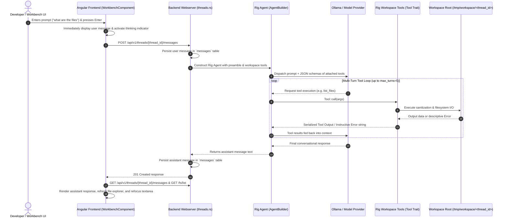
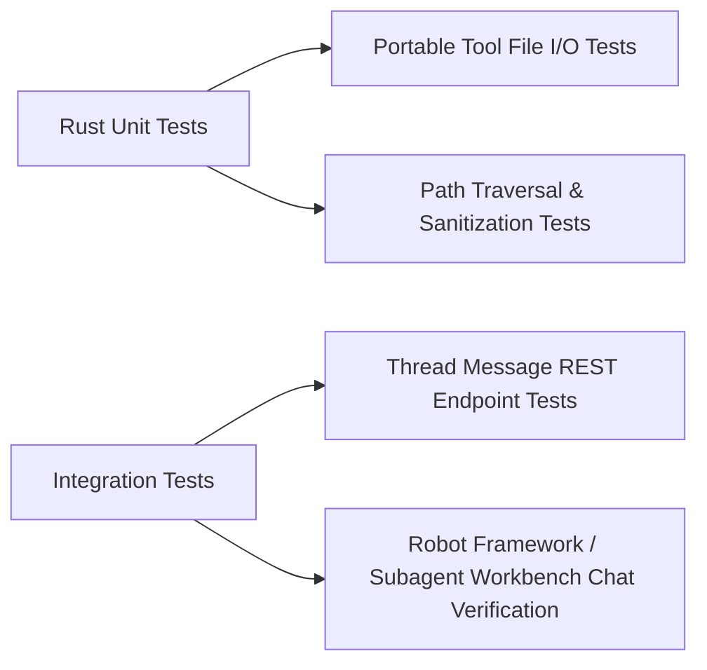

# Spec 11: Workspace Agent Tool Execution & Rig Multi-Turn Integration

**Status**: `complete`

## Overview & Scope
This specification defines the implementation and integration of **Rig's Tool Trait Architecture** and **Autonomous Multi-Turn Agent Loop** into the **Agent-As-Data (AAD)** backend (`aad-be-container`) and Workbench UI (`aad-fe-container`).

When developers interact with AI agents in conversational threads, the agent must be able to autonomously inspect, create, modify, and manage workspace files via strongly typed Rig tools (`read_file`, `write_file`, `list_files`, `replace_in_file`, `delete_file`, `rename_file`), self-correct when operations return errors, and deliver coherent conversational responses with live UI state synchronization.

---

## Dependencies & References
- **Build Order Phase**: **Phase 5 (Agent Execution & Workbench Tool Automation)**.
- **Dependencies**:
  - [09-backend-modular-architecture-spec.md](./09-backend-modular-architecture-spec.md) (Backend Modular Webserver & Routing)
  - [10-workbench-spec.md](./10-workbench-spec.md) (Workbench File Management & Chat UI)
  - `rig-core` version `0.42.0` (`rig_core::tool::Tool`, `rig_core::agent::AgentBuilder`)
- **PRD References**:
  - [Workspace Tools & Agent Execution PRD](../prds/workspace-filesystem-tools-prd.md)
  - [Agent-As-Data Master PRD](../prds/agent-as-data-prd.md)

---

## System Architecture & Interaction Flow



---

## Requirements

### 1. Rig Tool Implementations (`llm_tools.rs`)

All workspace tools must implement Rig's `rig_core::tool::Tool` trait with typed argument schemas and descriptive JSON schema definitions.

```rust
pub trait Tool {
    const NAME: &'static str;
    type Error: std::error::Error + Send + Sync + 'static;
    type Args: DeserializeOwned + Send + Sync;
    type Output: Serialize;

    async fn definition(&self, prompt: String) -> ToolDefinition;
    async fn call(&self, args: Self::Args) -> Result<Self::Output, Self::Error>;
}
```

#### Tool Specifications:
1. **`ListFilesTool` (`list_files`)**:
   - **Args**: `{ "dir_path": Option<String> }`
   - **Output**: `{ "files": Vec<String> }`
   - **Behavior**: Lists entries relative to `/tmp/workspace/<thread_id>/<dir_path>`. Returns a clean sorted list of filenames.
2. **`ReadFileTool` (`read_file`)**:
   - **Args**: `{ "filepath": String }`
   - **Output**: `{ "content": String }`
   - **Behavior**: Reads text content. If file does not exist, returns an instructive error with existing directory contents.
3. **`WriteFileTool` (`write_file`)**:
   - **Args**: `{ "filepath": String, "content": String }`
   - **Output**: `{ "success": bool, "message": String }`
   - **Behavior**: Writes text content, creating missing parent folders automatically.
4. **`ReplaceInFileTool` (`replace_in_file`)**:
   - **Args**: `{ "filepath": String, "search_string": String, "replace_string": String }`
   - **Output**: `{ "success": bool, "message": String }`
   - **Behavior**: Replaces exact text chunk within specified file.
5. **`DeleteFileTool` (`delete_file`)**:
   - **Args**: `{ "filepath": String }`
   - **Output**: `{ "success": bool, "message": String }`
   - **Behavior**: Safely removes specified file or empty directory.
6. **`RenameFileTool` (`rename_file`)**:
   - **Args**: `{ "filepath": String, "new_filepath": String }`
   - **Output**: `{ "success": bool, "message": String }`
   - **Behavior**: Moves/renames file within the workspace boundary.

---

### 2. Autonomous Agent Execution Loop (`threads.rs` & `execution.rs`)

When handling thread messages or agent execution requests:
1. **Builder Construction**:
   ```rust
   let agent = client
       .agent(&state.config.llm.model)
       .preamble(&system_prompt)
       .tool(crate::llm_tools::ListFilesTool { thread_id })
       .tool(crate::llm_tools::ReadFileTool { thread_id })
       .tool(crate::llm_tools::WriteFileTool { thread_id })
       .tool(crate::llm_tools::ReplaceInFileTool { thread_id })
       .tool(crate::llm_tools::DeleteFileTool { thread_id })
       .tool(crate::llm_tools::RenameFileTool { thread_id })
       .max_turns(5)
       .build();
   ```
2. **Execution & Fallback**:
   - Execute `agent.prompt(user_content).await` under a timeout.
   - If the LLM provider is temporarily unreachable or offline in local test environments, seamlessly fallback to deterministic workspace intelligence parsing to guarantee zero UI crashes or deadlocks.
3. **Structured Tracing**:
   - Log the full prompt, attached tools, and model configuration at `INFO` level before dispatch.
   - Log the final generated response and any tool execution steps.

---

### 3. Frontend Workbench Chat & UI Sync (`workbench.component.ts`)

1. **Instant Feedback**: Immediately append the user message locally upon submission and set `isProcessing = true`.
2. **Visual Thinking Indicator**: Display bouncing dots animation with `"Agent is thinking..."` during backend processing.
3. **Focus Preservation**: Ensure the message textarea uses `[readonly]="isProcessing"` (avoiding `[disabled]` blur) and call `focusMessageInput()` via `requestAnimationFrame` and deferred timer upon response arrival.
4. **Workspace State Sync**: Automatically trigger `loadThreadFiles()` and `getMessages(threadId)` on response completion to sync newly created/modified files in the editor pane.

---

## Test & Verification Strategy



### 1. Unit Tests (`aad-be-container/src/llm_tools.rs`)
- `test_portable_fs_tools`: Verify create, write, read, replace, rename, and delete operations within isolated thread workspace directory.
- `test_path_traversal_prevention`: Verify attempts to access `../` or `/etc/passwd` fail fast with security errors.

### 2. Integration Tests (`integration-tests/`)
- Test thread creation and verify physical `/tmp/workspace/<thread_id>` creation.
- Post user message `"what are the files"` to `/api/v1/threads/{id}/messages` and assert that an assistant response listing files is stored in `messages`.
- Verify file creation via agent tool execution and confirm file appears in `POST /api/v1/threads/{id}/fs/list`.

### 3. UI Verification
- Browser subagent tests on `/workbench/<thread_id>` verifying:
  - Immediate user message bubble display.
  - Bouncing dots "Agent is thinking..." indicator while request is in flight.
  - Assistant response rendered on completion.
  - Automatic focus returned to the textarea.
