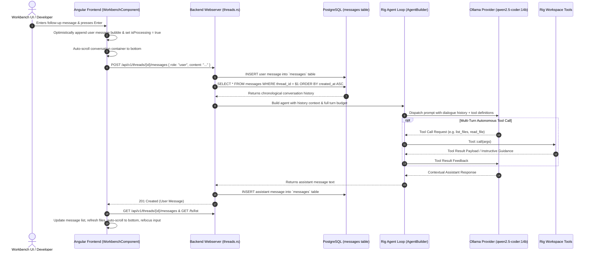

# Spec 12: Workbench Multi-Turn Conversational History & Dynamic Agent Dispatch

**Status**: `complete`

## Overview & Scope
This specification defines the multi-turn conversational history pipeline, adaptive timeout management, and dynamic thread-aware prompt dispatch for Workbench agent interactions in **Agent-As-Data (AAD)** using **Rig's `Agent` Execution Loop** and **`agent.prompt().with_history()`** pattern.

When users interact with an agent in a workspace thread, the agent must not treat each message as an isolated single-turn prompt, return raw JSON tool call payloads, or return repetitive static summaries. Instead, the backend must query prior chronological messages in the thread (`ORDER BY created_at ASC`), assemble the dialogue into structured `rig::completion::Message` turns, invoke Rig's autonomous `Agent` loop with all workspace tools attached, configure model timeout budgeting without premature artificial clamps, and dispatch prompts via `agent.prompt(user_content).with_history(history).await?` so that the agent executes tools autonomously, answers questions, and adapts actions in the context of the ongoing thread.

---

## Dependencies & References
- **Build Order Phase**: **Phase 5 (Agent Execution & Workbench Multi-Turn Intelligence)**.
- **Dependencies**:
  - [10-workbench-spec.md](./10-workbench-spec.md) (Workbench File Management & Chat UI)
  - [11-workspace-agent-tool-execution-spec.md](./11-workspace-agent-tool-execution-spec.md) (Workspace Agent Tool Execution & Rig Multi-Turn Integration)
- **PRD References**:
  - [Workspace Filesystem Tools & Agent Tool Execution PRD](../prds/workspace-filesystem-tools-prd.md)
  - [Agent-As-Data Master PRD](../prds/agent-as-data-prd.md)

---

## Architecture & Interaction Sequence



---

## Technical Requirements

### 1. Rig Dependency & Agent Construction (`Cargo.toml`, `threads.rs`)
- Add `rig = { version = "0.42.0", features = ["agent"] }` (or enable `rig` top-level crate) to provide Rig's first-class `Agent` execution loop and `agent.prompt().with_history()` API.
- Construct the Rig agent with a structured preamble:
  ```rust
  let agent = client.agent(&state.config.llm.model)
      .preamble(&system_prompt)
      .tool(crate::llm_tools::ReadFileTool { thread_id })
      .tool(crate::llm_tools::WriteFileTool { thread_id })
      .tool(crate::llm_tools::ReplaceInFileTool { thread_id })
      .tool(crate::llm_tools::ListFilesTool { thread_id })
      .tool(crate::llm_tools::DeleteFileTool { thread_id })
      .tool(crate::llm_tools::RenameFileTool { thread_id })
      .max_turns(5)
      .build();
  ```

### 2. Multi-Turn History Assembly & `with_history` Dispatch (`threads.rs`)
- In `create_message`, query prior chronological thread messages from `messages` (`ORDER BY created_at ASC`).
- Convert prior database messages to `rig::completion::Message` turns:
  ```rust
  let mut rig_history = Vec::new();
  for msg in history {
      if msg.role == "user" {
          rig_history.push(rig::completion::Message::user(&msg.content));
      } else {
          rig_history.push(rig::completion::Message::assistant(&msg.content));
      }
  }
  ```
- Dispatch the turn via Rig's native multi-turn execution API:
  ```rust
  let response = agent
      .prompt(user_content)
      .with_history(rig_history)
      .await?;
   ```
- This triggers Rig's internal multi-turn tool calling loop: if the model outputs tool calls (e.g. `list_files`), Rig executes them and feeds the results back to the LLM until a final response is generated. Raw tool calls (e.g. `{"name":"list_files"}`) are never returned to the user.
- **Model Output Normalization**: When open-weight models (such as Qwen2.5-Coder via Ollama) emit tool invocations formatted as JSON text directly inside the assistant text content instead of a structured tool call envelope, the pipeline detects the tool call, executes the tool via `PortableTool::call`, appends the tool execution result to the conversation context, and re-prompts the model to provide the natural, human-readable answer.

### 3. Adaptive Timeout & Dynamic Fallback
- Respect `state.config.llm.timeout_secs` without artificial clamps.
- Fallback processing must only engage on unrecoverable transport timeouts or connection errors, providing a helpful explanation rather than repeating canned file listings.

### 4. Frontend Chat Usability & Auto-Scroll (`workbench.component.ts`)
- Automatically scroll the conversation container (`#messagesContainer`) to the bottom when new messages are added or when the assistant reply arrives.
- Ensure textarea focus is restored seamlessly via `focusMessageInput()` after response delivery.

---

## Test & Verification Strategy

### 1. Unit Tests
- Rust tests in `threads.rs` or integration test validating:
  - Multi-turn prompt construction including prior messages.
  - Non-clamped timeout application from configuration.
- Angular component unit tests in `workbench.component.spec.ts` testing:
  - Message sending and scrolling behavior.

### 2. Live Verification
- Test interactive conversation via Workbench UI on `http://localhost:4200/workbench/26166d96-65e2-487f-be59-5e39d0debe40`.
- Send a question, verify response addresses the specific question.
- Send a follow-up question referencing the prior message (e.g., "what did I just ask you?"), verify the agent answers contextually.
