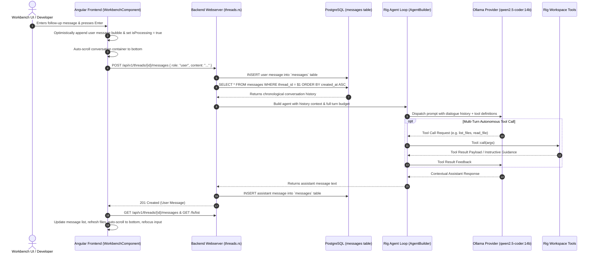

# Spec 12: Workbench Multi-Turn Conversational History & Dynamic Agent Dispatch

**Status**: `complete`

## Overview & Scope
This specification defines the multi-turn conversational history pipeline, adaptive timeout management, and dynamic thread-aware prompt dispatch for Workbench agent interactions in **Agent-As-Data (AAD)**.

When users interact with an agent in a workspace thread, the agent must not treat each message as an isolated single-turn prompt or return repetitive static summaries. Instead, the backend must query prior chronological messages in the thread (`ORDER BY created_at ASC`), assemble the dialogue into a structured conversation context, configure model timeout budgeting without premature artificial clamps, and dispatch prompts so that the agent answers questions and adapts actions in the context of the entire ongoing thread.

---

## Dependencies & References
- **Build Order Phase**: **Phase 5 (Agent Execution & Workbench Multi-Turn Intelligence)**.
- **Dependencies**:
  - [10-workbench-spec.md](./10-workbench-spec.md) (Workbench File Management & Chat UI)
  - [11-workspace-agent-tool-execution-spec.md](./11-workspace-agent-tool-execution-spec.md) (Workspace Agent Tool Execution & Rig Multi-Turn Integration)
- **PRD References**:
  - [Workspace Filesystem Tools & Agent Tool Execution PRD](../prds/workspace-filesystem-tools-prd.md)
  - [Agent-As-Data Master PRD](../prds/agent-as-data-prd.md)

---

## Architecture & Interaction Sequence



---

## Technical Requirements

### 1. Database History Assembly (`threads.rs`)
- In `create_message`, when `payload.role == "user"`:
  - Query all messages for `thread_id` ordered by `created_at ASC` prior to calling `process_thread_message`.
  - Pass the retrieved slice of previous `Message` records alongside the latest `user_content` to `process_thread_message`.
- Build the conversation context into the prompt:
  - Preamble / System instructions defining the workspace boundary, available tools, and current workspace file directory.
  - Previous dialogue turns formatted chronologically:
    ```
    Conversation History:
    User: <prior message>
    Assistant: <prior response>
    ...
    Current Request:
    User: <latest message>
    ```

### 2. Adaptive Timeout & Turn Budgeting
- Respect `state.config.llm.timeout_secs` for Ollama inference.
- Remove premature 5-second clamping (`std::cmp::min(state.config.llm.timeout_secs, 5)`), allowing sufficient time (e.g. 60–180s) for models such as `qwen2.5-coder:14b` to complete reasoning and tool calls without timing out.
- Ensure fallback handling is dynamic: If Ollama is completely unreachable (e.g. network failure or test stub), generate a helpful context-aware response acknowledging the specific question rather than repeating a static file summary.

### 3. Frontend Chat Usability & Auto-Scroll (`workbench.component.ts`)
- Automatically scroll the conversation container (`#messagesContainer`) to the bottom when new messages are added or when the assistant reply arrives.
- Ensure textarea focus is restored seamlessly via `focusMessageInput()` after response delivery.

---

## Test & Verification Strategy

### 1. Unit Tests
- Rust tests in `threads.rs` or integration test validating:
  - Multi-turn prompt construction including prior messages.
  - Non-clamped timeout application from configuration.
- Angular component unit tests in `workbench.component.spec.ts` testing:
  - Message sending and scrolling behavior.

### 2. Live Verification
- Test interactive conversation via Workbench UI on `http://localhost:4200/workbench/26166d96-65e2-487f-be59-5e39d0debe40`.
- Send a question, verify response addresses the specific question.
- Send a follow-up question referencing the prior message (e.g., "what did I just ask you?"), verify the agent answers contextually.
