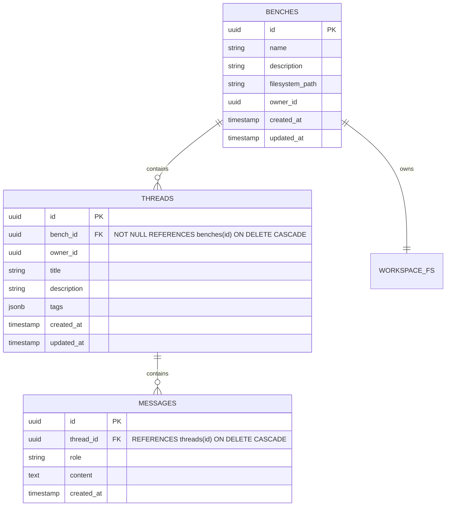

# Spec 13: Workbench Benches Domain, Schema & Scoped Execution

**Status**: `complete`

## Overview & Scope
This specification defines the backend domain models, database schema migrations, and REST APIs for **Benches** within **Agent-As-Data (AAD)** (`aad-be-container`), transitioning the workspace from a thread-centric root to a hierarchical **Bench** model.

Each Bench represents an isolated project workspace owning a shared filesystem directory (`/tmp/workspace/benches/<bench_id>`). All conversation threads created within a Bench are immutably tied to that Bench (`threads.bench_id`), and all Rig agent filesystem tool executions (`read_file`, `write_file`, `list_files`, etc.) are scoped to the Bench workspace directory.

---

## Dependencies & References
- **Build Order Phase**: **Phase 6 (Workbench Benches & Project Memory - Step 1)**.
- **Dependencies**:
  - [09-backend-modular-architecture-spec.md](./09-backend-modular-architecture-spec.md)
  - [10-workbench-spec.md](./10-workbench-spec.md)
  - [11-workspace-agent-tool-execution-spec.md](./11-workspace-agent-tool-execution-spec.md)
  - [12-workbench-multiturn-context-and-agent-dispatch-spec.md](./12-workbench-multiturn-context-and-agent-dispatch-spec.md)
- **PRD References**:
  - [Workbench Benches, Threads & Workspace Memory PRD](../prds/workbench-bench-thread-prd.md)
  - [Workspace Filesystem Tools PRD](../prds/workspace-filesystem-tools-prd.md)
  - [Agent-As-Data Master PRD](../prds/agent-as-data-prd.md)

---

## Architecture & Data Flow



---

## Detailed Requirements

### 1. Database Migrations (`aad-be-container/migrations`)
Create paired forward (`.up.sql`) and reverse (`.down.sql`) migrations:
- **`0021_benches_and_thread_bench_scoping.up.sql`**:
  - Create table `benches`:
    ```sql
    CREATE TABLE IF NOT EXISTS benches (
        id UUID PRIMARY KEY DEFAULT gen_random_uuid(),
        owner_id UUID NOT NULL,
        name TEXT NOT NULL,
        description TEXT,
        filesystem_path TEXT,
        created_at TIMESTAMPTZ DEFAULT CURRENT_TIMESTAMP,
        updated_at TIMESTAMPTZ DEFAULT CURRENT_TIMESTAMP
    );
    CREATE INDEX IF NOT EXISTS idx_benches_owner_id ON benches (owner_id);
    ```
  - **Backfill Existing Threads**:
    To prevent foreign key violations, ensure existing rows in `threads` are assigned to a default bench per owner:
    ```sql
    -- Insert a default bench for each distinct owner with threads
    INSERT INTO benches (id, owner_id, name, description)
    SELECT gen_random_uuid(), owner_id, 'Default Bench', 'Auto-created default bench for historical threads'
    FROM (SELECT DISTINCT owner_id FROM threads) t
    ON CONFLICT DO NOTHING;

    -- Add bench_id column as nullable initially
    ALTER TABLE threads ADD COLUMN bench_id UUID;

    -- Backfill threads.bench_id matching owner's default bench
    UPDATE threads SET bench_id = benches.id
    FROM benches
    WHERE threads.owner_id = benches.owner_id AND threads.bench_id IS NULL;

    -- Enforce NOT NULL and Foreign Key with CASCADE
    ALTER TABLE threads ALTER COLUMN bench_id SET NOT NULL;
    ALTER TABLE threads ADD CONSTRAINT fk_threads_bench_id FOREIGN KEY (bench_id) REFERENCES benches(id) ON DELETE CASCADE;
    CREATE INDEX IF NOT EXISTS idx_threads_bench_id ON threads (bench_id);
    ```
- **`0021_benches_and_thread_bench_scoping.down.sql`**:
  - Drops foreign key and column from `threads`, drops `benches` table.

### 2. Backend Models (`aad-be-container/src/models/`)
Add domain models in `benches.rs`:
- `Bench`:
  ```rust
  #[derive(Debug, Clone, Serialize, Deserialize, sqlx::FromRow)]
  pub struct Bench {
      pub id: Uuid,
      pub owner_id: Uuid,
      pub name: String,
      pub description: Option<String>,
      pub filesystem_path: Option<String>,
      pub created_at: Option<chrono::DateTime<chrono::Utc>>,
      pub updated_at: Option<chrono::DateTime<chrono::Utc>>,
  }
  ```
- Request/Response payloads:
  - `CreateBenchRequest`: `{ name: String, description: Option<String>, owner_id: Option<Uuid> }`
  - `UpdateBenchRequest`: `{ name: Option<String>, description: Option<String> }`
  - `ListBenchesRequest`: `{ owner_id: Uuid, pagination: Option<PageOptions> }`
- Update `CreateThreadRequest`:
  - Require or inject `bench_id: Uuid`.

### 3. REST API Router (`aad-be-container/src/webserver/benches.rs`)
Expose routes registered under `/{{api_prefix}}/v1/benches`:
- `GET /`: List benches for owner (ordered by `updated_at DESC`).
- `POST /`: Create bench, initialize `/tmp/workspace/benches/<bench_id>`, automatically scaffold default "General" thread, return bench.
- `GET /{id}`: Retrieve bench details and associated thread IDs.
- `PUT /{id}` (or `PATCH /{id}`): Update bench `name` and `description`.
- `DELETE /{id}`: Delete bench (cascades to threads & messages in DB) and recursively remove `/tmp/workspace/benches/<bench_id>`.
- `GET /{id}/threads`: List threads belonging to this bench.
- `POST /{id}/threads`: Create a thread bound to this bench.

### 4. Bench-Scoped Filesystem APIs (`aad-be-container/src/webserver/fs.rs`)
Refactor workspace root resolution from `/tmp/workspace/<thread_id>` to `/tmp/workspace/benches/<bench_id>`:
- Mount endpoints under `/{{api_prefix}}/v1/benches/{id}/fs`:
  - `POST /{id}/fs/list`: Lists files under `/tmp/workspace/benches/{id}`.
  - `GET /{id}/fs/read/*filepath`: Reads file content safely.
  - `POST /{id}/fs/write`: Writes file content safely.
  - `POST /{id}/fs/delete`: Deletes file safely.
- Maintain backwards compatibility forwarders from `/threads/{thread_id}/fs/*` by looking up the thread's `bench_id`.

### 5. Rig Agent Tool Execution Scoping
Update `aad-be-container/src/llm_tools.rs` and `webserver/threads.rs`:
- When agent executes in `threads.rs`, pass `bench_id` to workspace tools (`ListFilesTool`, `ReadFileTool`, `WriteFileTool`, `ReplaceInFileTool`, `DeleteFileTool`, `RenameFileTool`).
- Ensure tool filesystem operations resolve strictly against `/tmp/workspace/benches/<bench_id>`.

---

## Test Strategy & Verification Plan

### Unit & Integration Tests (Rust)
- `tests/test_benches_crud.rs`:
  - Verify creating a bench auto-generates the directory `/tmp/workspace/benches/<bench_id>`.
  - Verify updating bench name succeeds and persists.
  - Verify deleting a bench removes the filesystem folder and cascades to its threads.
- `tests/test_bench_filesystem_scoping.rs`:
  - Verify two threads in the same bench write and read files from the identical bench workspace root.
  - Verify path traversal attempts (`../`) are denied with 403 / `PermissionDenied`.

### Robot Framework Integration Tests
- Add `test_journey_13_bench_lifecycle.robot`:
  - Create bench via REST.
  - Verify initial "General" thread is present.
  - Create files in bench workspace.
  - Execute conversational message via thread and verify agent inspects bench files.
