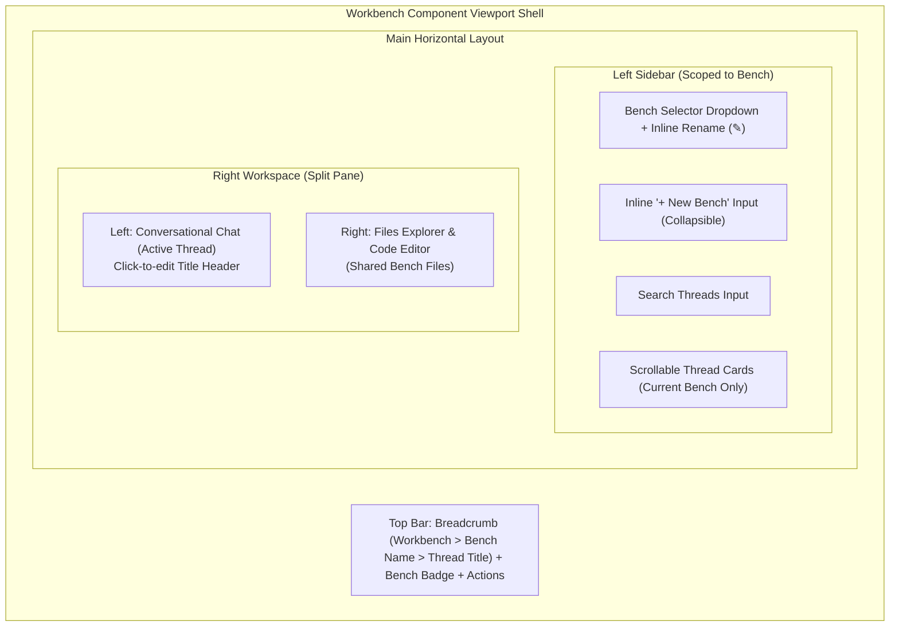

# Spec 14: Workbench Benches & Threads UI Navigation

**Status**: `complete`

## Overview & Scope
This specification defines the frontend architecture and user experience in **`aad-fe-container`** for managing **Benches** and **Threads** within the **Workbench** view (`/workbench`).

It implements the agreed **Option A** navigation layout, featuring a scoped Bench Switcher dropdown in the sidebar header, inline creation and editing without modal popups, an offset two-step confirmation for destructive actions, active bench visual clarity via top bar badges and breadcrumbs, and intelligent dynamic URL routing.

---

## Dependencies & References
- **Build Order Phase**: **Phase 6 (Workbench Benches & Project Memory - Step 2)**.
- **Dependencies**:
  - [10-workbench-spec.md](./10-workbench-spec.md) (Workbench File Management UI)
  - [13-workbench-benches-domain-and-scoped-execution-spec.md](./13-workbench-benches-domain-and-scoped-execution-spec.md) (Backend Benches REST APIs)
- **PRD References**:
  - [Workbench Benches, Threads & Workspace Memory PRD](../prds/workbench-bench-thread-prd.md)
  - [Agent Development UI & Testing Kit PRD](../prds/agent-ui-testing-kit-prd.md)

---

## UI Architecture & Layout

---

## Detailed Requirements

### 1. API Service Extension (`api.service.ts`)
Add Bench management endpoints to `ApiService`:
- `getBenches(ownerId?: string): Observable<Bench[]>`
- `getBench(id: string): Observable<Bench>`
- `createBench(name: string, description?: string, ownerId?: string): Observable<Bench>`
- `updateBench(id: string, name: string, description?: string): Observable<Bench>`
- `deleteBench(id: string): Observable<any>`
- `getBenchThreads(benchId: string): Observable<Thread[]>`
- `createBenchThread(benchId: string, title: string, description?: string, tags?: string[]): Observable<Thread>`
- Filesystem calls updated to accept `benchId`:
  - `listBenchFiles(benchId: string, dirPath?: string)`
  - `readBenchFile(benchId: string, filepath: string)`
  - `writeBenchFile(benchId: string, filepath: string, content: string)`
  - `deleteBenchFile(benchId: string, filepath: string)`

### 2. Smart Routing & Deep Linking (`workbench.routes.ts` / `app.routes.ts`)
Update route configurations:
- `/workbench`
- `/workbench/:benchId`
- `/workbench/:benchId/:threadId`
**Route Guard / Navigation Resolver**:
- Visiting `/workbench`: Fetch benches list. Auto-redirect to `/workbench/:benchId` with the most recently active bench (or create initial bench if none exist).
- Visiting `/workbench/:benchId`: Fetch threads for bench. Auto-redirect to `/workbench/:benchId/:threadId` with the most recent thread.

### 3. Sidebar Header Bench Switcher & Inline Operations (No Modals)
- **Bench Dropdown Selector**:
  - Displays the active Bench name with an active indicator badge.
  - Clicking opens a custom dropdown menu listing all available Benches.
- **Inline Create Bench**:
  - Clicking `+ New Bench` expands an inline row at the top of the bench dropdown.
  - An inline input field (`Bench name...`) with Enter / checkmark to commit, Escape to cancel.
  - Submits `createBench`, auto-navigates to the new bench, and closes inline input.
- **Inline Bench Renaming**:
  - An edit pencil icon (`edit`) in the sidebar bench header toggles the bench title into an editable input in-place.
  - Commits on `Enter` or blur via `updateBench`.
- **Offset Two-Step Delete Confirmation**:
  - Clicking delete does not trigger a modal popup.
  - Instead, an inline alert banner displays:
    `[ Cancel ]` .......... (spacing offset) .......... `[ Confirm Delete Bench ]`
  - The confirmation button is deliberately placed away from the trigger button to prevent double-click accidental deletion.

### 4. Thread List Scoped to Active Bench
- The sidebar thread list renders only threads associated with `activeBench.id`.
- Inline thread creation (`+ New Thread`) creates a thread directly in the active bench without prompt dialogs.
- Inline rename supported on thread cards and in the chat header.

### 5. Top Bar Visual Clarity & Breadcrumbs
- Top Bar displays an indigo pill badge: `Bench: <Bench Name>`.
- Interactive breadcrumb: `Workbench > <Bench Name> > <Thread Title>`.
  - Clicking `<Bench Name>` in the breadcrumb highlights the bench switcher.

---

## Test Strategy & Verification Plan

### Frontend Component Tests (Karma / Jasmine)
- `workbench.component.spec.ts`:
  - Verify selecting a bench fetches threads for that bench.
  - Verify inline bench creation creates and selects the new bench without modal.
  - Verify two-step delete requires clicking the offset confirm button before calling `deleteBench`.
  - Verify file explorer fetches from bench-scoped filesystem endpoint.

### Robot Framework UI Tests
- Extend `test_journey_12_workbench_ui.robot`:
  - Verify navigating to `/workbench` redirects to `/workbench/:benchId/:threadId`.
  - Verify switching benches swaps the thread list and shared files.
  - Verify inline renaming updates the top bar breadcrumb in real-time.
