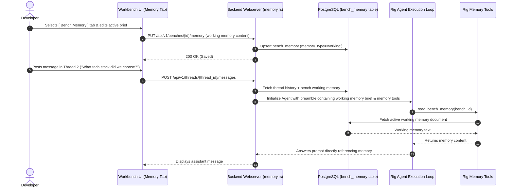

# Spec 15: Workbench Bench Working Memory & Rig Tools Integration

**Status**: `complete`

## Overview & Scope
This specification defines the implementation of **Phase 1: Explicit Bench Working Memory** within **Agent-As-Data (AAD)**. 

A Bench retains a shared working memory document stored in PostgreSQL (`bench_memory`), accessible and editable by human developers via a dedicated `[ Bench Memory ]` tab in the Workbench right pane, and inspectable/updatable by Rig AI agents across all threads within the Bench via specialized Rig tools (`read_bench_memory`, `update_bench_memory`).

---

## Dependencies & References
- **Build Order Phase**: **Phase 6 (Workbench Benches & Project Memory - Step 3)**.
- **Dependencies**:
  - [13-workbench-benches-domain-and-scoped-execution-spec.md](./13-workbench-benches-domain-and-scoped-execution-spec.md) (Bench Domain & Schema)
  - [14-workbench-benches-and-threads-ui-navigation-spec.md](./14-workbench-benches-and-threads-ui-navigation-spec.md) (Workbench UI Navigation)
  - [11-workspace-agent-tool-execution-spec.md](./11-workspace-agent-tool-execution-spec.md) (Rig Tool Trait Architecture)
- **PRD References**:
  - [Workbench Benches, Threads & Workspace Memory PRD](../prds/workbench-bench-thread-prd.md)
  - [Knowledge & Data System PRD](../prds/knowledge-data-system-prd.md)

---

## Architecture & Integration Flow



---

## Detailed Requirements

### 1. Database Schema (`aad-be-container/migrations`)
Create paired forward (`.up.sql`) and reverse (`.down.sql`) migrations:
- **`0022_bench_memory_schema.up.sql`**:
  ```sql
  CREATE TABLE IF NOT EXISTS bench_memory (
      id UUID PRIMARY KEY DEFAULT gen_random_uuid(),
      bench_id UUID NOT NULL REFERENCES benches(id) ON DELETE CASCADE,
      memory_type TEXT NOT NULL DEFAULT 'working', -- 'working', 'episodic', 'summary'
      title TEXT NOT NULL DEFAULT 'Active Working Memory',
      content TEXT NOT NULL DEFAULT '',
      metadata JSONB DEFAULT '{}'::jsonb,
      created_at TIMESTAMPTZ DEFAULT CURRENT_TIMESTAMP,
      updated_at TIMESTAMPTZ DEFAULT CURRENT_TIMESTAMP
  );

  CREATE UNIQUE INDEX IF NOT EXISTS idx_bench_memory_working_unique 
  ON bench_memory (bench_id) WHERE memory_type = 'working';

  CREATE INDEX IF NOT EXISTS idx_bench_memory_bench_type ON bench_memory (bench_id, memory_type);
  ```
- **`0022_bench_memory_schema.down.sql`**:
  - Drops table `bench_memory`.

### 2. Backend Memory API Router (`aad-be-container/src/webserver/memory.rs`)
Endpoints mounted at `/{{api_prefix}}/v1/benches/{bench_id}/memory`:
- `GET /`: Retrieve working memory and recent episodic logs for the bench.
- `PUT /`: Upsert working memory content (`{ content: String, metadata?: serde_json::Value }`).
- `POST /decision`: Append an episodic decision entry (`{ title: String, content: String, thread_id?: Uuid }`).

### 3. Rig Memory Tools Implementation (`aad-be-container/src/llm_tools.rs`)
Implement tools conforming to Rig's `Tool` trait:
- **`ReadBenchMemoryTool`**:
  - Input: `{}` (implicitly uses bound `bench_id`).
  - Fetches the active `working` memory markdown string from DB.
  - Returns: `{ content: String }`.
- **`UpdateBenchMemoryTool`**:
  - Input: `{ content: String, append: Option<bool> }`.
  - Overwrites or appends the working memory document in DB.
  - Returns: `{ success: bool, message: String }`.
- Attach tools to the agent builder in `webserver/threads.rs`. Also inject the active working memory brief directly into the system preamble so the agent has immediate baseline context without spending turns.

### 4. UI Editor & Memory Pane (`workbench.component.html` & `.ts`)
- The right-hand pane in the Workbench features two tabs:
  - `[ Files ]` (Active shared files explorer and text editor).
  - `[ Bench Memory ]` (Full-height markdown/text editor for working memory).
- Features an auto-save indicator or a explicit "Save Memory" button with success feedback.
- Allows developer to quickly toggle between editing code files and updating project memory.

---

## Test Strategy & Verification Plan

### Unit & Integration Tests (Rust)
- `tests/test_bench_memory.rs`:
  - Verify upserting working memory persists in DB and updates `updated_at`.
  - Verify Rig tools `read_bench_memory` and `update_bench_memory` execute correctly and mutate DB.
  - Verify deleting a bench cascade deletes all associated memory rows.

### Robot Framework UI Tests
- `test_journey_14_bench_memory.robot`:
  - Open `Bench Memory` tab in Workbench.
  - Add architectural constraint notes to Working Memory and save.
  - Send message to agent in a thread asking about the constraint.
  - Verify agent provides the answer sourced from Bench Memory.
