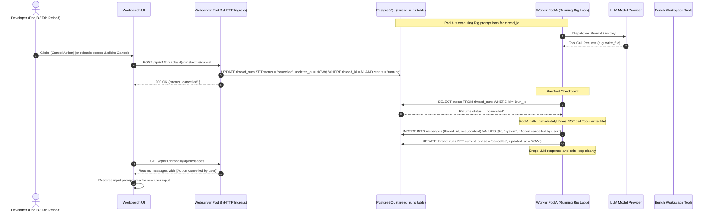

# Spec 16: Workbench Persistent Action Tracking & Distributed Cancellation Backend

**Status**: `draft`

## Overview & Scope
This specification defines the backend domain models, database schema migrations, and REST APIs for **Persistent Action Tracking** and **Distributed Pre-Tool Cancellation** within **Agent-As-Data (AAD)** (`aad-be-container`).

When an LLM reasoning turn or tool execution is initiated in a thread, its execution state must be persisted in PostgreSQL (`thread_runs`). This allows client applications (such as the Workbench UI) to immediately discover in-progress tasks on page reload or when navigating between threads. Furthermore, it enables distributed cancellation across horizontally scaled Kubernetes pods without requiring pod-affinity, web sockets, or IPC signaling: a cancellation request sets `status = 'cancelled'` in PostgreSQL, and any worker pod running the action detects this at pre-tool checkpoints and terminates safely before mutating files or project memory.

---

## Dependencies & References
- **Build Order Phase**: **Phase 7 (Workbench Action Lifecycle & Horizontal Cancellation - Step 1)**.
- **Dependencies**:
  - [09-backend-modular-architecture-spec.md](./09-backend-modular-architecture-spec.md)
  - [11-workspace-agent-tool-execution-spec.md](./11-workspace-agent-tool-execution-spec.md)
  - [12-workbench-multiturn-context-and-agent-dispatch-spec.md](./12-workbench-multiturn-context-and-agent-dispatch-spec.md)
  - [13-workbench-benches-domain-and-scoped-execution-spec.md](./13-workbench-benches-domain-and-scoped-execution-spec.md)
- **PRD References**:
  - [Workbench Benches, Threads & Workspace Memory PRD](../prds/workbench-bench-thread-prd.md)
  - [Workspace Filesystem Tools PRD](../prds/workspace-filesystem-tools-prd.md)

---

## Architecture & Data Flow



---

## Technical Specifications & Deliverables

### 1. Database Schema Migration (`0023_thread_runs_schema.up.sql` / `.down.sql`)
Create table `thread_runs`:
```sql
CREATE TABLE IF NOT EXISTS thread_runs (
    id UUID PRIMARY KEY DEFAULT gen_random_uuid(),
    thread_id UUID NOT NULL REFERENCES threads(id) ON DELETE CASCADE,
    bench_id UUID NOT NULL REFERENCES benches(id) ON DELETE CASCADE,
    status TEXT NOT NULL DEFAULT 'running', -- pending, running, cancelling, cancelled, completed, failed
    current_phase TEXT NOT NULL DEFAULT 'thinking', -- thinking, executing_tool, completed, cancelled, failed
    active_tool_name TEXT,
    error TEXT,
    created_at TIMESTAMPTZ DEFAULT CURRENT_TIMESTAMP,
    updated_at TIMESTAMPTZ DEFAULT CURRENT_TIMESTAMP
);

CREATE INDEX IF NOT EXISTS idx_thread_runs_thread_id ON thread_runs (thread_id);
CREATE INDEX IF NOT EXISTS idx_thread_runs_status ON thread_runs (status);
```

### 2. Domain Models (`aad-be-container/src/models/run.rs`)
- `ThreadRun`:
  ```rust
  #[derive(Debug, Clone, Serialize, Deserialize, sqlx::FromRow)]
  pub struct ThreadRun {
      pub id: Uuid,
      pub thread_id: Uuid,
      pub bench_id: Uuid,
      pub status: String,
      pub current_phase: String,
      pub active_tool_name: Option<String>,
      pub error: Option<String>,
      pub created_at: Option<chrono::DateTime<chrono::Utc>>,
      pub updated_at: Option<chrono::DateTime<chrono::Utc>>,
  }
  ```
- Request/Response payloads:
  - `CreateMessageResponse`: `{ message: Message, run_id: Uuid }`
  - `CancelRunResponse`: `{ message: String, status: String }`

### 3. Asynchronous Worker Dispatch in `threads.rs`
Update `create_message` in `aad-be-container/src/webserver/threads.rs`:
- Inserts user message into `messages`.
- Inserts row into `thread_runs` with `status: 'running'`, `current_phase: 'thinking'`.
- Returns `202 Accepted` with `{ message, run_id: run.id }`.
- Spawns background Tokio task `tokio::spawn(async move { ... })` executing `process_thread_message_with_run`.

### 4. REST APIs for Run State & Cancellation (`aad-be-container/src/webserver/threads.rs`)
Add routes under `/{{api_prefix}}/v1/threads/{id}/runs`:
- `GET /{id}/runs/active`: Returns `200 OK` with active `ThreadRun` or `204 No Content` if no run is currently `running` or `pending`.
- `POST /{id}/runs/active/cancel`: Updates active run record in PostgreSQL:
  ```sql
  UPDATE thread_runs 
  SET status = 'cancelled', updated_at = NOW() 
  WHERE thread_id = $1 AND status IN ('pending', 'running')
  RETURNING *;
  ```
- `GET /{id}/runs`: Returns recent historical runs for the thread ordered by `created_at DESC` (limit 20).

### 5. Pre-Tool Execution Checkpoints & Cancellation Handling
In `process_thread_message_with_run`:
- Before invoking any workspace tool (`write_file`, `delete_file`, `replace_in_file`, `rename_file`, `update_bench_memory`):
  - Check `SELECT status FROM thread_runs WHERE id = $run_id`.
  - If `status == 'cancelled'`, immediately break out of the loop without calling tool handler.
  - Insert system message:
    ```sql
    INSERT INTO messages (thread_id, role, content) 
    VALUES ($thread_id, 'system', '[Action cancelled by user]');
    ```
  - Update run record: `UPDATE thread_runs SET current_phase = 'cancelled', updated_at = NOW() WHERE id = $run_id`.
- While a tool is running:
  - Update `thread_runs SET current_phase = 'executing_tool', active_tool_name = $tool_name, updated_at = NOW()`.
  - Upon tool completion:
    - Update `thread_runs SET current_phase = 'thinking', active_tool_name = NULL, updated_at = NOW()`.
- On final completion:
  - Verify `thread_runs.status != 'cancelled'`. If not cancelled:
    - Insert assistant message into `messages`.
    - Update `thread_runs SET status = 'completed', current_phase = 'completed', updated_at = NOW()`.

---

## Test Strategy & Verification Plan

### Unit & Integration Tests (Rust)
- `tests/test_thread_runs.rs`:
  - Verify creating message produces a `ThreadRun` with `status: 'running'`.
  - Verify `GET /threads/{id}/runs/active` returns the active run.
  - Verify calling `POST /threads/{id}/runs/active/cancel` marks the run `cancelled` in DB.
  - Verify that a cancelled run halts before mutating files (e.g. `write_file` is not invoked).
  - Verify that a system message `[Action cancelled by user]` is appended to the thread.

### Robot Framework Integration Tests
- Add `test_journey_15_action_tracking_and_cancellation.robot`:
  - Step 1: Send user message to thread.
  - Step 2: Query active run immediately via `GET /threads/{id}/runs/active` and confirm `status == 'running'`.
  - Step 3: Trigger cancellation via `POST /threads/{id}/runs/active/cancel`.
  - Step 4: Confirm active run is terminated and `messages` contains `[Action cancelled by user]`.
