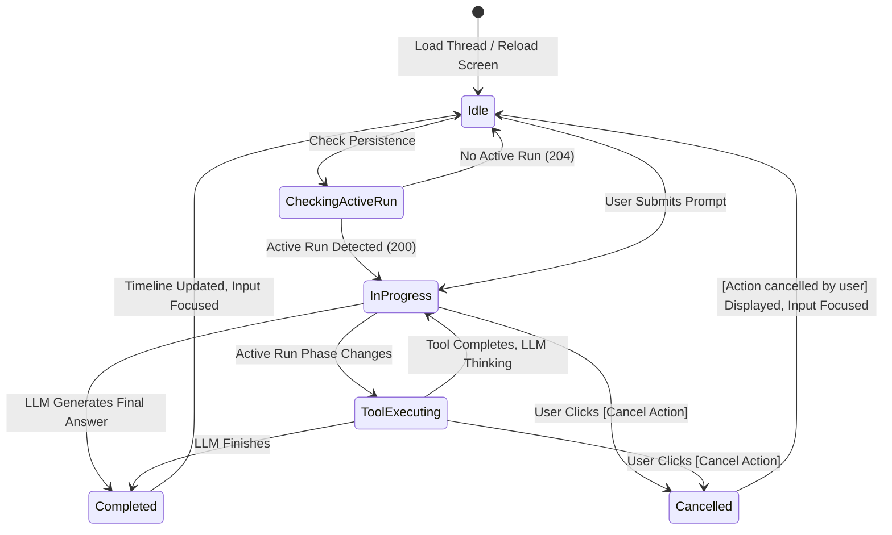

# Spec 17: Workbench Action In-Progress Reload State & Cancellation UI

**Status**: `draft`

## Overview & Scope
This specification defines the frontend user experience and component architecture for **Action In-Progress Discovery on Page Reload** and **Interactive Action Cancellation** within the **Agent-As-Data (AAD)** Workbench (`aad-fe-container`).

When a user submits a prompt, an LLM reasoning process or tool execution begins on the backend. If the user refreshes their browser tab, closes and re-opens the workbench, or navigates between threads, the frontend must immediately detect any active in-flight run from the backend persistence layer (`GET /api/v1/threads/:id/runs/active`), restore the visual in-progress indicators (`Assistant is thinking...`, `Executing tool: write_file...`), and expose an immediate **[Cancel]** button. If cancelled, the action halts safely without mutating files, and an informative system notification is rendered in the conversation stream.

---

## Dependencies & References
- **Build Order Phase**: **Phase 7 (Workbench Action Lifecycle & Horizontal Cancellation - Step 2)**.
- **Dependencies**:
  - [16-workbench-persistent-action-tracking-and-cancellation-spec.md](./16-workbench-persistent-action-tracking-and-cancellation-spec.md)
  - [14-workbench-benches-and-threads-ui-navigation-spec.md](./14-workbench-benches-and-threads-ui-navigation-spec.md)
  - [15-workbench-bench-working-memory-spec.md](./15-workbench-bench-working-memory-spec.md)
- **PRD References**:
  - [Workbench Benches, Threads & Workspace Memory PRD](../prds/workbench-bench-thread-prd.md)
  - [Agent Development UI & Testing Kit PRD](../prds/agent-ui-testing-kit-prd.md)

---

## User Interface & Interaction Flow



---

## Technical Specifications & Deliverables

### 1. Data Models (`aad-fe-container/src/app/models/` or `api.service.ts`)
```typescript
export interface ThreadRun {
  id: string;
  thread_id: string;
  bench_id: string;
  status: 'pending' | 'running' | 'cancelling' | 'cancelled' | 'completed' | 'failed';
  current_phase: 'thinking' | 'executing_tool' | 'completed' | 'cancelled' | 'failed';
  active_tool_name?: string | null;
  error?: string | null;
  created_at?: string;
  updated_at?: string;
}
```

### 2. Frontend API Service Extensions (`api.service.ts`)
Add methods:
- `getActiveThreadRun(threadId: string): Observable<ThreadRun | null>`:
  Calls `GET /api/v1/threads/${threadId}/runs/active`. Returns `null` on `204 No Content`.
- `cancelActiveThreadRun(threadId: string): Observable<{ message: string, status: string }>`:
  Calls `POST /api/v1/threads/${threadId}/runs/active/cancel`.
- `getThreadRuns(threadId: string): Observable<ThreadRun[]>`:
  Calls `GET /api/v1/threads/${threadId}/runs`.

### 3. Workbench Component State Restoration (`workbench.component.ts`)
Update `loadThreadContent(thread: Thread)`:
- Query `this.apiService.getActiveThreadRun(thread.id)` alongside `getMessages(thread.id)`.
- If an active run is returned (`status === 'running' || status === 'pending'`):
  - Set `this.isProcessing = true`.
  - Set `this.activeRun = run`.
  - Initiate periodic polling loop (every 1.5s) to check run status until status is `'completed'`, `'cancelled'`, or `'failed'`.
  - When finished, refresh message list and reset `this.isProcessing = false`.

### 4. In-Progress Visual Banner & Cancellation Action (`workbench.component.html`)
- Below the messages scroll area and above the input box:
  - When `isProcessing`:
    - Display an animated status banner with subtle gradient / pulse.
    - Show current phase:
      - If `activeRun?.current_phase === 'executing_tool'`: `Executing tool: {{ activeRun.active_tool_name }}...`
      - Otherwise: `Assistant is thinking...`
    - Display a prominent red-tinted button:
      ```html
      <button mat-stroked-button color="warn" (click)="cancelCurrentAction()" class="!text-xs">
        <mat-icon class="!w-4 !h-4 !text-sm mr-1">stop_circle</mat-icon>
        Cancel Action
      </button>
      ```
- Wire `cancelCurrentAction()`:
  - Calls `this.apiService.cancelActiveThreadRun(this.activeThread.id)`.
  - Sets `this.isProcessing = false`.
  - Reloads messages timeline to display `[Action cancelled by user]`.
  - Auto-focuses the chat input area.

### 5. Conversation Stream System Message Formatting
- In `workbench.component.html`, when `message.role === 'system'`:
  - Render as a centered, subdued badge with an icon (e.g. `info` or `cancel`) rather than a normal left-aligned chat card.
  - Style: `px-3 py-1.5 rounded-full bg-slate-100 text-slate-500 text-xs font-medium border border-slate-200`.

---

## Test Strategy & Verification Plan

### Frontend Component Tests (`workbench.component.spec.ts`)
- Verify that on initialization with an active run, `isProcessing` is true and cancel button is visible.
- Verify that clicking "Cancel Action" invokes `cancelActiveThreadRun` and updates local state.
- Verify system messages render with correct badge styles.

### Robot Framework End-to-End Tests
- Extend `test_journey_15_action_tracking_and_cancellation.robot`:
  - Launch prompt from frontend.
  - Simulate page reload (`/workbench/{benchId}/{threadId}`).
  - Verify banner shows in-progress state and cancel button.
  - Click cancel button and confirm timeline displays cancellation note and input area is restored.
