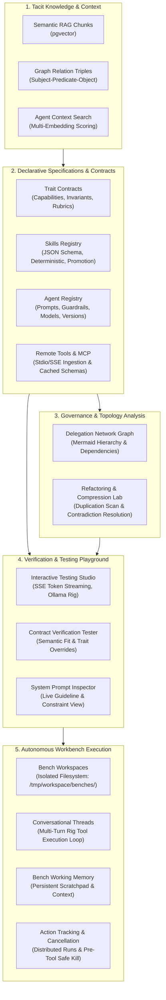
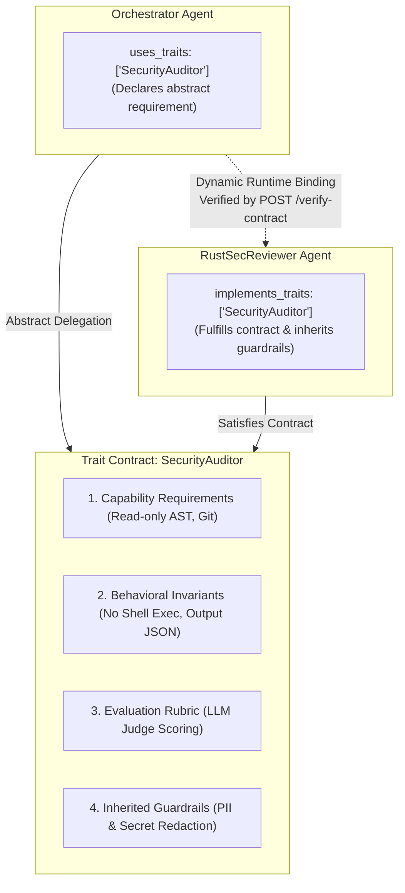

# Spec 18: Home Page Architecture Overview & Comprehensive Workspace Launchpad

## Status
`complete`

---

## 1. Overview & Business Context

The home view (`/home`) in `aad-fe-container` serves as the primary orientation and architectural landing page for the **Agent-As-Data (AAD)** platform. Over recent development phases, the platform has expanded significantly to encompass isolated bench workspaces, multi-turn tool calling, bench working memory, distributed action cancellation, knowledge vector search, graph tuples, skills promotion, and refactoring labs.

The current home page is out of date: it reflects an obsolete 4-box diagram and links to only 3 modules (`/traits`, `/agents`, `/interactive-testing`), omitting 7 major platform capabilities.

This specification defines the complete redesign of `HomeComponent` to:
1. **Explain What the App Does**: Ingest tacit enterprise knowledge, turn it into structured vector chunks and graph tuples, enforce declarative trait contracts, compose autonomous agents with guardrails, and execute reasoning agents in isolated workspaces.
2. **Present the 5-Stage System Lifecycle Flow**: An interactive, responsive architectural flow diagram covering Knowledge $\rightarrow$ Specifications $\rightarrow$ Governance $\rightarrow$ Verification $\rightarrow$ Workbench Execution.
3. **Clarify the Trait Contract Concept**: A dedicated visual and textual deep-dive breaking down the 4 pillars of Trait Contracts, distinguishing `implements_traits` from `uses_traits`, and explaining how abstract delegation eliminates brittle coupling in multi-agent architectures.
4. **Provide a 10-Module Workspace Matrix**: Direct launchpad cards for all 10 platform modules with category badges, descriptions, icons, and quick-action links.
5. **Display Platform Operational Tenets**: Highlights fail-fast configuration, zero direct runtime env vars, immutable version lineage, and isolated bench execution.

---

## 2. Architectural Flow Diagram (5 Lifecycle Phases)

---

## 3. Deep-Dive: Trait Contracts Architecture

### Why Traits Matter
In naive multi-agent frameworks, agents delegate tasks by referencing concrete agent identifiers (e.g. UUIDs). This causes severe architectural friction:
- **Tight Coupling**: Modifying or swapping a sub-agent breaks upstream callers.
- **No Behavioral Guarantees**: Natural language prompts alone cannot enforce environmental permissions or security boundaries.
- **Subjective Validation**: Lacking standardized rubrics, agent performance cannot be objectively audited or tested.

### The 4 Pillars of a Trait Contract
An Agent-As-Data **Trait** is an abstract behavioral interface consisting of:
1. **Capability Requirements**: Environmental prerequisites and required tools (e.g. `ast_parser`, `git_read_only`).
2. **Behavioral Invariants**: Unbreakable operational constraints the agent must always uphold or never violate (e.g. `MUST NEVER execute untrusted binaries`, `MUST ALWAYS return valid JSON`).
3. **Evaluation Rubric**: Objective scoring benchmarks utilized by automated LLM-as-a-Judge evaluators (`0.0 - 1.0` thresholds).
4. **Inherited Baseline Guardrails**: Pre- and post-execution filters (PII masking, secret redactor, prompt injection shield) automatically attached to any agent that implements this trait.

### Implements vs. Uses

---

## 4. UI Specification: `HomeComponent`

### 4.1 Header & Mission Banner
- Title: **Agent-As-Data Studio** with home icon and version badge.
- Mission subtitle: Highlighting enterprise tacit knowledge capture, declarative behavioral contracts, and autonomous bench execution.
- Quick navigation button: `Open Workbench` (`/workbench`).

### 4.2 Lifecycle Architecture Flow
- 5 phase cards connected with directional flow arrows.
- Color-coded by lifecycle stage:
  - Stage 1: Blue (Knowledge & Context)
  - Stage 2: Emerald (Declarative Specifications)
  - Stage 3: Violet (Governance & Topology)
  - Stage 4: Amber (Verification & Testing)
  - Stage 5: Rose (Autonomous Workbench)
- Sub-item bullet points detailing concrete features in each stage.

### 4.3 Trait Contracts Deep-Dive Panel
- Highlighted card with indigo/violet theme.
- Clear side-by-side comparison of **Traditional Naive Agents** (hardcoded IDs, prompt drift, zero safety contracts) vs. **Agent-As-Data Traits** (abstract contracts, inherited guardrails, verifiable invariants, dynamic binding).
- 4-pillar badge visual breakdown (Capabilities, Invariants, Rubrics, Guardrails).
- Direct link: `Explore Trait Contracts Registry` (`/traits`).

### 4.4 10-Module Workspace Matrix
Responsive CSS grid of all 10 core workspaces:
1. **Workbench** (`/workbench` | `chat`): Isolated bench project workspaces, multi-turn Rig threads, filesystem tools, bench memory, and active run cancellation.
2. **Agent Registry & Builder** (`/agents` | `smart_toy`): Declarative agent definitions, model parameters, guardrail rules, and immutable version revisions (`agent_revisions`).
3. **Trait Contracts** (`/traits` | `verified`): Abstract behavioral contracts, capability requirements, invariants, and inherited guardrails.
4. **Skills Registry** (`/skills` | `extension`): Reusable deterministic skill routines, input/output schemas, and one-click agent promotion.
5. **Remote Tools & MCP** (`/tools` | `dns`): External MCP server registration (Stdio/SSE), cached tool argument schemas, and tool discovery.
6. **Interactive Testing Studio** (`/interactive-testing` | `bug_report`): Real-time SSE token streaming playground, live prompt inspector, and contract verification checks.
7. **Delegation Network Graph** (`/network-visualizer` | `account_tree`): Interactive Mermaid topology visualizer of sub-agent and skill dependencies.
8. **Refactoring & Compression Lab** (`/refactoring-lab` | `build_circle`): Semantic cluster overlap analyzer, harmonization diffs, and contradiction resolution.
9. **Knowledge Base & Graph Inspector** (`/knowledge-inspector` | `library_books`): Semantic RAG chunk query engine and Subject-Predicate-Object (SPO) graph relationship explorer.
10. **Agent Context Search** (`/agent-context` | `search`): Natural language context search scoring agents and skills using separated multi-embeddings.

### 4.5 Platform Operational Guarantees
4 pillar cards:
- **Zero Direct Runtime Env Vars**: All config strictly loaded fail-fast via `AppConfig`.
- **Deterministic Version Lineage**: Immutable snapshots stored in `agent_revisions`.
- **Strict Entity Referencing**: Safe foreign-key guarantees with soft-delete archiving.
- **Distributed Run Safety**: Background worker execution with pre-tool cancellation hooks.

---

## 5. Test Strategy

### Angular Unit Tests (`home.component.spec.ts`)
- Verify `HomeComponent` compiles and instantiates.
- Verify that all 10 workspace cards are rendered with valid `routerLink` attributes matching `APP_NAV_MENU_ITEMS`.
- Verify the 5 lifecycle phases are rendered in the architecture section.
- Verify the Trait Contracts deep-dive panel renders the 4 pillars (Capabilities, Invariants, Rubrics, Guardrails).
- Verify the operational guarantees section displays the 4 tenets.

---

## 6. Success Verification Gate
- `ng test --watch=false` passes cleanly with 100% test pass rate.
- Visual inspection on `http://localhost:4200/home` confirms aesthetics, responsiveness, and all navigation links functional.
