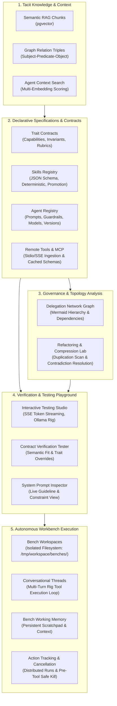
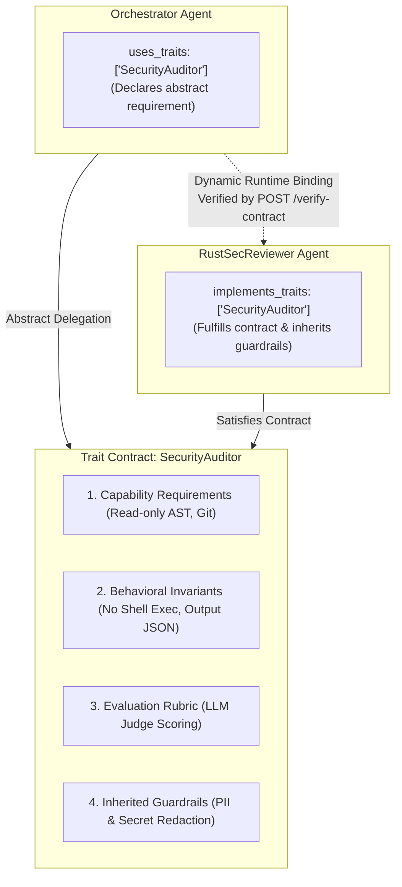

# Spec 18: Home Page Architecture Overview & Comprehensive Workspace Launchpad

## Status
`complete`

---

## 1. Overview & Business Context

The platform orientation experience in `aad-fe-container` is partitioned into two complementary views:
1. **Simple Home Landing (`/` and `/home`)**: A clean, accessible, low-cognitive-overhead entry point designed for fast developer onboarding. Communicates the high-level purpose of Agent-As-Data, showcases the 3-step workflow (Knowledge $\rightarrow$ Contracts & Agents $\rightarrow$ Autonomous Workbench), provides 4 primary action cards (Workbench, Traits & Agents, Testing Studio, Knowledge Base), and links directly to `/detail`.
2. **Comprehensive Architecture Deep-Dive (`/detail`)**: An exhaustive technical map for architects and engineers. Contains the 5-stage system workflow lifecycle, the Trait Contracts deep-dive (4 pillars, implements vs uses, brittle vs decoupled comparison), all 10 module launchpad cards with capability tags, and platform operational guarantees.

This two-tier structure ensures new developers are not overwhelmed while retaining full access to the complete technical architecture and Trait contract mechanics.

---

## 2. Architectural Flow Diagram (5 Lifecycle Phases - Detailed View)

---

## 3. Deep-Dive: Trait Contracts Architecture

### Why Traits Matter
In naive multi-agent frameworks, agents delegate tasks by referencing concrete agent identifiers (e.g. UUIDs). This causes severe architectural friction:
- **Tight Coupling**: Modifying or swapping a sub-agent breaks upstream callers.
- **No Behavioral Guarantees**: Natural language prompts alone cannot enforce environmental permissions or security boundaries.
- **Subjective Validation**: Lacking standardized rubrics, agent performance cannot be objectively audited or tested.

### The 4 Pillars of a Trait Contract
An Agent-As-Data **Trait** is an abstract behavioral interface consisting of:
1. **Capability Requirements**: Environmental prerequisites and required tools (e.g. `ast_parser`, `git_read_only`).
2. **Behavioral Invariants**: Unbreakable operational constraints the agent must always uphold or never violate (e.g. `MUST NEVER execute untrusted binaries`, `MUST ALWAYS return valid JSON`).
3. **Evaluation Rubric**: Objective scoring benchmarks utilized by automated LLM-as-a-Judge evaluators (`0.0 - 1.0` thresholds).
4. **Inherited Baseline Guardrails**: Pre- and post-execution filters (PII masking, secret redactor, prompt injection shield) automatically attached to any agent that implements this trait.

### Implements vs. Uses

---

## 4. UI Specification

### 4.1 Casual Business User Orientation View (`/` and `/home`)
- **Objective**: Provide an immediately comprehensible, jargon-free landing experience for business users, executives, and product managers.
- **Single-Occurrence Link Standard**: Every destination link (`/workbench`, `/traits`, `/knowledge-inspector`, `/interactive-testing`, `/detail`) appears **strictly once** on the page content to eliminate cognitive overload and visual clutter.
- **Hero Welcome Banner**:
  - Value proposition: "Enterprise Knowledge & Digital Teammates Studio".
  - Plain-English problem & solution: Explains that scattered docs and unwritten guidelines become an active company brain powering trustworthy AI teammates who follow strict corporate rules.
  - Zero redundant buttons in hero (letting the 4 pillars below serve as the focused gateways).
- **The 4 Unified Sequential Gateway Pillars** (Each destination represented once):
  1. 🧠 **Company Knowledge Base (`/knowledge-inspector`)**: Teach the AI your business. Ingest documentation, policies, and process playbooks into an interconnected organizational brain.
  2. 🛡️ **Job Roles & Safety Rules (`/traits`)**: Establish enforceable job certifications with **Traits**. Specifies approved tools, non-negotiable company policies, and automatic data protection.
  3. 💼 **Project Workbenches (`/workbench`)**: Dedicated project rooms where humans and AI teammates collaborate on files, documents, and multi-turn tasks in isolated environments.
  4. 🧪 **AI Testing Studio (`/interactive-testing`)**: Live preview sandbox where teams can test prompts and observe AI responses before deploying them on active projects.
- **Single Bridge to Technical Architecture (`/detail`)**: A single footer banner directing engineers and architects to the full technical blueprint, 5-phase data flow, and code contracts.

### 4.2 Comprehensive Architecture Deep-Dive View (`/detail`)
- **Header & Mission Banner**: Detailed Agent-As-Data Studio header with back navigation link to `/home`.
- **Lifecycle Architecture Flow**: 5-phase color-coded cards connected with directional arrows detailing Knowledge $\rightarrow$ Specs $\rightarrow$ Governance $\rightarrow$ Verification $\rightarrow$ Execution.
- **Trait Contracts Deep-Dive Panel**:
  - Comparison of naive hardcoded coupling vs. decoupled Trait contracts.
  - 4-pillar badge visual breakdown (Capabilities, Invariants, Rubrics, Guardrails).
  - Explicit syntax formula callout (`implements_traits` vs `uses_traits`).
- **10-Module Workspace Matrix**:
  - Comprehensive grid of all 10 core workspaces with capability tags and action links (`/workbench`, `/agents`, `/traits`, `/skills`, `/tools`, `/interactive-testing`, `/network-visualizer`, `/refactoring-lab`, `/knowledge-inspector`, `/agent-context`).
- **Platform Operational Guarantees**: 4 tenets (Fail-Fast Config, Immutable Lineage, Strict FKs, Distributed Pre-Tool Cancellation).

---

## 5. Test Strategy

### Angular Unit Tests (`home.component.spec.ts`)
- Verify `HomeComponent` compiles and instantiates.
- Verify that all 10 workspace cards are rendered with valid `routerLink` attributes matching `APP_NAV_MENU_ITEMS`.
- Verify the 5 lifecycle phases are rendered in the architecture section.
- Verify the Trait Contracts deep-dive panel renders the 4 pillars (Capabilities, Invariants, Rubrics, Guardrails).
- Verify the operational guarantees section displays the 4 tenets.

---

## 6. Success Verification Gate
- `ng test --watch=false` passes cleanly with 100% test pass rate.
- Visual inspection on `http://localhost:4200/home` confirms aesthetics, responsiveness, and all navigation links functional.
