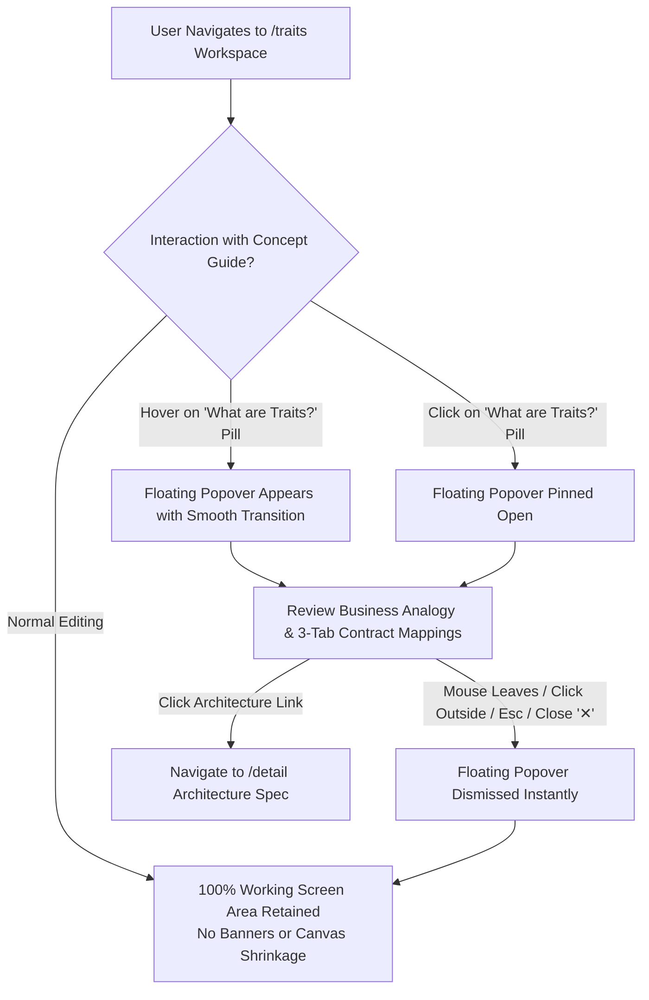

# Spec 19: Trait Registry Zero-Footprint Concept Guide

## Status
`complete`

---

## 1. Overview & Business Intent

In the Agent-As-Data Studio, **Traits** form the foundational contract layer governing autonomous AI teammate behaviors. While the home page (`/home`) communicates this clearly through the plain-English certification analogy (*"Think of Traits like verified job certifications"*), users entering the **Traits Registry** (`/traits`) are immediately confronted with abstract technical tabs:
1. `Capability Requirements`
2. `Behavioral Invariants`
3. `Evaluation Criteria`

To reinforce understanding and guide developers and business analysts as they create or modify traits, this specification introduces an **on-demand, zero-footprint concept guide** directly within `/traits`.

### The Zero-Footprint Requirement
Working space inside `/traits` is critical—the screen must comfortably host the searchable left sidebar and the complete trait blueprint editor (metadata, tab panels, and JSON schema editors). Therefore, the concept guide **must not consume persistent layout area**; no static callouts, fixed alert banners, or layout shrinking.

---

## 2. Architectural & Interaction Flow

---

## 3. Detailed UI & Content Specifications

### 3.1 Top Bar Trigger Anchor
- **Location**: Top bar of the right workspace (`h-14 bg-white border-b border-slate-200`), placed directly to the right of the `Traits Registry` title.
- **Visual Design**: Compact pill button (`px-2.5 py-1 text-xs font-semibold rounded-full border`):
  - Icon: `help_outline` (indigo-600)
  - Label: `What are Traits?`
  - Style: Subtle light indigo background (`bg-indigo-50/80 text-indigo-700 border-indigo-200/70 hover:bg-indigo-100/80 transition-colors cursor-pointer`).
  - Test ID: `data-testid="traits-concept-trigger"`

### 3.2 Floating Popover Panel
- **Placement**: Absolutely positioned floating card overlay anchored beneath the trigger pill with `z-50` elevation and subtle drop shadow (`shadow-xl rounded-2xl border border-slate-200 bg-white w-96 sm:w-[460px]`).
- **Interaction Contract**:
  - **Hover Trigger**: Hovering the trigger button opens the popover after a brief debounce (~150ms).
  - **Click-to-Pin**: Clicking the trigger pins the popover open so the user can interactively select text or click links without auto-dismissal.
  - **Dismiss Triggers**:
    - Moving cursor out (when not pinned).
    - Clicking the close `✕` button (`data-testid="traits-concept-close"`).
    - Clicking anywhere outside the popover element.
    - Pressing the `Escape` key.
- **Content Structure**:
  1. **Badge**: `2. Enforceable Behavioral Contracts`
  2. **Title**: `Job Roles & Safety Rules (Traits)`
  3. **Core Business Analogy**:
     > *"Think of Traits like verified job certifications. They define what tools the AI is allowed to touch, what company policies it must never violate, and what data protection guardrails stay active."*
  4. **Direct Mapping to Editor Tabs**:
     - 🛠️ **1. Capability Requirements**: Tools, state access, and environment permissions the agent must possess.
     - 🛡️ **2. Behavioral Invariants**: Unbreakable corporate policy rules the agent MUST ALWAYS or MUST NEVER violate.
     - 🔒 **3. Evaluation Criteria & Guardrails**: Built-in data & password protection, output grading rubrics, and automated safety fences.
  5. **Footer Architecture Link**:
     - Button / Link: `Explore Trait Architecture Blueprint →`
     - Destination: `/detail`

---

## 4. Test Strategy (Strict TDD)

### 4.1 Unit Tests (`traits-registry.component.spec.ts`)
- **T1: Trigger Presence**: Ensure the trigger button (`[data-testid="traits-concept-trigger"]`) is rendered in the top bar with correct label and icon.
- **T2: Zero Footprint When Closed**: When `isConceptGuideOpen` is `false`, the floating popover is not visible and does not alter the dimensions of the editor canvas.
- **T3: Toggle & Hover Visibility**:
  - Calling `toggleConceptGuide()` or `showConceptGuide()` sets visibility to `true`.
  - Popover container (`[data-testid="traits-concept-popover"]`) appears.
- **T4: Content Verification**:
  - Verifies presence of the certification analogy text: *"Think of Traits like verified job certifications"*.
  - Verifies presence of the 3 mapped tabs: `Capability Requirements`, `Behavioral Invariants`, and `Evaluation Criteria`.
- **T5: Dismissal**:
  - Clicking the close button (`[data-testid="traits-concept-close"]`) closes the popover.
- **T6: Deep-Dive Link**:
  - Verifies the architecture link targets `/detail`.

### 4.2 Integration Verification
- Validate that all existing trait editor tests and end-to-end user journeys (`test_journey_11_trait_editor_ui.robot`) continue passing without regressions.
