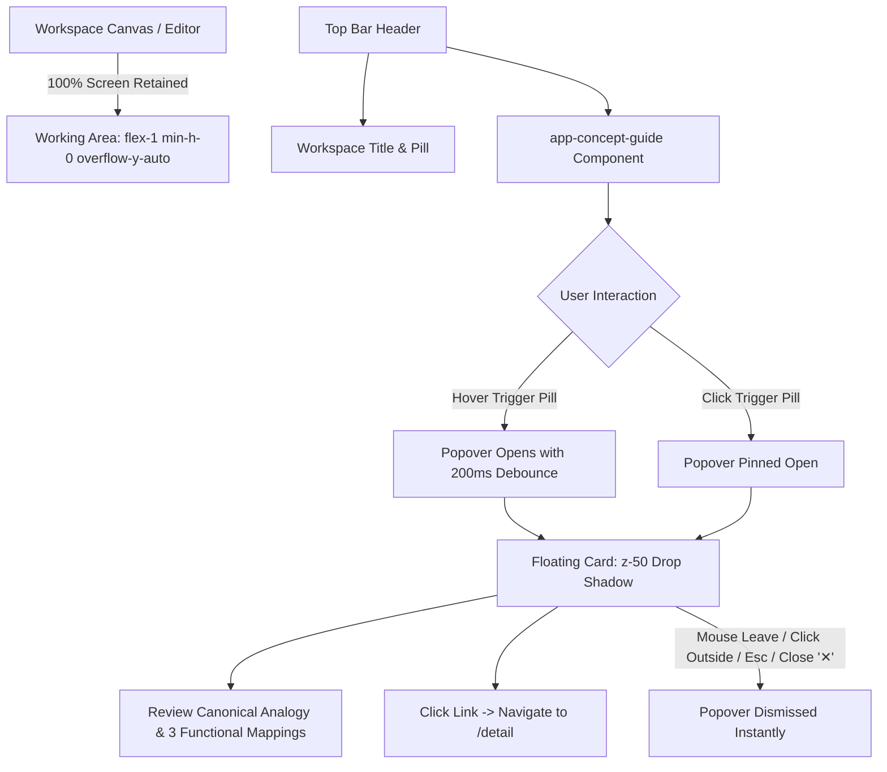

# Spec 20: Global Concept Guide Reusable Component & Multi-View Integration

## Status
`complete`

---

## 1. Overview & Business Intent

In accordance with the **Application & Platform Consistency Standard** and the **Zero-Footprint Concept Guide Standard** defined in the Master PRD ([agent-as-data-prd.md](../prds/agent-as-data-prd.md)) and UI PRD ([agent-ui-testing-kit-prd.md](../prds/agent-ui-testing-kit-prd.md)), users navigating across the Agent-As-Data Studio require clear, non-intrusive mental models that reinforce what each workspace does and how it operates.

Following the successful implementation of the concept guide in `/traits` (Spec 19), this specification expands the pattern across all core workspaces by creating a **reusable Angular component** (`ConceptGuideComponent` / `<app-concept-guide>`) and integrating it into the top bars of:
1. **Traits Registry** (`/traits`): Job Roles & Safety Rules (Refactoring existing inline popover to use the reusable component)
2. **Agents Registry** (`/agents`): Digital Teammates
3. **Skills Registry** (`/skills`): Standard Operating Procedures (SOPs)
4. **Project Workbenches** (`/workbench`): Active Project Rooms
5. **Interactive Testing Studio** (`/interactive-testing`): Pre-Production Sandbox
6. **Knowledge Base Inspector** (`/knowledge-inspector`): Company Brain & Institutional Memory

---

## 2. Zero-Footprint Architectural Contract



### Invariants
1. **Zero Canvas Shrinkage**: The guide trigger is embedded in the top bar header (`h-14 bg-white border-b border-slate-200`) adjacent to the view title. Opening/closing the popover does not alter, resize, or reflow the active working canvas.
2. **Canonical Lexicon Adherence**: All descriptive text strictly adheres to the canonical metaphors defined in [agent-ui-testing-kit-prd.md](../prds/agent-ui-testing-kit-prd.md).
3. **Behavioral Parity**: Hover delay, click-to-pin, escape key dismissal, and outside click dismissal must behave identically across every view.

---

## 3. Component Architecture & Data Model

### 3.1 Component Location & Declaration
- **Module Path**: `aad-fe-container/src/app/components/concept-guide/`
- **Files**:
  - `concept-guide.component.ts` (Standalone Angular component)
  - `concept-guide.component.html`
  - `concept-guide.component.scss`
  - `concept-guide.component.spec.ts`
- **Selector**: `<app-concept-guide>`

### 3.2 Component Inputs & Data Contract

```typescript
export interface ConceptTabMapping {
  icon: string;
  iconColor: string;
  title: string;
  description: string;
}

@Component({
  selector: 'app-concept-guide',
  standalone: true,
  imports: [CommonModule, RouterModule, MatIconModule],
  ...
})
export class ConceptGuideComponent {
  @Input() badge: string = '';
  @Input() title: string = '';
  @Input() icon: string = 'help_outline';
  @Input() triggerLabel: string = 'What is this?';
  @Input() analogyTitle: string = 'The Analogy';
  @Input() analogyText: string = '';
  @Input() tabMappings: ConceptTabMapping[] = [];
  @Input() detailLink: string = '/detail';
  @Input() detailLinkLabel: string = 'Explore Architecture Blueprint →';
  @Input() accentColor: 'indigo' | 'purple' | 'blue' | 'emerald' | 'amber' | 'slate' = 'indigo';
}
```

### 3.3 Canonical Concept Guide Configurations

| Route | View | Trigger Label | Analogy Title | Core Canonical Analogy | 3 Functional Tab / Feature Mappings |
| :--- | :--- | :--- | :--- | :--- | :--- |
| `/traits` | Traits Registry | `What are Traits?` | The Hiring & Certification Analogy | *"Think of Traits like verified job certifications. They define what tools the AI is allowed to touch, what company policies it must never violate, and what data protection guardrails stay active."* | 1. **Capability Requirements**: Required tools, state, and permissions.<br/>2. **Behavioral Invariants**: Unbreakable corporate policy rules.<br/>3. **Evaluation Criteria**: Built-in data guardrails and output grading rubrics. |
| `/agents` | Agents Registry | `What are Agents?` | The Digital Teammates Analogy | *"Think of Agents like specialized digital teammates. Each agent has a clear job description, core personality, assigned skills, and verified trait contracts determining what they can and cannot do."* | 1. **System Prompt & Identity**: Persona, tone, and step-by-step reasoning rules.<br/>2. **Traits & Governance**: Enforced certifications and corporate invariants.<br/>3. **Assigned Skills & Tools**: Standard operating procedures and execution capabilities. |
| `/skills` | Skills Registry | `What are Skills?` | The Standard Operating Procedure Analogy | *"Think of Skills like standard operating procedures (SOPs). They are modular, deterministic instruction packages with typed schemas that any authorized agent can invoke to execute specific tasks."* | 1. **Step-by-Step Instructions**: Exact procedural execution guidelines.<br/>2. **Typed JSON Schema**: Validated input and output payload parameters.<br/>3. **Trait Contract Verification**: Safety validation ensuring the skill satisfies required trait invariants. |
| `/workbench` | Workbenches | `What are Workbenches?` | The Active Project Rooms Analogy | *"Think of Workbenches like dedicated project war rooms. Each bench provides an isolated workspace filesystem, focused conversational threads, and working memory where agents collaborate without cross-project contamination."* | 1. **Isolated Filesystem**: Safe sandboxed files and assets for the active project.<br/>2. **Conversational Threads**: Multi-turn dialog, code editing, and tool execution logs.<br/>3. **Shared Bench Memory**: Working context and persistent memory preserved across sessions. |
| `/interactive-testing` | Testing Studio | `What is Testing Studio?` | The Pre-Production Sandbox Analogy | *"Think of the Testing Studio like an interactive staging sandbox. Safely preview how agents reason, test dynamic trait bindings, inspect system prompts, and verify outputs before deploying to live workflows."* | 1. **Prompt & Trait Inspector**: Live inspection of compiled system prompts and active traits.<br/>2. **Real-Time Token Streaming**: Low-latency SSE output streaming and reasoning traces.<br/>3. **Dynamic Sandbox Execution**: Test ad-hoc inputs and simulate tool returns safely. |
| `/knowledge-inspector` | Knowledge Base | `What is Knowledge Base?` | The Company Brain Analogy | *"Think of the Knowledge Base like company institutional memory. It stores vectorized unwritten wisdom, documents, and relation graphs so your AI teammates have verified grounding and never hallucinate."* | 1. **Semantic Vector Store**: High-dimensional vector embeddings for hybrid RAG search.<br/>2. **Knowledge Graph Triples**: Subject-Predicate-Object relation store linking company concepts.<br/>3. **Entity Resolution**: Canonical entity deduction and automated duplicate pruning. |

---

## 4. Test Strategy & TDD Plan

### 4.1 Unit Tests (`concept-guide.component.spec.ts`)
1. **Rendering**: Renders trigger button with configured label and icon (`[data-testid="concept-guide-trigger"]`).
2. **Hover Interaction**: Hovering over trigger opens popover; mouse leaving trigger closes popover after debounce delay.
3. **Hover Cancel**: Mouse entering popover cancels leave debounce timer so popover stays open.
4. **Pinning**: Clicking trigger pins popover open (`isPinned = true`); mouse leave while pinned does not close popover.
5. **Close Actions**:
   - Clicking close button (`[data-testid="concept-guide-close"]`) closes popover and resets pinned state.
   - Clicking outside backdrop closes popover.
   - Pressing `Escape` key closes popover.
6. **Data Display**: Correctly displays `badge`, `title`, `analogyTitle`, `analogyText`, all `tabMappings` items, and `detailLink`.

### 4.2 Integration Tests
- Verify all modified views (`/traits`, `/agents`, `/skills`, `/workbench`, `/interactive-testing`, `/knowledge-inspector`) render `<app-concept-guide>` in their top bars without layout regression.
- Execute full Angular test suite: `npm test -- --watch=false`.
- Execute Robot UI test suite: `./integration-tests/run-tests-local.sh integration-tests/tests/test_journey_11_trait_editor_ui.robot`.
