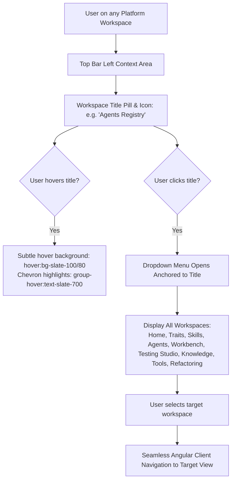

# Spec 21: Top Bar Workspace Title View Switcher Dropdown

## Status
`complete`

---

## 1. Overview & Business Intent

Developers frequently switch between registries and workspaces (Agents, Traits, Skills, Workbenches, Testing Studio, Knowledge Base) while designing, editing, and executing autonomous agents. While a hamburger menu currently resides on the right side of the top bar, having the primary view title itself (e.g. `Agents Registry`) serve as an interactive dropdown selector provides a natural, accessible mental model similar to modern IDE and cloud console navigation.

This specification implements an **interactive workspace title and view switcher dropdown** directly on the view description across all major application top bars:
- When a user clicks on the view description and its icon (e.g., `Agents Registry`, `Traits Registry`, `Skills Registry`, `Workbench`, `Interactive Testing Studio`, `Knowledge & SPO Tuple Inspector`), the application opens a dropdown menu displaying all available views.
- Clicking any view navigates to that view immediately.
- A visual affordance (`expand_more` chevron and subtle hover feedback) indicates that the title is interactive.

---

## 2. Interaction & Architectural Flow



---

## 3. UI & Interaction Contract

### 3.1 Workspace Title Container
- **Markup**:
  ```html
  <div class="flex items-center gap-1.5 px-2 py-1 -ml-2 rounded-lg hover:bg-slate-100/80 cursor-pointer transition-colors select-none group"
       [matMenuTriggerFor]="appMenu"
       data-testid="workspace-title-switcher"
       title="Switch workspace view">
    <mat-icon class="text-indigo-600">[module_icon]</mat-icon>
    <h1 class="text-lg font-black text-slate-800 m-0">[View Title]</h1>
    <mat-icon class="!w-4 !h-4 !text-base text-slate-400 group-hover:text-slate-700 transition-colors">expand_more</mat-icon>
  </div>
  ```
- **Affordance**:
  - Module icon + bold workspace title + trailing `expand_more` chevron icon (`!w-4 !h-4 !text-base text-slate-400`).
  - Interactive hover state: `hover:bg-slate-100/80 cursor-pointer transition-colors`.
  - Trigger binding: `[matMenuTriggerFor]="appMenu"` to trigger the navigation menu.
  - Test ID: `data-testid="workspace-title-switcher"`.

### 3.2 Target Workspaces Included in Menu
Every workspace menu provides canonical navigation items from `APP_NAV_MENU_ITEMS`:
- 🏠 **Home** (`/home`)
- 🛡️ **Traits Registry** (`/traits`)
- 🤖 **Agents Registry** (`/agents`)
- 🧩 **Skills Registry** (`/skills`)
- 💬 **Workbench** (`/workbench`)
- 🧪 **Interactive Testing** (`/interactive-testing`)
- 📚 **Knowledge Base & SPO Inspector** (`/knowledge-inspector`)
- 🛠️ **Tools Manager** (`/tools`)
- 🕸️ **Network Graph** (`/network-visualizer`)
- 🔬 **Refactoring Lab** (`/refactoring-lab`)

---

## 4. Test Strategy & TDD Plan

### 4.1 Unit Tests
Across the affected component test specs (`agent-registry`, `traits-registry`, `skills-registry`, `workbench`, `interactive-testing`, `knowledge-inspector`):
1. **Trigger Presence**: Verify `data-testid="workspace-title-switcher"` exists in the DOM and is bound to open the navigation menu.
2. **Title Content**: Verify it contains the view title, module icon, and chevron icon.
3. **Menu Interaction**: Triggering click on the title switcher opens the `mat-menu` with navigation links.

### 4.2 Integration Verification
- Run all unit test suites (`npm test -- --watch=false`).
- Run Robot Framework tests (`./integration-tests/run-tests-local.sh integration-tests/tests/test_journey_11_trait_editor_ui.robot`).
