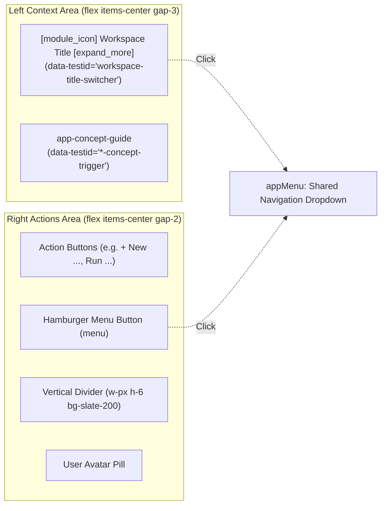

# Spec 22: Universal Top Bar Consistency & Concept Guide Integration Across All Views

## Status
`complete`

---

## 1. Overview & Business Intent

In accordance with the **Application & Platform Consistency Standard** and the **Global Top Bar & Navigation Menu Specification** defined in [agent-ui-testing-kit-prd.md](../prds/agent-ui-testing-kit-prd.md), all views across the Agent-As-Data Studio must share an identical top bar anatomy (`h-14 bg-white border-b border-slate-200 shadow-sm z-10`):
1. **Interactive Workspace Title & Quick View Switcher**: An interactive title pill with module icon, bold workspace name, and `expand_more` chevron that opens `appMenu` upon click (`data-testid="workspace-title-switcher"`).
2. **Zero-Footprint Concept Guide (`<app-concept-guide>`)**: Positioned directly adjacent to the view title, providing plain-English analogies, feature/tab mappings, and architecture links to `/detail`.
3. **Consistent Right-Side Action Area**: Action buttons, hamburger navigation menu (`appMenu`), divider, and user avatar.

### Audit of Inconsistent Views
An audit of existing views revealed several views out of pattern:
- **Network Graph Visualizer (`/network-visualizer`)**: Had an obsolete green badge labeled `"Knowledge Base"` instead of the standard title; lacked the view switcher and concept guide.
- **Refactoring Lab (`/refactoring-lab`)**: Lacked the view switcher dropdown and concept guide.
- **Tools Registry (`/tools`)**: Lacked the concept guide.
- **Agent Context Search (`/agent-context`)**: Lacked the right-hand hamburger navigation menu and view switcher dropdown.
- **Architecture Detail (`/detail`) & Home (`/home`)**: Lacked the interactive title view switcher dropdown on their header titles.

This specification unifies the top bar across all views, eliminating discrepancies.

---

## 2. Standardized Top Bar Architecture

---

## 3. Canonical Concept Guide Configurations for Remaining Views

| View | Route | Module Icon | Trigger Label | Canonical Analogy | 3 Functional Tab / Feature Mappings |
| :--- | :--- | :--- | :--- | :--- | :--- |
| **Network Visualizer** | `/network-visualizer` | `account_tree` | `What is Network Graph?` | **Org Chart & Delegation Map**: Think of the Network Graph like an interactive company org chart. It visually maps how agents, assigned skills, and trait contracts connect and delegate responsibilities across the organization. | 1. **Teammate Node Hierarchies** (`account_tree`): Visualizes individual agent worker nodes and their communication links. 2. **Trait Contract Boundaries** (`verified`): Highlights enforced capability boundaries and behavioral constraints per node. 3. **Skill Delegation Edges** (`extension`): Displays tool routing paths and procedural skill delegations between agents. |
| **Refactoring Lab** | `/refactoring-lab` | `build_circle` | `What is Refactoring Lab?` | **AI Governance & Quality Control**: Think of the Refactoring Lab like automated AI governance and quality control. It analyzes semantic overlap, identifies redundant agent prompts, and detects conflicting trait rules before deployment. | 1. **Overlap Cluster Detection** (`hub`): Semantic clustering finding duplicated or closely related agent prompts. 2. **Redundant Skill Pruning** (`content_cut`): Flags overlapping capabilities across skills to keep agent prompts lean. 3. **Invariant Conflict Analysis** (`gavel`): Pre-flight verification detecting contradictory behavioral invariants. |
| **Tools Registry** | `/tools` | `dns` | `What are Tools?` | **Workspace Tools (Toolbelt)**: Think of Tools like physical instruments on an AI teammate's toolbelt. They connect agents to filesystems, code interpreters, terminal commands, and external APIs with pre-tool safety checks. | 1. **Standardized Rig Tools** (`build`): Native file and directory operations executing within isolated workspaces. 2. **Model Context Protocol (MCP)** (`cloud_sync`): Distributed tool servers providing standard interfaces for enterprise systems. 3. **Pre-Tool Execution Safeties** (`security`): Invariant checks and distributed cancellation stopping dangerous commands. |
| **Agent Context Search** | `/agent-context` | `search` | `What is Context Search?` | **Context Discovery (Semantic Matcher)**: Think of Context Discovery like an intelligent semantic routing engine. It translates natural language task requirements into the exact subgraphs of skills and agents needed to fulfill the job. | 1. **Natural Language Task Context** (`search`): Searches vector embeddings and keyword indexes to discover relevant agent entities. 2. **AST Trace Depth** (`tune`): Configures structural subgraph traversal depth across agent skills and traits. 3. **Top Semantic Matches** (`psychology`): Ranks and previews matched agent components with entity type indicators. |

---

## 4. Test Strategy & TDD Plan

1. **Unit Tests**:
   - `network-visualizer.component.spec.ts`: Verify `workspace-title-switcher` and `network-concept-trigger` are rendered and configured properly.
   - `refactoring-lab.component.spec.ts`: Verify `workspace-title-switcher` and `refactoring-concept-trigger` are rendered and configured properly.
   - `tool-manager.component.spec.ts`: Verify `workspace-title-switcher` and `tools-concept-trigger` are rendered and configured properly.
   - `agent-context.component.spec.ts`: Verify top bar navigation menu and view switcher.
2. **Regression Testing**:
   - Run full test suite (`npm test -- --watch=false`).
   - Run Robot Framework tests (`./integration-tests/run-tests-local.sh integration-tests/tests/test_journey_11_trait_editor_ui.robot`).
