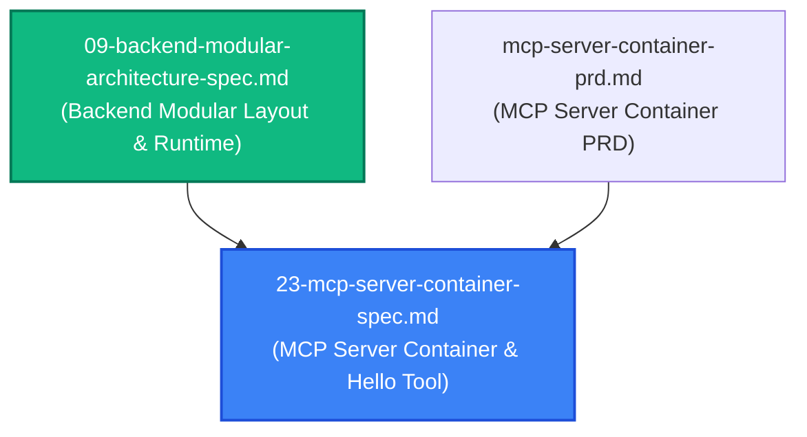
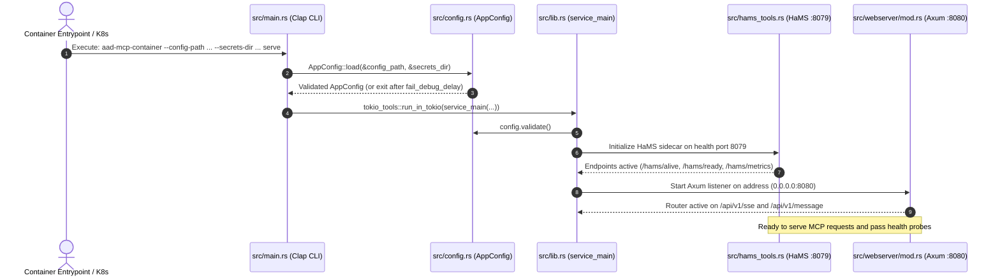

# Spec 23: Dedicated MCP Server Container & Baseline Greeting Tool

**Status**: `draft`

---

## Overview & Scope
This specification defines the build out of the **Model Context Protocol (MCP) Server Container (`aad-mcp-container`)** and its accompanying Helm chart (**`charts/agent-as-data-mcp`**). 

The MCP Server container provides an independent microservice for IDEs, autonomous agents, and AI assistants to interact with the Agent-As-Data ecosystem using the standard Model Context Protocol (MCP). The container implements the structural pattern established by [`aad-be-container`](../prds/agent-as-data-prd.md), reusing core configuration models (`WebServiceConfig`, `HamsConfig`, `ThreadRuntime`, `DebuggingConfig`), integrating the `hams` health monitoring sidecar on health port `8079`, and exposing the MCP transport on port `8080`.

As a foundational baseline milestone, this spec defines the implementation and end-to-end verification of the `hello` MCP tool.

---

## Dependencies & PRD References
- **PRD Reference**: [MCP Server Container PRD](../prds/mcp-server-container-prd.md)
- **Master PRD Reference**: [Agent-As-Data Master PRD](../prds/agent-as-data-prd.md)
- **Architectural Dependencies**: Pattern derived from [09-backend-modular-architecture-spec.md](./09-backend-modular-architecture-spec.md)



---

## 1. Directory Structure & Module Layout

The service is established in the workspace root at `aad-mcp-container/`:

```
aad-mcp-container/
├── Cargo.toml                  # Dependencies: axum, tokio, clap, figment, hams, serde, etc.
├── Dockerfile                  # Multi-stage release container build
├── config/
│   └── default.yaml            # Default development configuration
├── src/
│   ├── main.rs                 # Clap CLI entrypoint (parse flags, fail-debug-delay, Tokio harness)
│   ├── lib.rs                  # service_main orchestrator (load config, start HaMS, run Axum)
│   ├── config.rs               # WebServiceConfig, HamsConfig, AppConfig fail-fast loader
│   ├── hams_tools.rs           # HaMS harness, ProbeManual readiness binding, cancellation
│   ├── tokio_tools.rs          # Tokio multi-thread runtime builder
│   ├── metrics.rs              # Prometheus exporter hooks for HaMS
│   ├── state.rs                # Shared AppState (configuration, cancellation tokens)
│   ├── webserver/
│   │   ├── mod.rs              # Axum router setup, port 8080 listener, graceful shutdown
│   │   ├── sse.rs              # SSE transport session handler
│   │   └── rpc.rs              # JSON-RPC 2.0 protocol dispatching
│   └── tools/
│       ├── mod.rs              # Tool trait definition and tool registry
│       └── hello.rs            # Hello greeting tool implementation
└── tests/
    ├── config_tests.rs         # Configuration loading and validation unit tests
    └── hello_tool_tests.rs     # Tool schema and invocation unit tests
```

---

## 2. Configuration Data Models & Port Mapping

### Structure Re-use from Backend
To maintain strict consistency with `aad-be-container`, configuration structures are directly mirrored:

```rust
#[derive(Deserialize, Serialize, Debug, Clone)]
pub struct WebServiceConfig {
    pub address: String,
    pub api_prefix: String,
}

#[derive(Deserialize, Serialize, Debug, Clone)]
pub struct DebuggingConfig {
    pub environment: String,
    pub log_level: String,
    #[serde(default = "default_fail_debug_delay", with = "humantime_serde")]
    pub fail_debug_delay: Duration,
}

#[derive(Deserialize, Serialize, Debug, Clone)]
pub struct AppConfig {
    pub webservice: WebServiceConfig,
    #[serde(serialize_with = "serialize_hams")]
    pub hams: HamsConfig,
    #[serde(default)]
    pub runtime: ThreadRuntime,
    pub debugging: DebuggingConfig,
}
```

### Default Configuration (`config/default.yaml`)
```yaml
webservice:
  address: "0.0.0.0:8080"
  api_prefix: "/api"

hams:
  name: "aad-mcp"
  version: "0.1.0"
  port: 8079

runtime:
  threads: 2
  stack_size: 3000000
  name: "aad-mcp-worker"

debugging:
  environment: "development"
  log_level: "info"
  fail_debug_delay: "0s"
```

---

## 3. Service Lifecycle & HaMS Integration



---

## 4. MCP Protocol & `hello` Tool Specification

### Tool JSON Schema
The `tools/list` response includes:
```json
{
  "name": "hello",
  "description": "Generates a friendly greeting response for a specified user or entity name.",
  "inputSchema": {
    "type": "object",
    "properties": {
      "name": {
        "type": "string",
        "description": "The name of the user, persona, or entity to greet.",
        "minLength": 1
      }
    },
    "required": ["name"],
    "additionalProperties": false
  }
}
```

### Invocation Contract (`tools/call`)
- **Request**:
  ```json
  {
    "jsonrpc": "2.0",
    "id": 1,
    "method": "tools/call",
    "params": {
      "name": "hello",
      "arguments": {
        "name": "Antigravity"
      }
    }
  }
  ```
- **Success Response**:
  ```json
  {
    "jsonrpc": "2.0",
    "id": 1,
    "result": {
      "content": [
        {
          "type": "text",
          "text": "Hello, Antigravity!"
        }
      ],
      "isError": false
    }
  }
  ```
- **Error Response (Empty or Missing Name)**:
  ```json
  {
    "jsonrpc": "2.0",
    "id": 1,
    "result": {
      "content": [
        {
          "type": "text",
          "text": "Error: 'name' argument must be a non-empty string"
        }
      ],
      "isError": true
    }
  }
  ```

---

## 5. Helm Chart Specification (`charts/agent-as-data-mcp`)

Copied and adapted from `charts/agent-as-data`:
- **Chart.yaml**: `name: agent-as-data-mcp`, `version: 0.1.0`.
- **values.yaml**:
  - `image.repository: agent-as-data-mcp`
  - `service.port: 8080`
  - `service.hamsPort: 8079`
  - `config.webservice.address: "0.0.0.0:8080"`
  - `config.webservice.api_prefix: "/api"`
- **deployment.yaml**:
  - Command: `["/usr/local/bin/aad-mcp-container", "--config-path", "/etc/aad-mcp/config.yaml", "--secrets-dir", "/etc/aad-mcp/secrets", "serve"]`
  - Container ports: `name: http` (`8080`), `name: hams` (`8079`).
  - Liveness probe: HTTP GET `/hams/alive` on port `hams` (`8079`).
  - Readiness probe: HTTP GET `/hams/ready` on port `hams` (`8079`).
- **service.yaml**: Exposes port `8080` (targetPort `http`) and port `8079` (targetPort `hams`).

---

## 6. Root Makefile Targets & Port Overrides
The repository `Makefile` defines port variables with `?=` allowing arbitrary environment overrides for local serving (defaulting to `8082` and `8078` to avoid port clashes with `aad-be` during local multi-service testing):
```makefile
aad-mcp_PORT ?= 8082
aad-mcp_HEALTH_PORT ?= 8078

aad-mcp-dev:
	-@lsof -t -i :$(aad-mcp_PORT) | xargs kill -9 2>/dev/null || true
	-@lsof -t -i :$(aad-mcp_HEALTH_PORT) | xargs kill -9 2>/dev/null || true
	cd aad-mcp-container && \
	AAD_MCP__WEBSERVICE__ADDRESS="0.0.0.0:$(aad-mcp_PORT)" \
	AAD_MCP__HAMS__PORT="$(aad-mcp_HEALTH_PORT)" \
	cargo run -- serve

aad-mcp-watch:
	-@lsof -t -i :$(aad-mcp_PORT) | xargs kill -9 2>/dev/null || true
	-@lsof -t -i :$(aad-mcp_HEALTH_PORT) | xargs kill -9 2>/dev/null || true
	cd aad-mcp-container && \
	AAD_MCP__WEBSERVICE__ADDRESS="0.0.0.0:$(aad-mcp_PORT)" \
	AAD_MCP__HAMS__PORT="$(aad-mcp_HEALTH_PORT)" \
	AAD_MCP__DEBUGGING__LOG_LEVEL="debug" \
	RUST_LOG="debug" \
	cargo watch -x 'run -- serve'

aad-mcp-test:
	cd aad-mcp-container && cargo test

aad-mcp-docker:
	docker build -t agent-as-data-mcp:latest aad-mcp-container

aad-mcp-docker-run: aad-mcp-docker
	docker run -it --rm --name agent-as-data-mcp \
		-p $(aad-mcp_PORT):8080 \
		-p $(aad-mcp_HEALTH_PORT):8079 \
		agent-as-data-mcp:latest

build-mcp: aad-mcp-docker
```

---

## 7. FluxCD GitOps Integration (`fluxcd-dev/`)
1. **`fluxcd-dev/agent-as-data-mcp.yaml`**:
   - Declares `OCIRepository` tracking `oci://ghcr.io/polecatworks/agent-as-data/helm/agent-as-data-mcp`.
   - Declares `HelmRelease` deploying the MCP server into `agent-as-data-dev` with image `ghcr.io/polecatworks/agent-as-data-mcp:main`.
2. **`fluxcd-dev/virtualservice.yaml`**:
   - Ingress routing prefix `/mcp` mapped to `agent-as-data-mcp:8080`.

---

## 8. Comprehensive Test Strategy

### Unit Tests
1. **Config Loader & Validation**:
   - Verify loading from YAML files.
   - Verify environment variable overrides with prefix `AAD_MCP__` (e.g. `AAD_MCP__WEBSERVICE__ADDRESS`).
   - Verify fail-fast startup behavior when required configuration fields are missing.
2. **`hello` Tool Handler**:
   - Verify greeting generation: input `"World"` $\rightarrow$ `"Hello, World!"`.
   - Verify handling of whitespace: `"   Alice   "` $\rightarrow$ `"Hello, Alice!"`.
   - Verify validation error on empty string `""` or whitespace-only `"   "` $\rightarrow$ `isError: true`.
   - Verify handling of international UTF-8 characters: `"José"`, `"世界"`.

### Integration Tests
1. **HaMS Health Monitoring**:
   - Start the service and execute HTTP GET against `http://localhost:8079/hams/alive` $\rightarrow$ Expect HTTP 200.
   - Execute HTTP GET against `http://localhost:8079/hams/ready` $\rightarrow$ Expect HTTP 200.
   - Execute HTTP GET against `http://localhost:8079/hams/metrics` $\rightarrow$ Expect Prometheus metrics format.
2. **MCP SSE & JSON-RPC Protocol**:
   - Establish SSE connection to `http://localhost:8080/api/v1/sse`.
   - Send `initialize` JSON-RPC message to endpoint $\rightarrow$ verify protocol capabilities response.
   - Send `tools/list` $\rightarrow$ verify `hello` tool is present with schema.
   - Send `tools/call` with `{"name": "Developer"}` $\rightarrow$ verify response `Hello, Developer!`.
3. **Helm Lint**:
   - Execute `helm lint charts/agent-as-data-mcp` $\rightarrow$ verify zero errors and clean template rendering.
