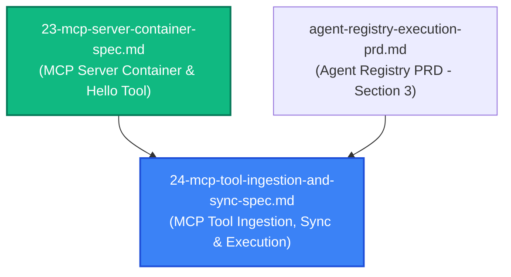

# Spec 24: Remote MCP Tool Ingestion, Synchronization & Execution Engine

**Status**: `complete`

---

## Overview & Scope
This specification defines the implementation of the **Remote MCP Tool Ingestion, Synchronization & Execution Engine** in [`aad-be-container`](../prds/agent-as-data-prd.md). 

Operating in Kubernetes environments governed by **Istio Service Mesh** and Ingress Gateways, the system utilizes stateless **HTTP POST JSON-RPC 2.0** as its transport. This spec replaces hardcoded tool capability mocks with live MCP protocol discovery, adds schema synchronization controls (eager validation, manual/webhook sync, and resilient degradation), and provides a remote tool execution bridge for agents invoking attached MCP tools.

The baseline verification target for this spec is the dedicated [`aad-mcp-container`](./23-mcp-server-container-spec.md) running locally or in-cluster, verifying discovery and execution of its canonical `hello` greeting tool.

---

## Dependencies & PRD References
- **Primary PRD**: [Agent Registry & Execution PRD](../prds/agent-registry-execution-prd.md) (Section 3: Remote MCP Tool Registration, Synchronization & Execution Engine)
- **Container PRD**: [MCP Server Container PRD](../prds/mcp-server-container-prd.md)
- **Master PRD**: [Agent-As-Data Master PRD](../prds/agent-as-data-prd.md)
- **Predecessor Specs**: [04-mcp-server-spec.md](./04-mcp-server-spec.md), [09-backend-modular-architecture-spec.md](./09-backend-modular-architecture-spec.md), [11-workspace-agent-tool-execution-spec.md](./11-workspace-agent-tool-execution-spec.md), [23-mcp-server-container-spec.md](./23-mcp-server-container-spec.md)



---

## 1. Database Schema Migration

### Forward Migration: `0024_mcp_tools_sync_schema.up.sql`
Add synchronization state columns to the `tools` table:
```sql
-- Migration 0024: Add MCP sync policy and status to tools
ALTER TABLE tools 
ADD COLUMN IF NOT EXISTS sync_policy VARCHAR(50) NOT NULL DEFAULT 'manual',
ADD COLUMN IF NOT EXISTS sync_status VARCHAR(50) NOT NULL DEFAULT 'synced',
ADD COLUMN IF NOT EXISTS last_sync_error TEXT;

CREATE INDEX IF NOT EXISTS idx_tools_sync_status ON tools(sync_status);
```

### Reverse Migration: `0024_mcp_tools_sync_schema.down.sql`
```sql
DROP INDEX IF EXISTS idx_tools_sync_status;

ALTER TABLE tools 
DROP COLUMN IF EXISTS last_sync_error,
DROP COLUMN IF EXISTS sync_status,
DROP COLUMN IF EXISTS sync_policy;
```

---

## 2. API Contracts & Payloads

### 1. Register Tool Server (`POST /{{api_prefix}}/v1/agents/tools/register`)

#### Request Payload
```json
{
  "id": "optional-uuid",
  "server_name": "aad-mcp",
  "transport_type": "http",
  "endpoint_config": {
    "url": "http://127.0.0.1:8082/mcp"
  },
  "sync_policy": "manual",
  "owner_id": "00000000-0000-0000-0000-000000000001"
}
```

#### Operational Lifecycle on Registration
1. Backend validates that `transport_type == "http"` and `endpoint_config.url` is present and valid.
2. Backend dispatches an HTTP POST JSON-RPC request to the endpoint:
   ```json
   {
     "jsonrpc": "2.0",
     "id": 1,
     "method": "initialize",
     "params": {
       "protocolVersion": "2024-11-05",
       "capabilities": {},
       "clientInfo": { "name": "aad-be-container", "version": "0.1.0" }
     }
   }
   ```
3. If the connection fails, times out, or returns a non-200/error response, the registration fails fast with `422 Unprocessable Entity`:
   ```json
   {
     "error": "Failed to connect to MCP server at http://127.0.0.1:8082/mcp: Connection refused"
   }
   ```
4. If `initialize` succeeds, the backend sends `notifications/initialized` and then queries `tools/list`:
   ```json
   {
     "jsonrpc": "2.0",
     "id": 2,
     "method": "tools/list",
     "params": {}
   }
   ```
5. Parsed tool entries (including `name`, `description`, `inputSchema`) are structured into `cached_capabilities`:
   ```json
   {
     "tools": [
       {
         "name": "hello",
         "description": "Generates a friendly greeting response for a specified user or entity name.",
         "inputSchema": {
           "type": "object",
           "properties": {
             "name": { "type": "string" }
           },
           "required": ["name"]
         }
       }
     ]
   }
   ```
6. Record is inserted/updated in `tools` with `cached_tools_count = tools.len()`, `sync_status = "synced"`, and `last_synced_at = NOW()`.
7. Returns `201 Created`:
   ```json
   {
     "id": "UUID",
     "server_name": "aad-mcp",
     "transport_type": "http",
     "cached_tools_count": 1,
     "sync_status": "synced"
   }
   ```

---

### 2. Manual & Webhook Sync (`POST /{{api_prefix}}/v1/agents/tools/{id}/sync`)

#### Operational Flow
1. Fetches tool server record by `id`.
2. Issues HTTP POST JSON-RPC `tools/list` to `endpoint_config.url`.
3. **On Success**:
   - Updates `cached_capabilities` with newly retrieved tools.
   - Sets `sync_status = 'synced'`.
   - Clears `last_sync_error = None`.
   - Updates `last_synced_at = NOW()`.
   - Returns `200 OK` with updated count and status.
4. **On Failure (Resilience Rule)**:
   - **Retains existing `cached_capabilities`** so active agent executions do not crash.
   - Sets `sync_status = 'degraded'`.
   - Records `last_sync_error = "HTTP POST failed: ..."` with error message.
   - Returns `200 OK` (or `207 Multi-Status`) with `sync_status: "degraded"` and diagnostic error.

---

### 3. Remote Tool Execution Bridge (`tools/call`)

When an agent or thread run invokes a tool that belongs to a registered MCP server:
1. Lookup tool in `tools` table by name matching an entry in `cached_capabilities.tools`.
2. Construct HTTP POST JSON-RPC 2.0 payload:
   ```json
   {
     "jsonrpc": "2.0",
     "id": "<request_id>",
     "method": "tools/call",
     "params": {
       "name": "<tool_name>",
       "arguments": { "<arg_key>": "<arg_value>" }
     }
   }
   ```
3. Send POST to `endpoint_config.url` with timeout (e.g. 15s).
4. Extract text/json content from `result.content` and return to the LLM agent completion context.

---

## 3. Test Strategy & Acceptance Criteria

### Automated Tests (TDD)
1. **`mcp_tool_sync_tests.rs` (Unit & Integration)**:
   - **Test 1 (`test_register_mcp_server_success`)**: Start mock Axum HTTP JSON-RPC server returning `initialize` and `tools/list` (`hello`). Register tool via `POST /v1/agents/tools/register`. Assert `201 Created`, `cached_tools_count == 1`, and database record holds `hello` tool definition.
   - **Test 2 (`test_register_mcp_server_unreachable_fails_fast`)**: Register with an unreachable port (`http://127.0.0.1:9999/mcp`). Assert `422 Unprocessable Entity` and verify no corrupt record is created.
   - **Test 3 (`test_manual_sync_updates_tools`)**: Register tool with 1 tool. Update mock server to return 2 tools. Invoke `POST /v1/agents/tools/{id}/sync`. Assert `cached_tools_count == 2` and `sync_status == "synced"`.
   - **Test 4 (`test_sync_failure_preserves_schema_and_marks_degraded`)**: Register tool successfully. Stop mock server. Invoke `POST /v1/agents/tools/{id}/sync`. Assert previous tools are retained, `sync_status == "degraded"`, and `last_sync_error` is populated.
   - **Test 5 (`test_remote_tool_execution_bridge`)**: Execute remote MCP tool via the execution bridge. Verify request payload formatting, response extraction, and error handling when tool returns `isError: true`.

2. **Integration Verification against `aad-mcp-container`**:
   - Target live `aad-mcp-container` running on port 8082.
   - Register `http://127.0.0.1:8082/mcp`.
   - Verify discovery of `hello` tool with its `name` schema.
   - Call `hello` tool with `{"name": "Antigravity"}` and verify `"Hello, Antigravity!"` output.
